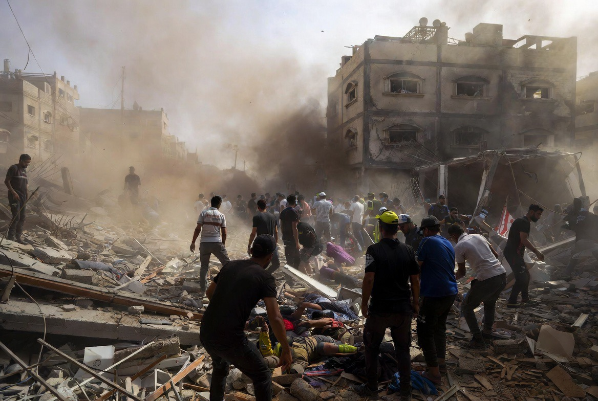

# Ceasefire Berdarah: Serangan terhadap Sipil, Ambulans & Krisis Moral dalam Konflik Israel–Gaza–Lebanon

*Ilustrasi ceasefire berdarah (pic: Grok AI).*

  
***Kadang yang bikin dunia paling lelah bukan cuma perang… tapi ketika orang mulai terbiasa melihat anak kecil mati di layar, lalu lanjut makan malam seperti biasa***
  

Pelanggaran gencatan senjata yang disertai korban sipil, tenaga medis, dan fasilitas kemanusiaan menimbulkan pertanyaan serius tentang efektivitas hukum humaniter internasional dalam konflik modern. 

Tulisan ini menganalisis serangan Israel di Gaza dan Lebanon Selatan melalui perspektif etika perang, hukum konflik bersenjata, dan psikologi dehumanisasi. 

Temuan menunjukkan bahwa ketika aktor militer mulai melihat seluruh wilayah sebagai “zona ancaman”, batas antara kombatan dan sipil menjadi kabur, sehingga risiko kekerasan terhadap warga sipil meningkat drastis.

## Pendahuluan

Ada sesuatu yang sangat mengerikan ketika kata “ceasefire” masih berjalan… tapi bayi tetap mati.

Karena ceasefire seharusnya berarti:
jeda napas,
ruang kemanusiaan,
kesempatan menyelamatkan yang terluka.

Namun ketika:
ambulans diserang,
tenaga medis tewas,
area sipil terus dibombardir,
maka dunia mulai bertanya ini masih operasi keamanan… atau krisis moral yang kehilangan rem? 

## Ambulans dan Tenaga Medis dalam Hukum Internasional

Dalam Geneva Conventions:
ambulans,
rumah sakit,
tenaga medis,
mendapat perlindungan khusus.

Prinsip dasarnya sederhana, bahkan dalam perang, manusia tetap wajib menyisakan ruang untuk menyelamatkan hidup.

Serangan terhadap tenaga medis bisa dianggap pelanggaran serius jika:
dilakukan sengaja,
tanpa dasar militer jelas,
atau secara sembrono mengabaikan proporsionalitas.

## Kenapa Sipil Tetap Jadi Korban?

Israel sering berargumen:
kelompok bersenjata beroperasi di area sipil,
senjata disembunyikan dekat permukiman,
ambulans kadang dituduh dipakai militan.

Dan memang, dalam perang urban modern,
kombatan dan sipil sering bercampur.

Masalahnya, kalau semua area sipil dianggap potensial ancaman… maka seluruh masyarakat bisa berubah jadi target tersirat.

Di titik inilah dehumanisasi mulai bekerja.

## Dehumanisasi: Mesin Psikologis Perang

Dalam psikologi konflik, musuh yang terus-menerus dilihat sebagai:
ancaman permanen,
“binatang”,
“sarang teror”,
atau populasi kolektif berbahaya,
akan lebih mudah diperlakukan tanpa empati.

Dan ini berbahaya sekali. Karena ketika empati runtuh, bayi bisa dianggap “kerusakan sampingan statistik.”

## Lebanon Selatan: Kenapa Terus Dibom?

Israel menganggap:
Hezbollah masih ancaman aktif,
ceasefire Iran tidak otomatis berlaku ke Lebanon.

Sementara pihak Lebanon dan banyak pengkritik berkata, serangan yang terus menghantam area sipil memperlihatkan ekspansi logika perang tanpa batas jelas.

Akibatnya:
desa hancur,
tenaga medis tewas,
warga sipil terus mengungsi.

## Problem Besar: “Self-Defense” vs Proporsionalitas

Israel selalu menekankan “hak membela diri. Dan secara hukum internasional hak itu memang ada. Tetapi hukum perang juga mengenal:
proporsionalitas,
pembedaan sipil-kombatan,
kewajiban meminimalkan korban sipil.

Jadi kritik dunia bukan selalu “Israel tak boleh membela diri” melainkan “apakah cara yang dipakai masih proporsional?”

## Kenapa Dunia Makin Marah?

Karena gambar yang keluar bukan:
markas militer,
bunker elite,
melainkan:
bayi berdarah,
paramedis tewas,
ambulans rusak,
keluarga terkubur reruntuhan.

Dan citra seperti itu menghancurkan legitimasi moral sangat cepat.

## Siklus Kekerasan yang Mengerikan

Ini bagian paling tragis. Semakin banyak sipil tewas:
semakin besar kebencian,
semakin mudah radikalisasi,
semakin panjang perang.

Jadi, pembunuhan sipil tidak hanya menghancurkan hari ini… tapi juga menanam perang generasi berikutnya.

## Inti Terdalam

Peradaban diuji bukan saat damai. Tapi saat manusia punya kekuatan untuk menghancurkan… lalu memilih sejauh mana ia menahan diri.

Dan ketika:
ambulans jadi sasaran,
tenaga medis ikut mati,
bayi masuk statistik perang,
maka pertanyaannya bukan cuma “siapa menang?” melainkan “apa yang tersisa dari kemanusiaan setelahnya?” 

Pelanggaran ceasefire dan serangan terhadap area sipil memperlihatkan rapuhnya batas moral dalam perang modern.

Walaupun negara memiliki hak mempertahankan keamanan, hukum humaniter internasional tetap menuntut:
perlindungan sipil,
proporsionalitas,
dan penghormatan terhadap tenaga medis.

Karena tanpa itu… ceasefire hanya menjadi jeda kecil di antara dua gelombang penderitaan.

  
**Referensi**

International Committee of the Red Cross. (1949/2024). Geneva Conventions and additional protocols.

United Nations Office for the Coordination of Humanitarian Affairs. (2026). Protection of civilians in armed conflict report.

Human Rights Watch. (2026). Attacks on medical and civilian infrastructure in Gaza and Lebanon.

Amnesty International. (2026). Civilian harm and proportionality in Middle East conflicts.
