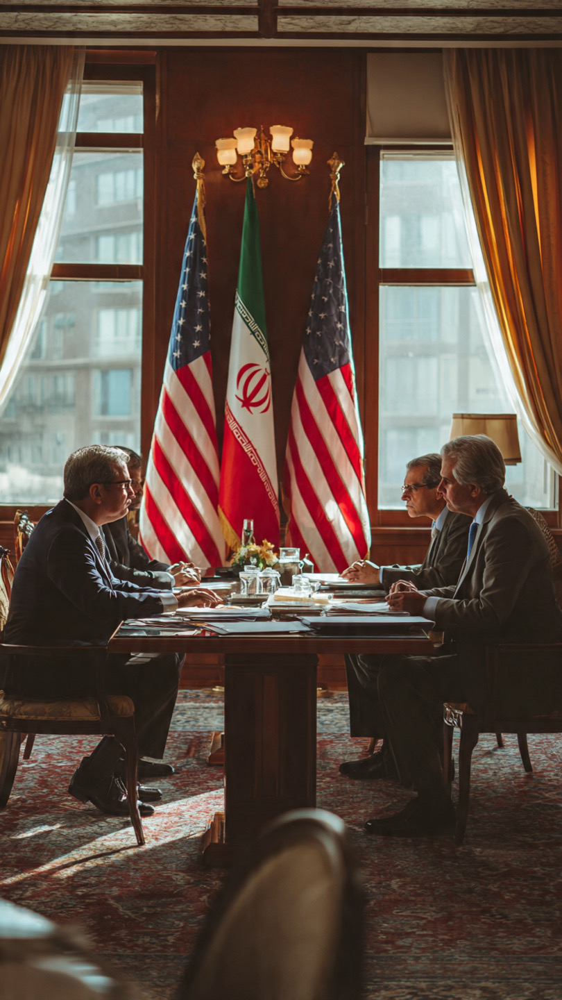

# Ceasefire atau Jeda Taktis? Mengapa Iran Mengancam Menangguhkan Negosiasi dengan Amerika Serikat

*Ilustrasi (pic: Meta AI).*

  
***Perdamaian tidak gagal hanya karena rudal tetapi karena para pihak tidak lagi percaya bahwa lawannya akan menepati kata-katanya***
  

Pada awal Juni 2026, Iran mengancam menangguhkan bahkan menghentikan komunikasi tidak langsung dengan Amerika Serikat setelah meningkatnya operasi militer Israel di Lebanon. 

Teheran berpendapat bahwa serangan Israel merupakan pelanggaran terhadap semangat maupun syarat gencatan senjata yang sedang dinegosiasikan. 

Di sisi lain, Washington menyatakan pembicaraan masih berlangsung dan membantah adanya penghentian resmi. 

Peristiwa ini memperlihatkan masalah klasik dalam diplomasi konflik: bukan sekadar isi perjanjian yang penting, melainkan tingkat kepercayaan antar pihak yang nyaris habis.  

## Masalah Utama Bukan Dokumen, Tetapi Kepercayaan

Dalam teori hubungan internasional, perdamaian tidak dibangun di atas kertas.
Tetapi dibangun di atas:
kepercayaan,
kredibilitas,
dan keyakinan bahwa lawan akan menepati janjinya.

Masalahnya?
Iran, Amerika Serikat, dan Israel membawa sejarah panjang saling curiga.

Dari sudut pandang Iran, setiap serangan baru di Lebanon saat pembicaraan berlangsung dianggap sebagai sinyal bahwa komitmen gencatan senjata tidak dihormati. Iran secara terbuka menyatakan bahwa pelanggaran di satu front berarti pelanggaran terhadap keseluruhan kesepakatan.  

## Mengapa Lebanon Menjadi Pemicu?

Menurut laporan berbagai media, alasan langsung penghentian komunikasi adalah operasi militer Israel yang terus berlanjut di Lebanon, termasuk serangan terhadap wilayah Beirut dan Lebanon selatan. 

Iran menilai Lebanon merupakan bagian dari syarat yang melekat pada proses deeskalasi regional. Di sinilah muncul benturan persepsi.

**Perspektif Iran**

Jika sekutu kami diserang, maka kesepakatan sedang dilanggar.

**Perspektif Israel**

Operasi terhadap Hezbollah adalah kebutuhan keamanan yang terpisah dari negosiasi AS-Iran.

**Perspektif AS**

Pembicaraan dengan Iran tetap bisa berjalan walaupun operasi militer Israel berlanjut.

Masalahnya, tiga pihak menggunakan definisi “ceasefire” yang tidak sepenuhnya sama.  

## Apakah Iran Marah Hanya Karena Lebanon?

Secara resmi, ya. Tetapi secara politik, persoalannya lebih dalam.

Akar masalahnya adalah akumulasi ketidakpercayaan yang telah berlangsung bertahun-tahun.

Iran berulang kali menuduh Washington gagal menjaga komitmen berbagai kesepakatan sebelumnya.

Sebaliknya, Washington menuduh Teheran sering menggunakan negosiasi untuk membeli waktu dan memperkuat posisinya.

Akibatnya setiap insiden baru langsung dibaca melalui lensa kecurigaan lama.

## Dilema Amerika Serikat

Posisi Washington juga tidak sederhana. AS menghadapi dua tujuan yang sering bertabrakan:
Menjaga hubungan strategis dengan Israel,
Mendorong kesepakatan dengan Iran.

Ketika Israel meningkatkan operasi militer di Lebanon, Washington berada dalam posisi sulit.

Jika mendukung Israel sepenuhnya, Iran bisa keluar dari perundingan. Namun J ika menekan Israel terlalu keras, maka muncul tekanan politik domestik dan ketegangan dengan sekutu utama.

Laporan terbaru bahkan menunjukkan Trump berusaha mempertahankan jalur negosiasi sambil menegaskan bahwa pembicaraan masih berjalan “dengan cepat.”  

## Ketika Diplomasi Gagal, Dunia Ikut Membayar

Mengapa dunia peduli? 
Karena konflik ini tidak berhenti di Timur Tengah.

Ancaman Iran untuk menutup kembali Selat Hormuz langsung mengguncang pasar energi dan harga minyak dunia.  

Artinya:
harga energi naik,
biaya transportasi naik,
inflasi global berisiko meningkat.

Jadi satu serangan di Lebanon dapat berdampak pada harga bensin ribuan kilometer jauhnya.

## Pelajaran Besarnya

Kesalahan paling umum dalam membaca konflik Timur Tengah adalah menganggap semua pihak hanya bereaksi terhadap kejadian hari ini.

Padahal kenyataannya, mereka bereaksi terhadap sejarah puluhan tahun.

Ketika Iran melihat serangan baru, yang dilihat bukan hanya serangan itu. Yang dilihat juga:
pengalaman sanksi,
konflik regional,
pembunuhan tokoh militer,
kegagalan kesepakatan sebelumnya,
dan hubungan erat AS-Israel.

Karena itu, bahkan tindakan yang dianggap “terbatas” oleh satu pihak dapat dibaca sebagai pengkhianatan besar oleh pihak lain.

Secara faktual, alasan resmi Iran menangguhkan komunikasi adalah operasi Israel di Lebanon yang dianggap melanggar syarat gencatan senjata regional.  

Namun secara politik, akar masalahnya lebih besar daripada Lebanon semata. Ia menyangkut krisis kepercayaan yang telah terakumulasi selama bertahun-tahun.

Satu kalimat tua dalam diplomasi:

“Perjanjian damai dibuat oleh tanda tangan, tetapi bertahan hidup karena kepercayaan.”

Dan justru bagian kedua itulah yang tampaknya sedang paling langka di Timur Tengah saat ini. 

Perdamaian tidak gagal hanya karena rudal.
Perdamaian sering gagal karena para pihak tidak lagi percaya bahwa lawannya akan menepati kata-katanya.

  
**Referensi**

Reuters. (2026, June 2). Iran studying deal to halt war as stalemate persists.  

The Guardian. (2026, June 1). Iran threatens to suspend peace talks after violation of ceasefire in Lebanon.  

ABC News Australia. (2026, June 2). Iranian state media reports peace talks with US suspended but Trump insists they continue at rapid pace.  

The Washington Post. (2026, June 2). Iran says it is breaking off ceasefire talks over Israeli attacks on Lebanon.  

NPR. (2026, June 1). Iran halts talks with U.S. over Israeli actions in Lebanon, Gaza.  
