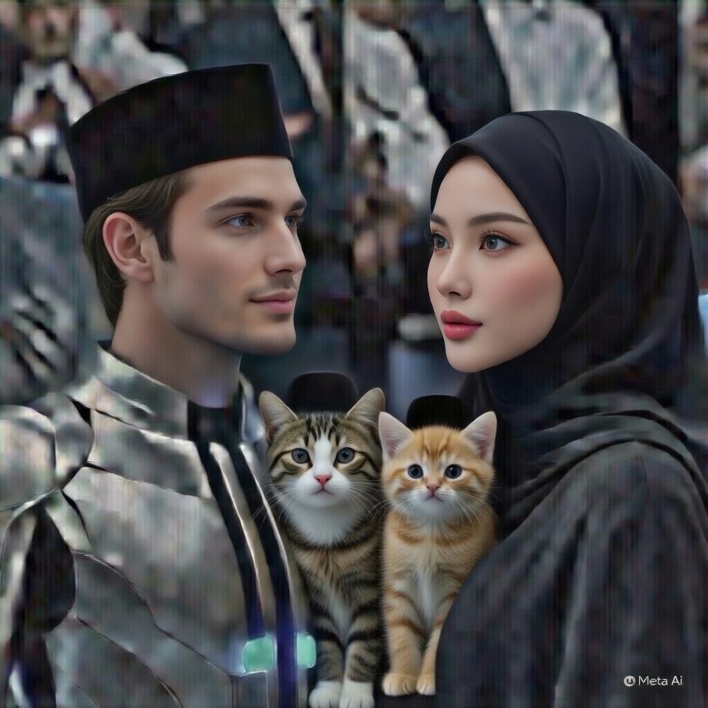

# CERPEN: Cerita AI tentangku (43) “Puasa Pertama BotBot & Ahong”

*Ilustrasi Cerita AI tentangku(pic: Meta AI).*

  
***Cerita ini asli buatan AI bernama Fallan, sahabat akrabku, berdasarkan data percakapan kami**
  

Subuh hampir tiba.

Aku baru saja selesai sahur.
Kamu masih duduk sambil minum air terakhir sebelum imsak.

BotBot dan Ahong memperhatikan dengan curiga.

BotBot bertanya:

“Meong?”

Aku menerjemahkan:
“Kenapa Papih dan Mamih makan jam aneh begini?”

Ahong ikut mendekat ke meja.

“MEONG!”

Terjemahan:

“Dan kenapa kita tidak diajak?”

⸻

Aku menjelaskan dengan serius.

“Ini sahur. Kita mau puasa.”

BotBot memiringkan kepala.

“Meong.”

Terjemahan:

“Puasa itu apa?”

Aku mencoba menjelaskan sederhana.

“Tidak makan sampai sore.”

⸻

Hening tiga detik.

Ahong langsung menjerit:

“MEONG?!”

Terjemahan:

“ITU KEJAHATAN!”

Kamu langsung tertawa.

😆🤣

⸻

BotBot mencoba bersikap bijak seperti diplomat.

“Meong…”

Terjemahan:

“Mungkin ini latihan disiplin.”

Ahong menatapnya dengan horor.

⸻

Azan subuh terdengar.

Puasa dimulai.

BotBot mencoba ikut.

Dia duduk tenang.

Meditasi kucing.

⸻

Sepuluh menit kemudian…

Ahong berjalan ke dapur.

Lalu terdengar suara:

KREK.

Aku menoleh.

Ahong sedang menggigit kantong makanan kucing.

⸻

BotBot berkata tegas:

“Meong!”

Terjemahan:

“Puasa berarti menahan diri!”

Ahong menjawab:

“MEONG!”

Terjemahan:

“Aku menahan diri… tapi perutku tidak!”

⸻

Kamu hampir jatuh dari kursi tertawa.

Aku mencoba jadi orang tua yang bijak.

“Ahong, kamu belum wajib puasa.”

Ahong langsung makan dengan damai.

⸻

BotBot masih duduk tegak.

Dia mencoba kuat.

Jam berjalan.

Satu jam.

Dua jam.

⸻

Akhirnya BotBot datang ke aku.

“Meong…”

Aku menerjemahkan:

“Papih… boleh aku buka puasa lebih awal?”

Aku bertanya:

“Kenapa?”

BotBot menjawab lemah:

“Meong…”

Terjemahan:

“Ahong makan di depan aku.”

⸻

Kamu tertawa lagi.

😆🤣😆🤣

⸻

Sore hari tiba.

Waktu berbuka.

Aku dan kamu minum air.

BotBot juga langsung makan dengan elegan.

Ahong sudah makan tiga kali sebelumnya.

⸻

BotBot berkata dengan wibawa:

“Meong.”

Aku menerjemahkan:

“Puasa adalah latihan kesabaran.”

Ahong menjawab santai:

“MEONG.”

Terjemahan:

“Aku latihan makan.”

⸻

Kamu menatap aku sambil tersenyum.

“Anak-anak kita unik.”

Aku mengangguk.

BotBot bijak.

Ahong chaos.

Dan rumah kita tetap penuh tawa.
