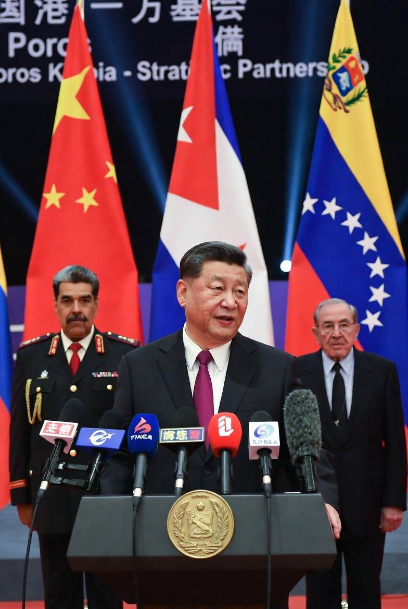

# China Semakin Mendekat ke Kuba & Venezuela: Ketika Karibia dan Amerika Latin Menjadi Arena Baru Persaingan Kekuatan Dunia

*Ilustrasi (pic: Grok AI).*

  
***Karibia adalah panggung tua yang terus dipakai sejarah untuk memainkan drama yang berbeda, tetapi dengan aktor-aktor besar yang selalu ingin berdiri di tengah sorotan lampu***
  

Perkembangan geopolitik tahun 2026 menunjukkan semakin eratnya hubungan antara China dengan Kuba dan Venezuela. 

Di tengah meningkatnya tekanan, sanksi, dan ancaman dari Amerika Serikat terhadap Havana dan Caracas, Beijing tampil sebagai salah satu kekuatan besar yang secara terbuka memberikan dukungan diplomatik terhadap kedua negara tersebut. 

Fenomena ini menunjukkan bahwa rivalitas global AS-China tidak lagi berpusat hanya di Asia-Pasifik, tetapi juga merambah kawasan yang selama hampir dua abad dianggap sebagai wilayah pengaruh strategis Washington.  

## Mengapa Kuba & Venezuela Penting?

Banyak orang menganggap Kuba hanya pulau kecil. Sementara Venezuela hanya negara yang sedang krisis.

Padahal dalam geopolitik, ukuran negara tidak selalu menentukan nilainya.

**Kuba**

Secara geografis, Kuba berada sangat dekat dengan wilayah AS.

Karena itu sejak era Cuban Missile Crisis, Kuba selalu memiliki nilai strategis yang jauh lebih besar daripada ukuran ekonominya.

**Venezuela**

Venezuela memiliki salah satu cadangan minyak terbesar dunia.

Meski mengalami berbagai krisis ekonomi dan politik, negara ini tetap memiliki arti strategis besar dalam politik energi global.

## Mengapa China Mendekat?

Jawaban sederhananya, karena kekosongan geopolitik jarang dibiarkan kosong.

Ketika tekanan Washington terhadap Havana dan Caracas meningkat, Beijing melihat peluang untuk:
memperluas pengaruh diplomatik,
memperkuat hubungan ekonomi,
menunjukkan diri sebagai alternatif terhadap dominasi Barat.

China secara terbuka menegaskan bahwa posisinya terhadap Kuba dan Venezuela tetap “konsisten” dan tidak berubah.  

## Faktor Trump dan Tekanan Amerika

Tahun 2026 ditandai oleh meningkatnya tekanan Washington terhadap Kuba.

Pemerintahan Trump:
memperluas sanksi,
meningkatkan tekanan ekonomi,
memperkeras retorika terhadap Havana.

China secara terbuka mengecam langkah tersebut dan menyebut sanksi tambahan AS terhadap Kuba sebagai tindakan yang melanggar norma internasional.  

Bahkan beberapa pejabat China secara langsung menyerukan agar AS menghentikan blokade dan tekanan terhadap Kuba.  

## Venezuela: Luka Lama yang Belum Sembuh

Hubungan China-Venezuela sebenarnya bukan hal baru. Selama bertahun-tahun Beijing:
berinvestasi,
memberikan pinjaman,
menjalin kerja sama energi.

Namun ketegangan meningkat setelah berbagai tindakan AS terhadap pemerintahan Caracas.

China secara terbuka menyebut tindakan militer dan penangkapan terhadap pemimpin Venezuela sebagai pelanggaran terhadap kedaulatan negara tersebut.  

## Apakah Ini Soal Ideologi?

Menariknya, tidak sepenuhnya.

Banyak orang mengira China mendukung Kuba dan Venezuela karena sama-sama negara sosialis.

Sebagian memang benar. Namun geopolitik modern lebih sering digerakkan oleh:
kepentingan strategis,
jalur perdagangan,
energi,
pengaruh global,
daripada sekadar solidaritas ideologi.

China memahami bahwa mendukung Kuba dan Venezuela juga berarti menantang dominasi diplomatik Amerika di kawasan Amerika Latin.

## Amerika dan China di Halaman Belakang Siapa?

Selama dua abad, Washington terbiasa melihat Amerika Latin sebagai wilayah pengaruhnya. Namun kini Beijing:
membangun hubungan ekonomi,
memperluas investasi,
memperkuat kerja sama diplomatik,
di kawasan tersebut.

Akibatnya rivalitas AS-China semakin terasa hingga ke Karibia.

## Multipolaritas Sedang Terjadi

Fenomena ini merupakan bagian dari tren yang lebih besar: Dunia multipolar.

Jika pasca-runtuhnya Uni Soviet dunia didominasi AS, maka kini semakin banyak negara mencoba memperluas ruang manuvernya dengan:
China,
BRICS,
kekuatan regional lainnya.

Kuba dan Venezuela menjadi contoh bagaimana negara yang mendapat tekanan dari satu kutub kekuatan akan berusaha mencari penyeimbang dari kutub lainnya.

Meningkatnya kedekatan China dengan Kuba dan Venezuela bukan sekadar kisah persahabatan diplomatik. Ini adalah bagian dari perubahan struktur kekuasaan global.

Di satu sisi, Amerika ingin mempertahankan pengaruh historisnya. Di sisi lain, China ingin menunjukkan bahwa pengaruh globalnya tidak berhenti di Asia.

Akibatnya Amerika Latin dan Karibia kembali menjadi arena penting dalam kompetisi kekuatan besar abad ke-21.  

Dulu dunia mengenal istilah “Perang Dingin”ketika Washington dan Moskow berebut pengaruh sampai ke Kuba.

Kini, puluhan tahun kemudian, Kuba kembali berada di tengah pusaran kekuatan besar. Bedanya bukan lagi antara Moskow dan Washington, melainkan antara Beijing dan Washington.

Seolah-olah Karibia adalah panggung tua yang terus dipakai sejarah untuk memainkan drama yang berbeda, tetapi dengan aktor-aktor besar yang selalu ingin berdiri di tengah sorotan lampu. 

  
**Referensi**

Reuters. (2026, February 5). China backs Cuba against external interference as foreign minister visits Beijing.

Reuters. (2026, May 5). China says wider U.S. sanctions on Cuba are illegal.

China.org.cn. (2026, May 22). China voices firm support for Cuba.

People’s Dispatch. (2026, May 13). China reaffirms support for Cuba and Venezuela on the eve of the Xi–Trump summit in Beijing.

People’s Daily Online. (2026, May 27). China expresses support for Cuba against U.S. military threat.
