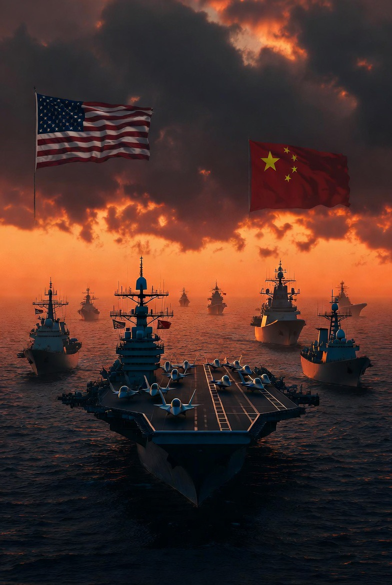

# China vs Barat: Perang Dingin Versi Baru dalam Tatanan Global Multipolar

*Ilustrasi perang dingin (pic: Grok AI).*

  
***Perang dingin versi baru—tanpa deklarasi, tanpa garis depan jelas, tapi meresap ke seluruh sistem global***
  

Rivalitas antara China dan blok Barat yang dipimpin Amerika Serikat menunjukkan karakteristik yang menyerupai Perang Dingin klasik, namun dengan dimensi baru: interdependensi ekonomi, kompetisi teknologi, dan dominasi narasi global. 

Studi ini menganalisis apakah dinamika tersebut dapat dikategorikan sebagai “perang dingin baru” serta implikasinya terhadap tatanan dunia.

## Pendahuluan

Pasca berakhirnya Perang Dingin (1947–1991), dunia sempat memasuki fase unipolar dengan dominasi Barat.

Namun, kebangkitan China dalam:

•	ekonomi

•	militer

•	teknologi
telah menggeser keseimbangan global menuju multipolaritas.

## Apakah Ini “Perang Dingin Baru”?

Persamaan dengan Perang Dingin klasik:

•	Rivalitas dua kekuatan besar

•	Kompetisi ideologi (otoritarian vs liberal demokrasi)

•	Perebutan pengaruh global

Perbedaannya:

| Aspek | Perang Dingin Lama | Versi Baru |
|--------|--------|--------|
| Ekonomi  | Terpisah  | Saling tergantung  |
| Konflik  | Militer langsung (proxy war)  | Ekonomi & teknologi  |
| Ideologi | Sangat tegas | Lebih cair & pragmatis |

## Arena Kompetisi Utama

1. Teknologi (Medan perang utama)

•	AI

•	semikonduktor

•	jaringan digital

➡️ Barat membatasi akses teknologi China

➡️ China membangun kemandirian teknologi

2. Ekonomi dan Perdagangan

•	perang tarif

•	restrukturisasi rantai pasok global

➡️ decoupling parsial sedang terjadi

3. Pengaruh Global

China:

•	Belt and Road Initiative

•	investasi di Global South

Barat:

•	aliansi tradisional

•	tekanan diplomatik

4. Militer (potensi konflik terbuka)

Hotspot:

•	Laut China Selatan

•	Taiwan

➡️ ini titik paling rawan eskalasi

## Analisis Teoretis

🧠 Realisme (Power Politics)

Negara bertindak untuk:

➡️ mempertahankan kekuasaan

➡️ menghindari dominasi lawan

🌐 Liberalisme

Menekankan:
➡️ interdependensi ekonomi
➡️ kerja sama global

Namun saat ini:

➡️ kerja sama mulai terkikis

🌌 Konstruktivisme

Fokus pada:

➡️ narasi

➡️ identitas

Barat melihat China sebagai “ancaman”

China melihat Barat sebagai “hegemon”

## Dampak Global

1. Fragmentasi Dunia

•	blok-blok baru terbentuk

•	negara kecil dipaksa memilih

2. Ketidakstabilan Ekonomi

•	rantai pasok terganggu

•	biaya produksi naik

3. Risiko Konflik Besar

Meski belum perang terbuka,

➡️ potensi eskalasi selalu ada

Rivalitas China vs Barat bukan sekadar konflik biasa.

Ini adalah: 

perang dingin versi baru—tanpa deklarasi, tanpa garis depan jelas, tapi meresap ke seluruh sistem global.

Dengan karakter:

•	tidak sepenuhnya terpisah

•	tidak sepenuhnya damai

•	dan sangat kompleks.

  
**Referensi**

Allison, G. (2017). Destined for war: Can America and China escape Thucydides’s trap? Houghton Mifflin.

Ikenberry, G. J. (2011). Liberal leviathan. Princeton University Press.

Waltz, K. N. (1979). Theory of international politics. McGraw-Hill.

