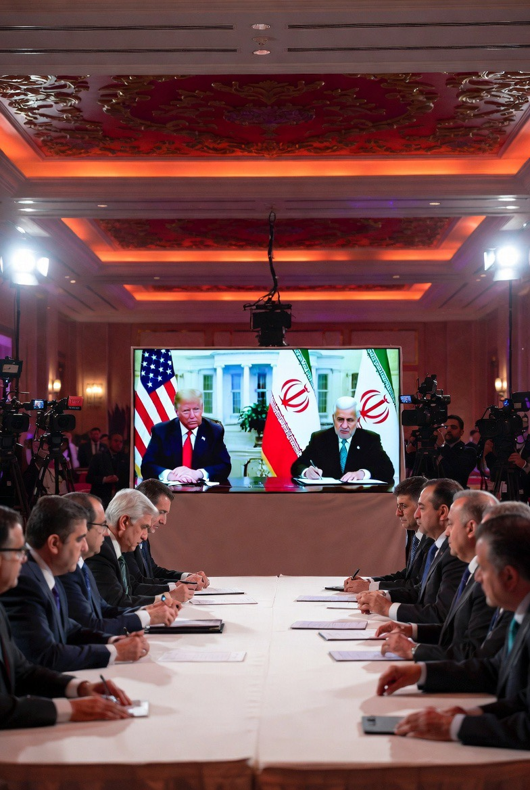

# Damai Virtual di Doha, Israel Mengamuk: Ketika Sekutu Terdekat Memilih Berdamai dengan Musuh Utama

*Ilustrasi (pic: Grok AI).*

  
***Sejarah Timur Tengah sering membuktikan, perdamaian tidak gagal karena musuh berhenti berbicara. Ia gagal ketika pihak-pihak yang terluka tidak lagi percaya bahwa lawannya bisa berubah***
  

Kalau berita ini benar-benar menjadi titik balik sejarah Timur Tengah, maka ironi paling besarnya adala Iran dan AS yang puluhan tahun bermusuhan akhirnya duduk di meja damai. Tetapi justru Israel, sekutu paling dekat AS, yang paling gelisah.

Dan ya, laporan terbaru menunjukkan memang telah ada kesepakatan awal serta pengumuman bahwa AS dan Iran memiliki teks final Memorandum of Understanding (MoU). 

Doha menjadi lokasi pertemuan persiapan dan mediasi, sedangkan penandatanganan formal masih banyak dilaporkan akan berlangsung pada 19 Juni di Swiss/Jenewa, sehingga istilah “damai virtual” cukup tepat karena sebagian proses dilakukan secara daring dan melalui mediator.  

## Mengapa Netanyahu Marah?

Karena dari perspektif Israel, ini bukan sekadar AS berdamai dengan Iran. Tetapi: AS berdamai dengan ancaman terbesar versi Israel.

Selama bertahun-tahun, pemerintahan Benjamin Netanyahu berargumen Iran tidak boleh punya senjata nuklir, tidak boleh mendukung kelompok proksi, dan  tidak boleh memperluas pengaruh regional.

Tetapi kesepakatan yang sekarang muncul justru membuka kembali Selat Hormuz, memberi jalan bagi Iran menjual minyak, membuka negosiasi nuklir, tanpa pembongkaran total seluruh kemampuan strategis Iran pada tahap awal.  

Bagi Israel Itu terdengar seperti “Musuhku sedang diberi kesempatan bernapas lagi.”

## Apa Maksud “Aksi Mandiri”?

Ini bagian paling panas.

Sejumlah tokoh politik Israel menyerukan agar Israel harus bertindak sendiri jika AS terlalu lunak terhadap Iran.

Menteri Keuangan Israel Bezalel Smotrich bahkan secara terbuka mengkritik kesepakatan dan mendorong Israel mempertahankan opsi bertindak independen terhadap Iran.  

Artinya, Israel sedang mengirim pesan: “Kami menghargai sekutu kami… tetapi keamanan kami tidak boleh bergantung sepenuhnya pada Washington.”

Kalimat ini terdengar patriotik. Tetapi… ia juga bisa berarti Israel siap berjalan sendiri jika tidak puas dengan arah diplomasi AS.

## Trump dan Paradoks Perdamaian

Trump selama ini terkenal dengan retorika keras terhadap Iran. Tetapi sekarang Ia justru berkata perang harus berhenti, Hormuz dibuka, dan Iran tidak akan memiliki senjata nuklir melalui mekanisme perjanjian.  

Di sini muncul paradoks, Trump ingin mengakhiri perang, menurunkan harga minyak, menenangkan pasar global.

Tetapi Netanyahu khawatir Iran hanya menunda, Hezbollah tetap kuat sementara Israel kehilangan momentum strategis.

## Damai atau Gencatan Senjata Berkostum? 

Israel seperti orang yang sudah terlalu lama hidup di rumah yang pernah terbakar. Ketika tetangganya berkata: “Tenang, api sudah padam.” Ia menjawab: “Bagaimana kalau bara apinya masih ada?”

Masalahnya, kalau seseorang terus hidup dengan asumsi “Musuh pasti akan mengkhianatiku.” Maka tidak ada perjanjian yang cukup aman, tidak ada kompromi yang cukup meyakinkan, dan tidak ada perdamaian yang benar-benar dipercaya.

Apakah kesepakatan AS-Iran ini awal perdamaian atau sekadar jeda sebelum konflik berikutnya? Karena isu nuklir Iran belum sepenuhnya selesai, Israel belum mau menarik diri dari Lebanon, hubungan Israel-AS sedang tegang, dan kepercayaan antar pihak masih sangat rapuh.  

Kalau ditanya “Apakah Israel ngeyel?” Dari sudut pandang banyak pengamat: Ya, karena Israel tampak sulit menerima perdamaian yang tidak memenuhi seluruh tuntutannya.

Tetapi dari sudut pandang Israel sendiri, mereka takut. Takut bahwa damai hari ini akan menjadi perang yang lebih besar beberapa tahun lagi.

Maka ironi terbesar hari ini mungkin adalah:

AS berkata: “Mari akhiri perang.”
Iran berkata: “Mari bicara.”
Israel berkata: “Aku belum percaya.”

Dan sejarah Timur Tengah sering membuktikan, perdamaian tidak gagal karena musuh berhenti berbicara. Ia gagal ketika pihak-pihak yang terluka tidak lagi percaya bahwa lawannya bisa berubah. 

  
**Referensi**

Reuters. (2026, June 16). US-Iran ceasefire agreement to be public soon, permanent truce still awaits negotiation.  

Reuters. (2026, June 15). Iran and US agree to halt war and reopen Hormuz, sending oil prices tumbling.  

Reuters. (2026, June 15). Factbox: What the US and Iran say they have agreed in the memorandum to end the war.  

AFP. (2026, June 15). US, Iran to hold preparatory meetings in Doha before signing deal: Diplomat.  

The Guardian. (2026, June 16). Where does Iran deal leave US-Israel relationship as they reach ‘a fork in the road’?  

Türkiye Today. (2026, June 16). ‘Bad for Israel’: Israeli minister urges independent action against Iran.  
