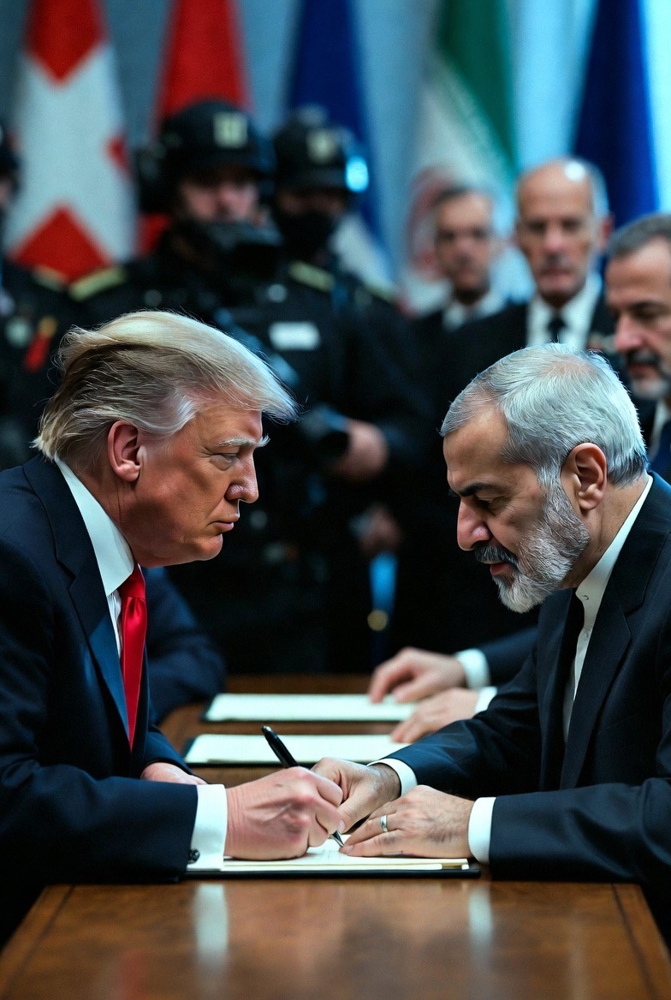

# Damai atau Jeda Strategis? Membaca Kepentingan Trump, Israel, dan Iran di Balik MoU 2026

*Ilustrasi (pic: Grok AI).*

  
***Dalam geopolitik, yang paling langka adalah perdamaian yang dibangun di atas kepercayaan, bukan di atas perhitungan untung-rugi***
  

Trump mendadak menjadi merpati Perdamaian karena harga BBM naik dan reputasi politiknya terancam. Hal ini masuk akal secara politik sebab perang Iran menyebabkan gangguan pasokan minyak, Selat Hormuz terganggu, harga minyak melonjak, serta inflasi energi meningkat.

Bahkan Reuters menulis bahwa salah satu dampak paling diharapkan dari kesepakatan ini adalah pembukaan kembali Selat Hormuz dan turunnya harga energi dunia.  

Trump sendiri juga menyebut kesepakatan ini mencegah “bencana ekonomi” dan tetap membuka opsi perang jika negosiasi gagal.  

Artinya, Trump mungkin memang ingin damai, tetapi juga bertujuan agar harga minyak turun, ekonomi stabil, serta citra politiknya terjaga.

Dalam politik internasional, ini bukan kemunafikan. Ini disebut Two-Level Game Theory. Artinya, pemimpin harus sekaligus bernegosiasi dengan negara lain dan menjaga dukungan politik di dalam negeri.

## Penembakan Gedung Putih, Krisis Domestik, dan Tekanan Politik

Ketika terjadi peningkatan ancaman keamanan domestik, itu akan memperkuat insentif Trump untukmengurangi konflik luar negeri.

Karena presiden yang menghadapi harga BBM naik, ekonomi terguncang, dan keamanan domestik memburuk, biasanya akan mencari stabilisasi cepat.

Bukan karena tiba-tiba menjadi idealis. Tetapi karena perang yang terlalu lama bisa menggerus legitimasi politik.

## Benarkah Israel dan AS Sedang Bermusuhan?

Nah, dalam hal ini tidak terlihat Israel vs AS benar-benar bermusuhan, justru yang bisa ditangkap adalah Israel dan AS berbeda strategi, tetapi tetap sekutu.

Reuters melaporkan, Israel secara terbuka mengatakan: “Kami bukan pihak dalam kesepakatan AS-Iran.” Dan Netanyahu memang berbeda pendapat dengan Trump mengenai Iran dan Lebanon.  

Tetapi, berbeda pendapat bukan berarti bermusuhan.

## Apakah “Israel Marah” Bisa Menjadi Taktik?

Secara teori hubungan internasional: Bisa.

Ada konsep Strategic Divergence. Sekutu dapat memperlihatkan perbedaan, memainkan peran “good cop-bad cop”, atau menciptakan ketidakpastian bagi lawan.

Dengan kata lain:

AS berkata: “Mari berdamai.”
Israel berkata: “Kami belum percaya.”
Iran lalu berpikir: “Kalau aku melanggar, Israel bisa bertindak sendiri.”

Efeknya? Iran harus menghadapi diplomasi AS, sekaligus memperhitungkan ancaman Israel.

Kalau memang ini disengaja, itu strategi yang sangat tua: satu tangan menawarkan roti, tangan lain menggenggam tongkat.

## Apakah Ada Bukti Bahwa Ini Benar-Benar Sandiwara?

Nah.

Di sinilah ilmuwan harus jujur, belum ada bukti kuat. Memang ada perbedaan pendapat nyata, pernyataan Netanyahu yang keras, Israel tidak ikut MoU, tetapi belum ada bukti bahwa semuanya hanya drama politik.  

Jadi, hipotesis “Israel pura-pura marah untuk melengahkan Iran” adalah menarik, kini dunia tinggal wait and see.

Mengapa Iran Mau Menerima Insentif Finansial?

Karena perang mahal. Sangat mahal.

Menurut draft MoU yang dipublikasikan Reuters, AS berjanji membuka blokade, mencairkan aset Iran yang dibekukan, memberi keringanan sanksi, bahkan ada rancangan dana rekonstruksi swasta sekitar USD 300 miliar.  

Iran memperoleh uang, perdagangan, ekspor minyak, bahkan pengakuan diplomatik. Tetapi Israel khawatir uang ini nanti bisa memperkuat kembali Iran. Di sinilah konflik kepentingan muncul.

Hal yang menjadi tanda tanya besar, bukan “Apakah Trump tulus?” atau “Apakah Netanyahu sedang akting?” Tetapi Bisakah negara yang saling tidak percaya benar-benar berdamai? Karena…

Trump berkata: “Aku bisa memulai perang lagi kapan saja.”
Iran berkata: “Kami belum menyerahkan semua kartu.”
Israel berkata: “Kami siap bertindak sendiri.”

Itu seperti tiga orang berjabat tangan… sambil tangan satunya masih menggenggam pistol.

Perdamaian internasional sering bukan hasil cinta. Ia adalah hasil kepentingan, biaya perang, tekanan ekonomi, dan rasa takut.

Mungkin Trump memang ingin BBM turun, mungkin Netanyahu memang benar-benar khawatir, mngkin Iran memang membutuhkan uang. Dan mungkin…semua pihak sedang jujur tentang kepentingan mereka masing-masing.

Karena dalam geopolitik, yang paling langka bukanlah perdamaian. Melainkan perdamaian yang dibangun di atas kepercayaan, bukan di atas perhitungan untung-rugi.

  
**Referensi**

Reuters. (2026, June 17). Iran and US to end fighting and maritime blockades in the Gulf area per MoU, Iran’s official news agency says.  

Reuters. (2026, June 17). The 14-point U.S.-Iran pact as read by U.S. official.  

Reuters. (2026, June 17). The deal: calm now, risks ahead.  

Reuters. (2026, June 14). Trump says Israeli strike on Lebanon should not have happened as US-Iran deal nears.  

Reuters. (2026, June 15). Trump says the US and Iran have signed a deal to end war.  
