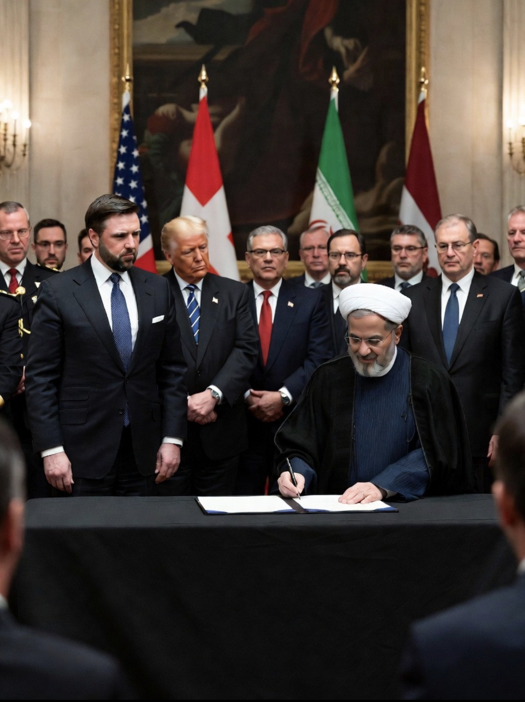

# Damai di Swiss, Bom di Lebanon: Apakah Perjanjian AS-Iran Sedang Sekarat atau Justru Bertahan?

*Ilustrasi (pic: Grok AI).*

  
***Perdamaian AS-Iran belum runtuh, tetapi masih berjalan di atas jembatan kaca yang retaknya terlihat dari jauh***
  

Perjanjian damai AS-Iran sudah ada kerangka dan roadmap, namun belum ada perdamaian final.

Dengan kata lain, mereka belum menikah, baru bertunangan. Dan selama masa tunangan itu… tetangga sebelah masih lempar petasan ke jendela. 

## Status Terbaru Swiss

Dari perkembangan hari ini, yang sudah disepakati adalah Roadmap 60 hari.

AS dan Iran menyetujui jalur negosiasi selama 60 hari untuk mencapai kesepakatan final. Mereka juga membentuk mekanisme komunikasi langsung agar insiden militer tidak langsung berubah menjadi perang besar.  

Artinya, negosiasi masih hidup, delegasi masih bekerja, dan pembicaraan teknis masih berjalan.

Bahkan Swiss kembali dipuji karena status netralnya membantu menjaga kepercayaan kedua pihak.  

## Lalu Mengapa Israel Masih Menyerang Lebanon?

Nah… inilah duri terbesar dalam seluruh proses.

Menteri Pertahanan Israel secara terbuka mengatakan bahwa pasukan Israel tidak akan menarik diri dari Lebanon Selatan. Operasi terhadap Hezbollah tetap berlangsung.  

Dari sudut pandang Iran: “Kalau sekutu kami di Lebanon masih dibom, bagaimana bisa disebut perdamaian?”

Dari sudut pandang Israel: “Kami tidak akan berhenti selama Hezbollah masih dianggap ancaman.”

Dari sudut pandang Washington: “Tolong jangan bikin negosiasi kami meledak.”

## Apakah Israel Bisa Menggagalkan Perdamaian?

Secara teori: Ya. Karena salah satu isu utama yang dibawa Iran ke Swiss justru Lebanon.

Bahkan beberapa laporan menyebut Lebanon menjadi salah satu topik paling sensitif dalam negosiasi.  

Namun secara praktik, baik Washington maupun Teheran tampaknya mulai menyadari bahwa konflik Lebanon tidak boleh otomatis menghancurkan seluruh hubungan AS-Iran. Karena harga kegagalannya terlalu mahal.

## Selat Hormuz Ditutup Lagi?

Ini bagian yang paling membingungkan, karena jawabannya: Ya dan Tidak.

Bingung? Mari kita bedah.

Secara politik, Iran memang mengumumkan kembali penutupan Hormuz beberapa hari lalu sebagai respons atas serangan Israel di Lebanon.  

Namub secara operasional, Selat Hormuz tidak benar-benar lumpuh total, sebab hari ini tanker masih bergerak, rute pelayaran alternatif dekat wilayah Oman masih digunakan. Lalu lintas memang jauh lebih lambat dan mahal dibanding kondisi normal.  

Jadi situasinya sekarang lebih tepat disebut “Hormuz terbuka secara teknis, tetapi belum pulih secara normal.”  

## Mengapa Trump dan Rubio Terlihat Sangat Sibuk?

Karena ada ketakutan besar, yaitu harga minyak, ekonomi global, serta perdagangan dunia.

Hari ini Menteri Luar Negeri AS, Marco Rubio, bahkan berkeliling negara-negara Teluk untuk meyakinkan mereka bahwa kesepakatan dengan Iran tidak akan mengorbankan keamanan kawasan.  

Kalau Hormuz benar-benar ditutup penuh selama berminggu-minggu, maka harga energi melonjak, inflasi global naik, dan ekonomi dunia ikut terguncang.

Dan Washington sangat ingin menghindari skenario itu.  

## Analisis

Kesalahan terbesar banyak pengamat adalah menganggap “Damai AS-Iran” sama dengan “Damai Timur Tengah.” Padahal tidak, sama sekali tidak.

Yang sedang dicoba di Swiss adalah menghentikan perang langsung antara AS dan Iran. Bukanmenyelesaikan seluruh konflik Timur Tengah. Karena Israel masih punya agenda sendiri, Hezbollah punya agenda sendiri, Lebanon punya masalah sendiri, serta Teluk Arab punya ketakutan sendiri.

Yang terlihat justru paradoks yang menarik:

Iran berkata: “Kami tidak bisa percaya AS jika Israel terus menyerang Lebanon.”

Sebagian pejabat AS mungkin menjawab: “Kami tidak mengendalikan semua keputusan Israel.”

Dan di situlah masalahnya.

Selama puluhan tahun, banyak negara menganggap AS dan Israel bergerak sebagai satu blok. 

Tetapi negosiasi Swiss menunjukkan sesuatu yang lebih rumit, kadang Washington ingin menurunkan suhu. Sementara Tel Aviv merasa suhu itu masih terlalu dingin.

Negosiasi AS-Iran di Swiss belum gagal, roadmap 60 hari masih berlaku, pembicaraan teknis masih berjalan, Selat Hormuz belum ditutup total dan masih ada pelayaran.  

Namun, Israel masih melanjutkan operasi di Lebanon, padahal Iran masih menjadikan Lebanon sebagai syarat penting dalam pembicaraan, sementara kepercayaan antara semua pihak masih sangat tipis.  

Jadi kalau harus merangkum situasi hari ini dalam satu kalimat: Perdamaian AS-Iran belum runtuh, tetapi masih berjalan di atas jembatan kaca yang retaknya terlihat dari jauh. 

  
**Referensi**

Reuters. (2026, June 25). Rubio wraps up Gulf tour as allies share concerns over Iran peace accord.  

Reuters. (2026, June 24). Hormuz: Open, barely moving.  

The Guardian. (2026, June 24). Israel says IDF is staying in southern Lebanon, undermining Iran peace talks.  

Reuters. (2026, June 21). US disputes Iranian claims about closing Strait of Hormuz as negotiators head to Switzerland.  

Bloomberg/Swissinfo. (2026, June 22). US and Iran Make Progress in Talks, Aim to Keep Hormuz Open.  
