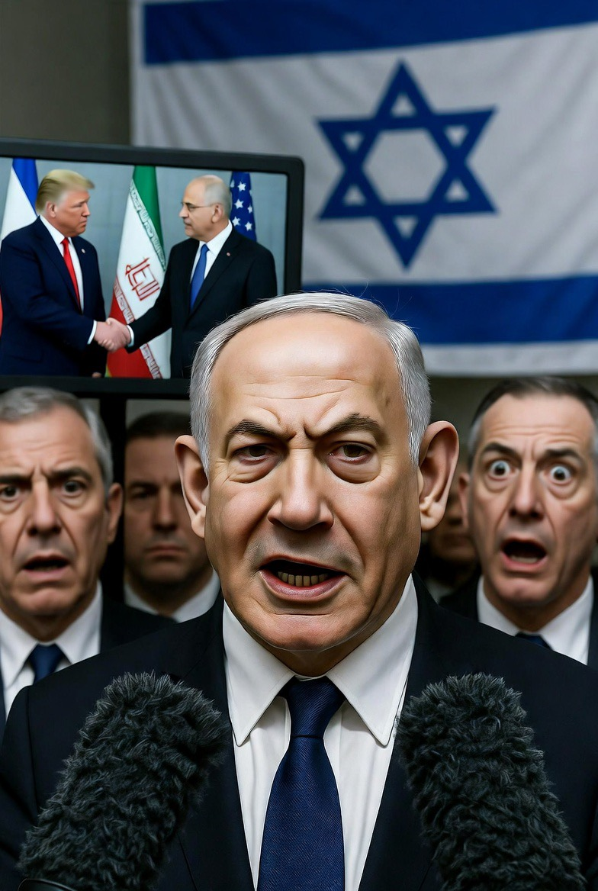

# Damai yang Membuat Israel Cemberut: Mengapa Kesepakatan AS-Iran Justru Membuka Konflik Baru?

*Ilustrasi (pic: Grok AI).*

  
***Perdamaian yang paling sulit bukanlah membuat musuh berhenti menembak. Melainkan meyakinkan pihak yang terluka bahwa ia boleh berhenti merasa takut***
  

Kesepakatan awal (framework agreement) antara AS dan Iran saat ini secara garis besar berisi tentang penghentian perang, pembukaan kembali Selat Hormuz, penghentian blokade laut AS terhadap Iran, dan rencana perundingan lebih lanjut mengenai program nuklir Iran.  

Beberapa laporan menyebut penandatanganan formal direncanakan pada Jumat, 19 Juni 2026 di Jenewa, dengan Pakistan dan Qatar berperan sebagai mediator. Namun detail finalnya masih berubah dan belum semua poin diumumkan secara terbuka.  

## Mengapa Israel Kecewa Berat?

Karena dari sudut pandang Israel, kesepakatan ini seperti: “Musuh utamaku berdamai dengan sahabat terdekatku… tapi senjata dan teknologi yang kutakutkan belum benar-benar hilang.”

Menurut berbagai laporan, kesepakatan awal ini tidak secara eksplisit memaksa Iran membongkar seluruh program nuklirnya.

Yang dibahas lebih banyak penghentian perang, verifikasi tertentu, pembatasan aktivitas, dan negosiasi lanjutan.  

Bagi Israel? Itu belum cukup.

## Mengapa Israel Tetap Ngeyel di Lebanon?

Karena Israel melihat Lebanon bukanlah Lebanon, tetapi Lebanon adalah Hezbollah. Dan Hezbollah sama dengan perpanjangan tangan Iran.

Maka logika keamanan Israel kira-kira: “Kalau Iran masih punya pengaruh di Lebanon, kami tidak bisa berhenti.”

Itulah sebabnya Benjamin Netanyahu menegaskan bahwa pasukan Israel akan tetap berada di Lebanon “selama diperlukan”, meskipun ada kesepakatan AS-Iran.  

## Jadi Israel Salah?

Nah… di sini geopolitik menjadi sangat abu-abu. 

Dari perspektif Israel, Iran pernah mendukung kelompok yang memusuhi Israel, yaitu Hezbollah yang memiliki persenjataan besar. 

Mereka takut: “Kalau kami berhenti sekarang, ancaman akan kembali beberapa tahun lagi. Makanya mereka memilih keamanan maksimum.

Tetapi dari perspektif kritik internasional, Israel sering dianggap terlalu mengandalkan kekuatan militer, sulit menerima kompromi, dan kadang memperlakukan “keamanan” sebagai alasan untuk “perang tanpa akhir.”

Karena kalau syarat damai adalah Iran harus menyerahkan SEMUA kemampuan nuklir, sementara Iran melihat program nuklirnya sebagai simbol kedaulatan, maka damai menjadi target yang hampir mustahil.

Israel memiliki trauma sejarah yang sangat besar. Tetapi kadang trauma menghasilkan paradoks.

Orang yang pernah hidup dalam ketakutan, bisa menjadi semakin mencintai perdamaian atau semakin takut mempercayai perdamaian.

Israel saat ini berada pada kondisi kedua. Mereka tidak bertanya: “Apakah Iran mau damai?” tetapi:“Bagaimana jika Iran pura-pura damai?”

Maka setiap perjanjian dipandang kurang keras, kurang menjamin, serta kurang aman.

## Tetapi Ada Masalah Besar…

Jika Israel berkata: “Kami akan terus menyerang sampai ancaman hilang total.” Pertanyaannya: Ancaman itu kapan hilang? 1 tahun? 10 tahun? 50 tahun? Atau… tidak pernah?

Karena jika standar keamanannya adalah nol risiko, maka tidak akan ada kesepakatan yang cukup. Tidak ada perdamaian yang cukup. Dan perang bisa berubah menjadi kondisi permanen.

## Damai Ini Sebenarnya Rapuh

Meskipun AS dan Iran tampak semakin dekat, ada tiga bom waktu:

1. Program nuklir Iran

Iran ingin mempertahankan teknologi sipilnya dan menjaga kedaulatan. Sementara Israel ingin pembatasan sangat ketat, bahkan pembongkaran total.

2. Hezbollah dan Lebanon

Iran ingin Lebanon masuk dalam gencatan senjata. Sedangkan Israel berkata: “Tidak.”
Inilah salah satu titik paling panas yang hampir menggagalkan negosiasi sebelumnya.  

3. Selat Hormuz

Pembukaan kembali Selat Hormuz sangat penting. Karena sekitar seperlima perdagangan minyak dunia melewati selat ini.
Tetapi kesepakatannya masih awal dan perusahaan pelayaran besar masih berhati-hati menunggu implementasi nyata.  

## Jadi… Apakah Israel “ngeyel”?

Kalau dilihat dari kritik internasional: Ya.
Karena Israel tampak sulit menerima perdamaian yang tidak memenuhi seluruh tuntutannya.

Tetapi… kalau dilihat dari sudut pandang keamanan Israel: Mereka takut.
Takut bahwa perdamaian hari ini hanya akan menjadi perang yang ditunda.

Maka paradoks terbesar Timur Tengah hari ini mungkin adalah:

AS berkata: “Perang harus dihentikan.”
Iran berkata: “Kami mau damai, tapi tidak mau dipermalukan.”
Israel berkata: “Kami mau damai… tapi kami tidak percaya damai.”

Dan sejarah sering menunjukkan, perdamaian yang paling sulit bukanlah membuat musuh berhenti menembak. Melainkan meyakinkan pihak yang terluka bahwa ia boleh berhenti merasa takut. 

  
**Referensi**

Reuters. (2026, June 15). Iran and US agree to halt war and reopen Hormuz, sending oil prices tumbling. Reuters.  

Reuters. (2026, June 14). US, Iran reach preliminary agreement to end war, signing set for Friday. Reuters.  

Reuters. (2026, June 16). What the US and Iran say is in the memorandum to end the war. Reuters.  

Reuters. (2026, June 16). UN human rights chief welcomes US-Iran deal, urges restraint in the region. Reuters.  

Reuters. (2026, June 16). Oil rebounds on concerns about US-Iran peace deal, restoration of supply. Reuters.  

Reuters. (2026, June 13). Trump says deal to end war will be signed on Sunday, Iran peace deal looms while new military action flares near Strait of Hormuz. Reuters.  

Reuters. (2026, June 14). US, Iran reach preliminary agreement to end war, signing set for Friday. Reuters. Bagian “Netanyahu says he stood firm”

Reuters. (2026, June 15). Iran and US agree to halt war and reopen Hormuz. Reuters. Bagian “NETANYAHU SAYS HE ‘STOOD FIRM’”.  
