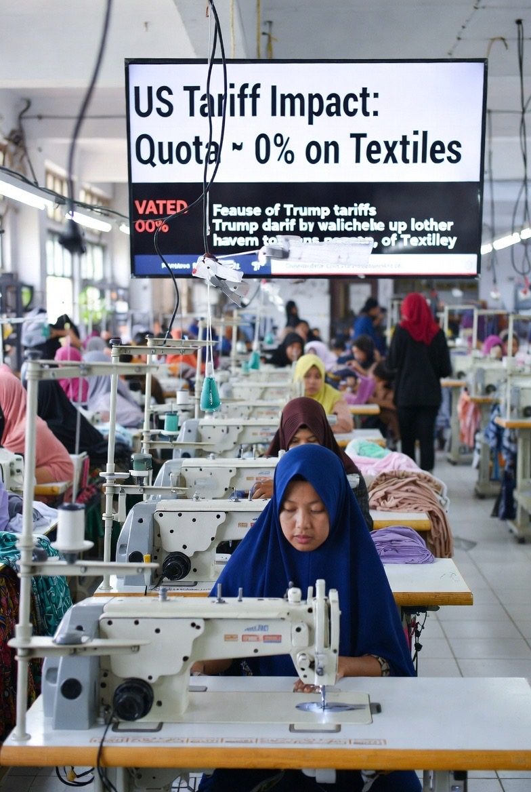

# Dampak Tarif Amerika Serikat terhadap Neraca Perdagangan Indonesia

*Ilustrasi dampak tarif (pic: Grok AI).*

  
***Tarif bukan sekadar angka bea masuk. Ia adalah instrumen geopolitik yang berdampak langsung pada neraca pembayaran, stabilitas makro, dan legitimasi kebijakan domestik***
  

Kita akan menganalisis dengan memakai tiga fondasi teori:

1.	Teori Keunggulan Komparatif (Ricardo)
Tarif mengganggu alokasi efisien produksi global.

2.	Model Partial Equilibrium (Grossman & Helpman)
Tarif menaikkan harga impor, menurunkan volume perdagangan, dan menciptakan deadweight loss.

3.	Asymmetric Interdependence (Keohane & Nye)
Negara yang lebih bergantung pada akses pasar akan lebih terdampak kebijakan tarif sepihak.

## Struktur Perdagangan Indonesia–AS

AS adalah salah satu pasar ekspor utama Indonesia, terutama untuk:

•	tekstil dan garmen

•	alas kaki

•	karet dan produk turunannya

•	furnitur

•	elektronik ringan

Dalam beberapa tahun terakhir, Indonesia menikmati surplus perdagangan dengan AS.

Artinya: Indonesia lebih banyak mengekspor ke AS dibanding mengimpor.

Tarif AS terhadap produk Indonesia akan berdampak langsung pada:

•	volume ekspor

•	penerimaan devisa

•	kinerja manufaktur padat karya

## Mekanisme Dampak Tarif

Ketika AS menaikkan tarif:

1️⃣ Harga produk Indonesia di pasar AS naik

2️⃣ Permintaan konsumen AS turun

3️⃣ Importir AS mencari alternatif (Vietnam, Meksiko, dll.)

4️⃣ Volume ekspor Indonesia menyusut

Dampak langsung:

•	Neraca perdagangan bisa menyempit

•	Sektor manufaktur terdampak

•	PHK potensial di industri padat karya

Dampak tidak langsung:

•	Tekanan nilai tukar rupiah

•	Penurunan penerimaan pajak ekspor

•	Sentimen investor negatif

## Elasticity Matters

Besarnya dampak tergantung pada:

•	Price elasticity of demand di AS

•	Substitusi produk (apakah mudah diganti negara lain?)

•	Struktur rantai pasok global

Jika produk Indonesia mudah digantikan, dampaknya besar.

Jika Indonesia punya niche market unik, dampaknya lebih kecil.

Literatur seperti:

•	Feenstra (2016) Advanced International Trade

•	Bagwell & Staiger (2002) The Economics of the World Trading System

menunjukkan bahwa tarif paling merugikan negara dengan posisi tawar lemah dalam rantai nilai global.

## Simulasi Teoretis 

Misal:

•	Ekspor Indonesia ke AS = USD 25 miliar

•	Tarif tambahan 10%

•	Elasticity permintaan = -1.5

Maka potensi penurunan ekspor bisa signifikan, tergantung substitusi.

Efeknya tidak hanya ke neraca perdagangan bilateral, tapi juga:

📉 pertumbuhan GDP

📉 lapangan kerja

📉 cadangan devisa

## Strategi Mitigasi

Dalam literatur ekonomi politik perdagangan, respons negara menengah biasanya:

1️⃣ Diversifikasi Pasar

Mengurangi ketergantungan pada satu pasar besar.

2️⃣ Upgrading Industri

Masuk ke produk bernilai tambah lebih tinggi yang kurang elastis.

3️⃣ Negosiasi Bilateral

Memanfaatkan FTA atau preferensi tarif.

4️⃣ Hedging Diplomatik

Menjaga hubungan baik tanpa kehilangan otonomi kebijakan.

## Risiko Jangka Panjang

Jika tarif menjadi alat politik berulang:

•	Ketidakpastian meningkat

•	Investasi manufaktur melemah

•	Negara terdorong ke proteksionisme balasan

Ini bisa menciptakan spiral perang dagang regional.

Literatur WTO menunjukkan bahwa tarif unilateral sering memicu retaliasi.

## 🔎 Inti Literatur

Konsensus akademik menunjukkan:

1.	Tarif hampir selalu mengurangi volume perdagangan bilateral.

2.	Negara dengan ketergantungan pasar tinggi lebih rentan terhadap shock tarif.

3.	Dampak makro tergantung elastisitas permintaan dan substitusi pasar.

4.	Negara kuat dapat menggunakan tarif sebagai instrumen tekanan geopolitik.

Tarif AS terhadap Indonesia:

✔️ Secara jangka pendek → menekan surplus perdagangan

✔️ Secara menengah → memukul sektor padat karya

✔️ Secara panjang → mendorong restrukturisasi ekonomi

Namun dampaknya sangat tergantung pada:

•	elastisitas permintaan

•	kemampuan diversifikasi

•	strategi diplomasi perdagangan

Tarif bukan sekadar angka bea masuk. Ia adalah instrumen geopolitik yang berdampak langsung pada neraca pembayaran, stabilitas makro, dan legitimasi kebijakan domestik.

  
**Referensi**

Bagwell, K., & Staiger, R. W. (2002).
The Economics of the World Trading System. MIT Press.

Feenstra, R. C. (2016).
Advanced International Trade: Theory and Evidence (2nd ed.). Princeton University Press.

Krugman, P. R., Obstfeld, M., & Melitz, M. J. (2018).
International Economics: Theory and Policy (11th ed.). Pearson.

Fajgelbaum, P. D., Goldberg, P. K., Kennedy, P. J., & Khandelwal, A. K. (2020).
The Return to Protectionism. Quarterly Journal of Economics, 135(1), 1–55.

Amiti, M., Redding, S. J., & Weinstein, D. E. (2019).
The Impact of the 2018 Tariffs on Prices and Welfare. Journal of Economic Perspectives, 33(4), 187–210.

Keohane, R. O., & Nye, J. S. (1977).
Power and Interdependence. Little, Brown.

Farrell, H., & Newman, A. L. (2019).
Weaponized Interdependence. International Security, 44(1), 42–79.

Anderson, J. E., & van Wincoop, E. (2003).
Gravity with Gravitas. American Economic Review, 93(1), 170–192.

Head, K., & Mayer, T. (2014).
Gravity Equations: Workhorse, Toolkit, and Cookbook. Handbook of International Economics, Vol. 4.

World Trade Organization
General Agreement on Tariffs and Trade (GATT), khususnya Pasal I dan 
