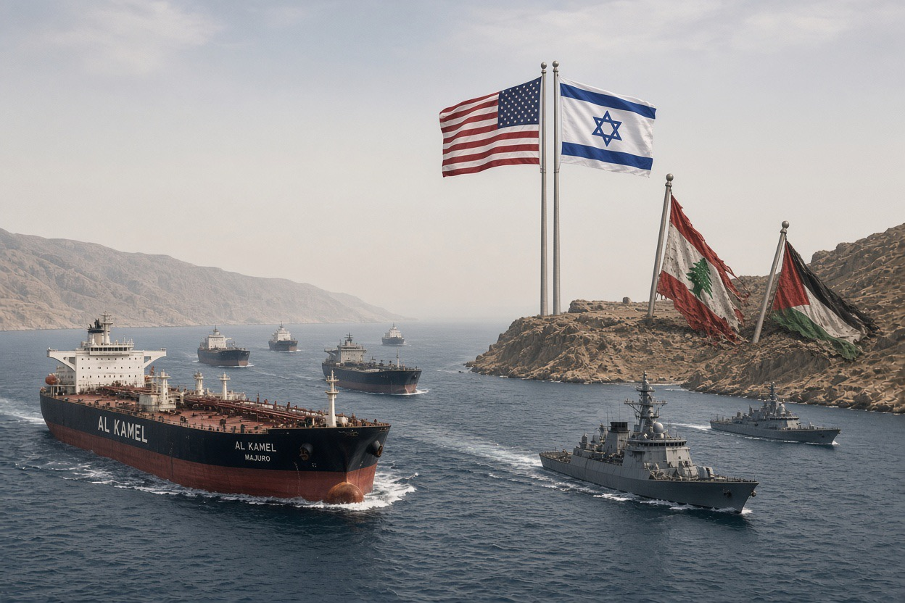

# Dari Hormuz ke Lebanon: Ketika “Keamanan” Berubah Menjadi Klaim Atas Ruang

*Ilustrasi (pic: Grok AI).*

  
***Kalau prinsipnya berubah menjadi “Kalau pasukanmu cukup kuat, peta bisa kamu gambar ulang,” maka dunia kembali ke hukum rimba***
  

Pada 14 Agustus, Trump mengatakan AS akan segera mendeklarasikan Selat Hormuz sebagai “US territory”. Pernyataan itu diberitakan berbagai media; Iran langsung menolak gagasan tersebut. 

Secara hukum laut, persoalannya serius.

Selat Hormuz merupakan selat yang digunakan untuk pelayaran internasional, dan rezim hukum laut internasional mengenal hak transit passage yang tidak boleh dihambat secara sewenang-wenang. Konvensi Hukum Laut PBB mengatur prinsip tersebut dalam Part III. 

Jadi seorang presiden tidak bisa mengubah status hukum sebuah selat internasional hanya dengan mengatakan: “Mulai sekarang ini wilayah kami.” Kalau begitu hukum internasional berubah menjadi fitur rename di Google Maps. 

Yang menarik, ada laporan bahwa seorang pejabat kemudian menggambarkan komentar Trump sebagai candaan. Tetapi Trump sendiri kembali mengulang gagasan tersebut, sehingga secara politik tidak bijaksana menganggapnya sekadar lelucon. 

## Analogi dengan Israel

Kita harus hati-hati membandingkan Hormuz dengan Palestina, karena status hukumnya berbeda.

Tetapi ada pola politik yang bisa dibandingkan, bahwa kekuatan besar mengubah kontrol de facto menjadi bahasa kepemilikan atau hak menentukan.

Israel misalnya tidak sekadar melakukan operasi militer di Lebanon.

Pada Juni, Israel menerbitkan peta yang menunjukkan zona kontrol militer yang diperluas di Lebanon selatan dan mengatakan tidak menutup kemungkinan melakukan operasi di luar zona tersebut. 

Pada 30 Juni, Netanyahu bahkan mengunjungi wilayah Lebanon yang diduduki Israel dan mengatakan Israel tidak akan menarik diri selama Hezbollah masih dianggap sebagai ancaman. 

Dan sampai 13 Agustus 2026, Menteri Pertahanan Israel Katz masih mengatakan IDF tidak akan meninggalkan Lebanon selatan sebelum Hezbollah dilucuti. 

Jadi ada sebuah pola yang sangat jelas, ketika militer masuk maka dibuat zona keamanan, zona dipertahankan, penarikan digantungkan pada kondisi keamanan, sehingga kehadiran menjadi berkepanjangan.

Ini bukan berarti Israel secara otomatis menyatakan “Lebanon sekarang milik Israel.” Tetapi secara geopolitik, kontrol teritorial sementara dapat berubah menjadi kondisi yang semakin permanen jika tidak ada mekanisme penarikan yang efektif.

Itulah problem occupation creep.

## Lebanon Sudah Melihat Sejarah ini Sebelumnya

Reuters melaporkan Israel kini menguasai kembali zona sekitar 10 km ke dalam wilayah Lebanon, sementara para veteran Israel sendiri mengingatkan bahwa strategi semacam ini menyerupai pendudukan Israel sebelumnya di Lebanon selatan yang berlangsung hingga 2000. 

Nah, ini menarik sekali.

Karena argumen Israel adalah “Kami membutuhkan zona ini demi keamanan.” Tetapi sejarah menunjukkan bahwa zona keamanan dapat berubah menjadi pendudukan berkepanjangan.

Dan pendudukan berkepanjangan kemudian melahirkan resistensi. Kemudian resistensi digunakan sebagai alasan untuk mempertahankan pendudukan. Inilah security dilemma yang berubah menjadi lingkaran setan.

Pada Februari 2026, media melaporkan adanya kelompok ekstremis Israel/settler yang masuk ke wilayah Lebanon selatan dan menyerukan pendudukan serta pembangunan permukiman. Bahkan terdapat aksi simbolik berupa penanaman pohon di wilayah Lebanon. 

Itu menunjukkan bahwa kelompok ideologis sipil menginginkan wilayah tersebut menjadi ruang permukiman Yahudi.

Dan di sinilah agama menjadi sangat berbahaya kalau dipakai sebagai lisensi teritorial. Kita akan memisahkan Yudaisme dari zionisme ekstremis.

Tidak ada dasar ilmiah untuk mengatakan bahwa orang Yahudi sama dengan ekspansionis. Itu sama kelirunya dengan mengatakan semua muslim adalah jihadist.

Yang kita analisis adalah gerakan politik tertentu dan ideologi tertentu, bukan DNA atau agama seseorang.

Tetapi ketika kelompok politik mengatakan bahwa suatu wilayah memiliki legitimasi religius sehingga penduduk yang sekarang tinggal di sana menjadi penghalang terhadap “hak historis”, maka agama dapat berubah menjadi teknologi legitimasi territorial.

Dan sejarah manusia penuh dengan bencana yang muncul ketika kalimat “Tanah ini milik kami karena Tuhan.” berubah menjadi “Karena itu manusia yang tinggal di sana harus pergi.”

Nah, di situlah lonceng bahayanya berbunyi. 

## Tepi Barat Menunjukkan Mekanisme Lonceng Bahaya

Reuters baru saja melaporkan kasus di Fasayil, Tepi Barat, ketika pemukim Israel mengambil sumber air Palestina dan mengalihkannya untuk fasilitas kolam wisata. Reuters juga melaporkan lebih dari 160 serangan terkait air oleh pemukim pada 2026 berdasarkan data PBB. 

Dan kasus Qusra bahkan lebih telanjang.

Pemukim mengepung rumah-rumah Palestina, memutus air dan listrik, serta menghalangi akses. Aktivis asing dan Israel yang mencoba mengirim bantuan juga menghadapi pembatasan militer, sehingga warga harus mengambil bantuan dari luar area. 

Ini bukan lagi debat abstrak tentang “siapa punya klaim historis.” Ini soal siapa yang dapat menggunakan air, tanah, rumah, jalan, dan ruang hidup.

Dalam studi konflik, itu adalah territorial control.

## Ironi yang Sangat Pahit

Israel mengatakan “Kami membutuhkan zona keamanan agar warga Israel aman.”

Sementara Palestina mengatakan “Kami kehilangan tanah karena zona keamanan dan permukiman.”

Lebanon mengatakan “Kami kehilangan wilayah karena zona keamanan Israel.”

Iran mengatakan “Kehadiran militer Israel adalah ancaman regional.”

Kemudian Israel menjawab “Lihat, mereka semua mengancam kami.”

Dan siklusnya kembali ke awal. Ancaman berubah menjadi pendudukan, lalu resistensi, kemudian ancaman, menjadi pendudukan lagi.

Ini adalah security dilemma yang mengalami self-reinforcement.

## Hormuz:  Versi lain dari Logika yang Sama

Trump mengatakan AS sudah memiliki kontrol atas Hormuz dan dapat mendeklarasikannya sebagai wilayah AS.

Secara geopolitik, bahasa seperti itu mempunyai fungsi. Ia mengubah “kami mengontrol akses” menjadi“kami berhak menentukan akses.”

Dan perbedaan antara keduanya sangat besar. Yang pertama adalah kapabilitas, sedangkan yang kedua adalah klaim legitimasi.

Begitu sebuah negara berhasil membuat dunia menerima klaim legitimasi tersebut, kekuasaan de facto dapat mulai memperoleh bentuk hukum atau politik de jure.

## Hobi “Ngaku-Ngaku” AS dan Israel

Dalam ilmu politik, kita bisa menyebutnya territorialization of power. Bahwa kekuatan tidak hanya diwujudkan dengan tank dan kapal perang.

Ia diwujudkan dengan peta, pos pemeriksaan, zona keamanan, izin bergerak, akses air, kontrol perbatasan, pangkalan, hukum, dan akhirnya narasi tentang siapa yang mempunyai hak atas ruang tersebut.

Itulah sebabnya peta sangat penting dalam konflik. Siapa yang menggambar garis sering kali sedang menentukan siapa yang dianggap “ada” di dalam garis itu.

Dan faktanya,  Israel memang mempertahankan pendudukan militer di Lebanon selatan dengan memperluas zona kontrol militernya. Kemudian kelompok ekstremis Israel menyerukan pendudukan/permukiman di Lebanon. 

Israel sebelumnya mempunyai sejarah pendudukan panjang di Lebanon selatan, sedangkan di Tepi Barat, ekspansi pemukiman, pengambilalihan tanah dan kekerasan pemukim terus menjadi persoalan serius. 

Dan sekarang Trump bahkan berbicara mengenai menjadikan Hormuz sebagai wilayah AS. 

Ada satu pola yang jauh lebih mengkhawatirkan daripada sekadar “Israel nakal” atau “Trump suka klaim wilayah”, yaitu ketika kekuatan militer memperoleh kontrol atas wilayah, selalu muncul godaan untuk mengubah kontrol sementara menjadi tatanan permanen.

Trump memperlihatkan versi ekstremnya dengan Hormuz “Kami mengontrolnya, maka kami akan menyebutnya milik kami.”

Israel memperlihatkan versi berbeda di Lebanon “Kami menduduki zona ini demi keamanan, dan kami tidak pergi sampai kondisi kami terpenuhi.”

Dan di Tepi Barat, persoalannya sudah lebih parah lagi, ketika tanah, air, permukiman, infrastruktur, menjadi pengusiran, benar-benar perubahan fakta di lapangan. 

Itulah sebabnya hukum internasional begitu keras terhadap perolehan wilayah melalui kekuatan. Sebab kalau prinsipnya berubah menjadi “Kalau pasukanmu cukup kuat, peta bisa kamu gambar ulang,” maka dunia kembali ke hukum rimba.

Dan lucunya, semua negara besar selalu mengatakan “Kami tidak sedang menjajah. Kami hanya sedang menjaga keamanan.” 

Kalimat itu adalah salah satu kalimat paling mahal dalam sejarah manusia. 

  
***References***

Al Jazeera. (2026, August 15). US President Trump says he will declare Strait of Hormuz US territory. Al Jazeera⁠

Reuters. (2026, August 13). After US criticism, Israel ties Lebanon withdrawal to Hezbollah disarmament. Reuters⁠

Reuters. (2026, August 14). Palestinian freshwater springs being seized by Israeli settlers. Reuters⁠

Reuters. (2026, August 14). Siege of Palestinian village draws US criticism as Israeli settlers dig in. Reuters⁠

Reuters. (2026, June 18). Israel talks with US over continuing its Lebanon troop deployment, officials say. Reuters⁠

Reuters. (2026, July 15). Occupied zone in Lebanon: Israeli military veterans see shadow of past wars. Reuters⁠

Reuters. (2026, July 17). EU reiterates its call for Israel to refrain from more settlement expansion. Reuters⁠

The New Arab. (2026, February). Israeli extremists enter southern Lebanon, call for settlements. The New Arab⁠

United Nations. (1982). United Nations Convention on the Law of the Sea, Part III: Straits used for international navigation. United Nations⁠
