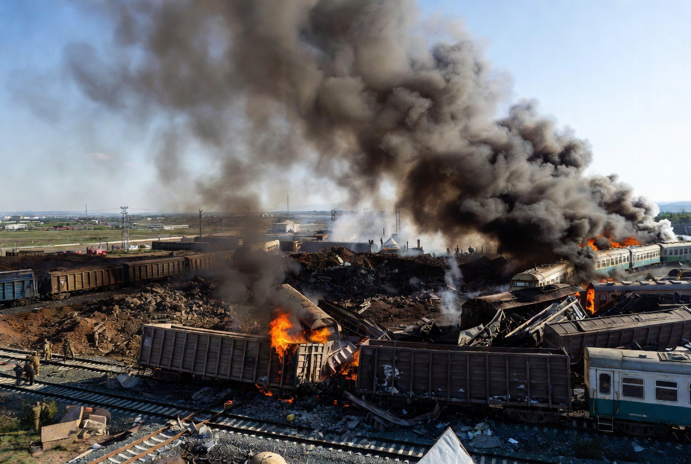

# Dari Perlindungan Kapal Dagang ke Perubahan Rezim? Menilai Tujuan Strategis Intervensi AS terhadap Iran dalam Perspektif Hubungan Internasional

*Ilustrasi (pic: Grok AI).*

  
***“Dalam politik internasional, peluru sering kali ditembakkan dengan bahasa keamanan, tetapi dibaca oleh sejarah sebagai perebutan kekuasaan.”***
  

Sejak dimulainya operasi militer AS terhadap Iran pada 2026, narasi resmi Washington menegaskan bahwa tindakan tersebut merupakan respons terhadap ancaman terhadap pelayaran internasional di Selat Hormuz dan ditujukan untuk menjaga stabilitas kawasan. 

Namun, di luar pernyataan resmi, muncul pertanyaan yang jauh lebih mendasar: Apakah operasi ini semata-mata bertujuan melindungi kebebasan navigasi, atau merupakan bagian dari strategi yang lebih luas untuk mengubah konfigurasi politik Iran?

Pertanyaan ini bukan sekadar retorika. Dalam kajian hubungan internasional, membedakan alasan langsung (proximate cause) dari tujuan strategis (strategic objective) merupakan langkah awal sebelum menarik kesimpulan.

## Politik Internasional Tidak Pernah Bergerak oleh Satu Motif

Realisme, salah satu teori dominan dalam hubungan internasional, berangkat dari asumsi sederhana, bahwa negara bertindak berdasarkan kepentingan nasional, bukan semata-mata alasan moral.

Karena itu, ketika pemerintah menyampaikan alasan resmi suatu operasi militer, ilmuwan politik tidak berhenti pada pertanyaan: “Apa yang mereka katakan?” melainkan melanjutkan dengan pertanyaan: “Apa kepentingan yang mungkin mereka kejar?”

Hans Morgenthau bahkan berpendapat bahwa kebijakan luar negeri sebaiknya dianalisis melalui konsep kepentingan yang didefinisikan sebagai kekuasaan (interest defined as power), bukan semata berdasarkan retorika moral.

## Kapal Dagang atau Arsitektur Kekuasaan Regional?

Serangan terhadap kapal dagang memang dapat menjadi dasar penggunaan kekuatan menurut tafsir tertentu atas hukum internasional, khususnya bila dianggap sebagai ancaman terhadap kebebasan navigasi.

Namun pertanyaan berikutnya adalah: Mengapa responsnya berupa serangan terhadap puluhan sasaran jauh dari lokasi insiden maritim?

Dalam teori strategi militer terdapat konsep: Center of Gravity (Clausewitz). Artinya, untuk menghilangkan ancaman, yang diserang bukan hanya gejala, tetapi pusat kemampuan lawan.

Di sinilah muncul dua interpretasi.

Interpretasi pertama mengatakan: Infrastruktur militer Iran harus dilemahkan agar ancaman terhadap pelayaran berhenti.

Interpretasi kedua menyatakan: Operasi tersebut secara bertahap menciptakan kondisi yang dapat melemahkan pemerintahan Iran secara keseluruhan.

Perbedaan keduanya tampak kecil, namun konsekuensinya sangat besar.

## Regime Change: Tujuan atau Konsekuensi?

Dalam literatur hubungan internasional, regime change tidak selalu berarti invasi untuk menduduki ibu kota.

Regime change dapat terjadi melalui tekanan ekonomi, isolasi diplomatik, operasi militer, perang informasi, hingga munculnya tekanan domestik yang melemahkan legitimasi pemerintah.

Artinya, perubahan rezim bisa menjadi tujuan eksplisit maupun konsekuensi strategis, tergantung pada kebijakan yang diambil dan dinamika konflik.

## Mengapa Publik Kini Lebih Skeptis?

Salah satu perubahan besar abad ke-21 adalah krisis kepercayaan terhadap narasi resmi.

Kasus Irak 2003 menjadi titik balik penting. Kala itu, keberadaan senjata pemusnah massal (WMD) dijadikan salah satu dasar utama invasi. Setelah perang usai, senjata tersebut tidak ditemukan sebagaimana yang diperkirakan.

Pengalaman tersebut membuat publik internasional menjadi jauh lebih kritis terhadap justifikasi perang berikutnya.

Libya 2011 juga memunculkan perdebatan serupa. Mandat perlindungan warga sipil berkembang menjadi jatuhnya rezim Muammar Gaddafi, sehingga sebagian akademisi mempertanyakan batas antara perlindungan sipil dan perubahan rezim.

Akibat pengalaman historis tersebut, setiap intervensi baru hampir selalu dipertanyakan: Apakah tujuan yang diumumkan akan tetap menjadi tujuan akhirnya?

Skeptisisme ini lahir dari pengalaman sejarah, bukan semata dari prasangka.

## Infrastruktur Sipil: Dilema Strategi Modern

Salah satu isu paling kontroversial adalah penargetan objek yang memiliki fungsi ganda (dual-use), seperti: rel kereta, jembatan, pelabuhan, ataupun pembangkit listrik.

Dalam hukum humaniter internasional, objek seperti ini dapat menjadi sasaran apabila memberikan kontribusi efektif terhadap operasi militer.

Namun hukum juga menetapkan prinsip distinction (pembedaan antara sasaran militer dan sipil), proportionality (proporsionalitas), dan precaution (kehati-hatian).

Karena itu, perdebatan bukan sekadar apakah suatu objek boleh diserang, tetapi juga apakah manfaat militer yang diperoleh sebanding dengan dampak kemanusiaan yang ditimbulkan.

## Perang Informasi: Medan Tempur Baru

Konflik modern tidak hanya berlangsung di udara dan darat. Ia juga berlangsung di ruang informasi.

Setiap pihak berusaha membangun legitimasi melalui narasi. AS menekankan perlindungan pelayaran dan stabilitas kawasan. Sementara Iran menekankan kedaulatan, agresi asing, dan penderitaan warga sipil. Akibatnya, publik internasional kemudian menjadi arena perebutan opini.

Di era media sosial, monopoli informasi hampir mustahil dipertahankan. Klaim dari semua pihak segera dibandingkan dengan citra satelit, dokumentasi lapangan, laporan organisasi internasional, dan analisis independen. 

Hal ini membuat legitimasi politik semakin bergantung pada kemampuan membuktikan klaim, bukan sekadar menyatakannya.

Benarkah operasi AS bertujuan melindungi kapal dagang? Bisa jadi, karena keamanan jalur pelayaran memang merupakan kepentingan strategis global.

Namun apakah terdapat kemungkinan bahwa operasi tersebut juga memiliki dimensi regime change? Hipotesis ini juga layak dikaji karena sejarah menunjukkan bahwa dalam beberapa konflik sebelumnya, tujuan yang diumumkan kepada publik berkembang menjadi perubahan pemerintahan.

Dengan demikian, pertanyaan ilmiah yang paling tepat bukanlah: “Apakah AS berbohong?” Melainkan “Sejauh mana tujuan operasional yang dinyatakan selaras dengan tujuan strategis jangka panjang?”

Dalam hubungan internasional, pertanyaan seperti ini lebih produktif daripada menerima atau menolak satu narasi secara utuh. Ia mendorong analisis berbasis bukti, membandingkan pernyataan resmi dengan pola tindakan, konteks historis, serta dampak nyata di lapangan. 

Di situlah ilmu politik bekerja: bukan sebagai pembela satu pihak, melainkan sebagai alat untuk menguji konsistensi antara retorika, strategi, dan realitas.

  
**Referensi**

Bellamy, A. J. (2015). The responsibility to protect: A defense. Oxford University Press.

International Committee of the Red Cross. (n.d.). Conduct of hostilities. https://casebook.icrc.org/law/conduct-hostilities

Morgenthau, H. J. (1948/2006). Politics among nations: The struggle for power and peace (7th ed.). McGraw-Hill.

Oxford Public International Law. (n.d.). Regime change. https://opil.ouplaw.com

Reuters. (2026, July 9). Iran says it hits U.S. military targets as conflict escalates.

Yale Law Journal. (2025). The dangerous rise of dual-use objects in war. https://yalelawjournal.org
