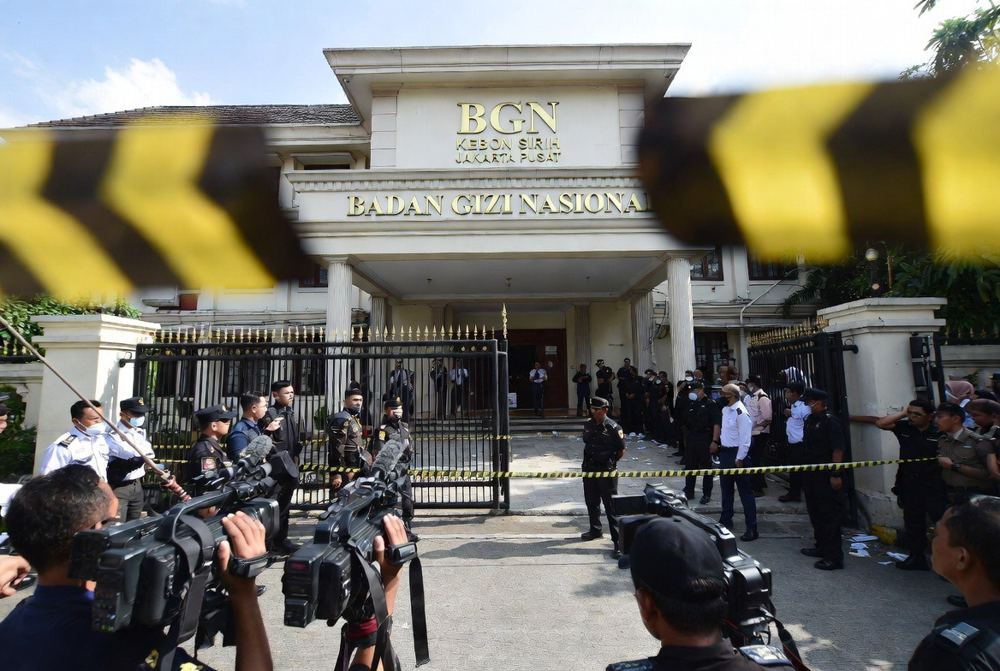

# Dari Program Kebanggaan Menjadi Skandal Nasional: Babak Baru Kasus BGN per 4 Juni 2026

*Ilustrasi (pic: Grok AI).*

  
***Apakah ini akhir cerita? Atau justru awal dari pembongkaran jaringan yang lebih besar?***
  

Per 4 Juni 2026, kasus Badan Gizi Nasional (BGN) memasuki fase yang jauh lebih serius dibanding sehari sebelumnya. 

Jika pada 3 Juni publik masih melihat penggeledahan dan pemeriksaan, maka pada 4 Juni Kejaksaan Agung telah menetapkan dan menahan mantan Kepala BGN Dadan Hindayana beserta dua mantan wakilnya sebagai tersangka dugaan korupsi tata kelola Program Makan Bergizi Gratis (MBG).  

Perkembangan ini mengubah status kasus dari sekadar penyelidikan menjadi krisis politik, birokrasi, dan kepercayaan publik terhadap salah satu program unggulan pemerintahan.

## Apa yang Berubah Hari Ini?

Kemarin publik bertanya: “Apakah benar ada kasus?”
Hari ini pertanyaannya berubah menjadi: “Seberapa besar kasusnya?”

Karena kini terdapat: penetapan tersangka, penahanan, penggeledahan, penyitaan barang bukti, dan pemeriksaan intensif oleh Jampidsus Kejagung terhadap tiga mantan pimpinan tertinggi BGN.  

## Yang Membuat Kasus Ini Tidak Biasa

Biasanya pejabat dicopot. Lalu beberapa bulan kemudian muncul proses hukum.

Di sini?

Urutannya nyaris seperti adegan film politik.

📍 2 Juni malam:
Presiden mengganti pimpinan BGN.

📍 3 Juni pagi:
Kejagung menggeledah kantor BGN.

📍 3 Juni sore:
Mantan pimpinan ditetapkan tersangka.

📍 4 Juni:
Penahanan resmi berlangsung.  

Dalam ilmu politik birokrasi, pola secepat ini sering menunjukkan satu hal: Negara kemungkinan sudah mengetahui adanya masalah jauh sebelum publik mengetahuinya.

Bukan berarti konspirasi. Tetapi biasanya informasi awal sudah beredar di lingkaran pengawasan internal sebelum meledak ke media.

## Dugaan Kasusnya Apa?

Menurut keterangan yang muncul hingga hari ini, penyidikan mengarah pada dugaan korupsi tata kelola MBG, termasuk dugaan praktik “jual beli titik” SPPG (Satuan Pelayanan Pemenuhan Gizi).  

Jika dugaan ini terbukti, maka persoalannya bukan sekadar uang. Melainkan akses, karena titik SPPG adalah simpul distribusi utama program MBG.

Dalam bahasa sederhana, yang diperebutkan bukan hanya anggaran tetapi juga pintu masuk ke proyek nasional.

## Mengapa Pemerintah Bergerak Sangat Cepat?

Ada hipotesis menarik. Pemerintah mungkin sedang menyelamatkan bukan pejabatnya, tetapi programnya.

MBG merupakan salah satu program paling identik dengan pemerintahan saat ini. Jika pemerintah dianggap lamban, kepercayaan publik terhadap MBG bisa runtuh.

Sebaliknya jika pemerintah bertindak cepat, pesan yang muncul adalah: “Program tetap berjalan. Yang bermasalah akan diproses.”

Secara politik, ini strategi damage control yang cukup rasional.

## Apakah Ini Akan Berhenti pada Tiga Orang?

Nah… ini pertanyaan paling panas.

Karena hingga hari ini Kejagung masih menghitung kerugian negara dan masih membuka kemungkinan adanya pihak lain yang terlibat.  

Dalam kasus korupsi besar biasanya ada tiga lapis:

**Lapis Pertama**

Pelaksana

**Lapis Kedua**

Pengambil keputusan

**Lapis Ketiga**

Penerima manfaat

Jika penyidikan berhenti di lapis pertama atau kedua, publik akan bertanya: “Lalu siapa yang menikmati hasil akhirnya?”

## Ujian Terbesar Bukan Penangkapan

Ironisnya, ujian terbesar pemerintah bukanlah penahanan tersangka. Ujian terbesar adalah: apakah MBG tetap berjalan?

Karena bagi masyarakat, anak tetap harus makan, sekolah tetap harus menerima distribusi, dan program tetap harus berjalan.

Kalau pelayanan terganggu, maka skandal hukum akan berubah menjadi krisis kebijakan.

Per 4 Juni 2026, kasus BGN telah naik kelas dari dugaan menjadi perkara pidana dengan tersangka yang telah ditahan. 

Mantan Kepala BGN Dadan Hindayana dan dua mantan wakilnya resmi berada dalam tahanan Kejaksaan Agung terkait dugaan korupsi tata kelola Program Makan Bergizi Gratis.  

Namun pertanyaan terbesar belum terjawab: Apakah ini akhir cerita? Atau justru awal dari pembongkaran jaringan yang lebih besar?

Karena dalam sejarah politik Indonesia, penahanan pejabat tinggi sering kali bukan bab terakhir. Justru sering menjadi bab pertama.

  
**Referensi**

ANTARA. (2026, June 4). Kejagung tahan 3 eks pejabat BGN usai ditetapkan tersangka korupsi tata kelola MBG.  

ANTARA. (2026, June 4). Kejagung ungkap jemput paksa Dadan Hindayana.  

Liputan6. (2026, June 3). Kejagung tetapkan Dadan Hindayana, Sony, dan Lodewyk tersangka tata kelola MBG.  

NU Online. (2026, June 4). Kejagung tahan mantan Kepala BGN Dadan Hindayana terkait dugaan korupsi program MBG.  

Suara.com. (2026, June 3). Pakai rompi pink dan diborgol, Kejagung resmi tahan eks Kepala BGN Dadan Hindayana Cs.  
