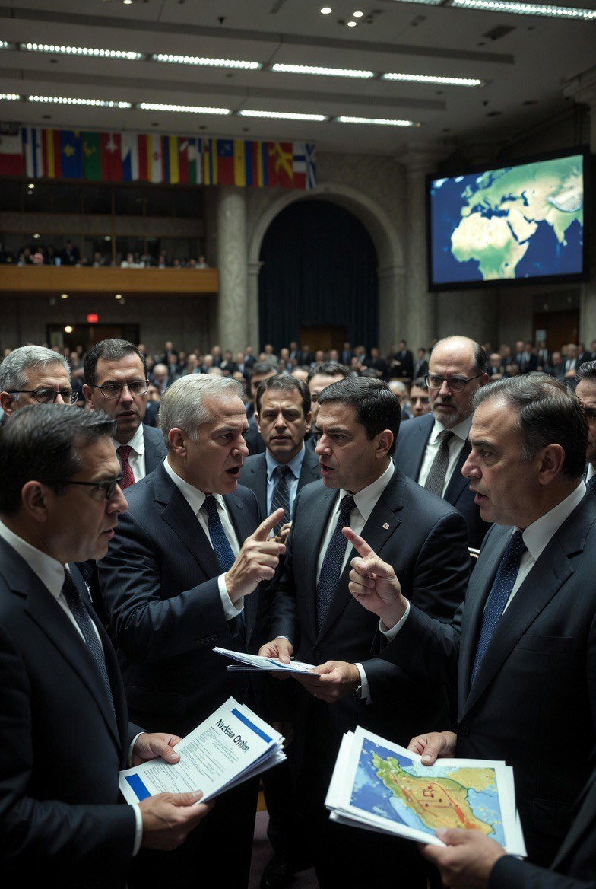

# Dari Rumor ke Realitas: Analisis Epistemik atas Lobi Politik, Ketertundaan Verifikasi, dan Kegagalan Antisipasi dalam Keputusan Strategis Negara

*Ilustrasi rumor (pic: Grok AI).*

  
***Yang paling berbahaya bukan kebohongan… tapi kebenaran yang datang terlambat***
  

Artikel ini menganalisis bagaimana rumor politik dan dugaan lobi sering kali mendahului fakta empiris dalam dinamika kebijakan negara. 

Dengan pendekatan epistemologi politik, teori lobi, dan decision-making under uncertainty, tulisan ini menunjukkan bahwa banyak keputusan strategis besar didahului oleh sinyal lemah (weak signals) yang diabaikan karena tidak terverifikasi. 

Ketika sinyal tersebut terbukti benar, respons sering terlambat, menciptakan kesan bahwa “rumor menjadi kenyataan”.

## Pendahuluan

Dalam politik global, informasi tidak selalu hadir dalam bentuk fakta yang jelas sejak awal. 

Sering kali, publik pertama kali menerima:

•	rumor

•	bocoran

•	spekulasi

Namun, dalam beberapa kasus: rumor tersebut kemudian terkonfirmasi sebagai realitas.

Fenomena ini memunculkan pertanyaan: apakah rumor hanyalah kebisingan… atau justru sinyal awal dari keputusan yang belum diumumkan?

## Metodologi

Pendekatan yang digunakan:

1.	Epistemologi politik (bagaimana pengetahuan terbentuk)

2.	Analisis lobi dan pengaruh kebijakan

3.	Teori pengambilan keputusan dalam ketidakpastian

## Epistemologi Politik

Menurut Karl Popper: pengetahuan berkembang melalui dugaan dan pengujian (conjectures and refutations).

Dalam konteks politik:

•	rumor = dugaan

•	verifikasi = proses yang sering tertunda.

## Lobi dan Pengaruh Kebijakan

Menurut Robert Dahl: kekuasaan tidak selalu terlihat di permukaan, tetapi bekerja melalui jaringan pengaruh.

Lobi sering:

•	tidak transparan

•	tidak terdokumentasi publik

•	baru terlihat setelah kebijakan keluar

## Weak Signal Theory

Dalam studi strategi: keputusan besar sering didahului oleh sinyal kecil yang diabaikan.

Karena:

•	dianggap tidak kredibel

•	tidak cukup bukti

•	atau bertentangan dengan narasi resmi.

## Analisis

A. Rumor sebagai Prekursor Realitas

Rumor sering muncul karena:

•	kebocoran internal

•	fragmentasi informasi

•	interpretasi terhadap pergerakan elite.

Ketika rumor kemudian terbukti: publik merasa “sudah tahu sejak awal” padahal sebelumnya tidak dianggap serius.

B. Lobi sebagai Mekanisme Tersembunyi

Lobi bekerja dalam ruang:

•	tertutup

•	informal

•	tidak selalu tercatat

Akibatnya: keputusan publik sering tampak tiba-tiba, padahal telah melalui proses panjang di belakang layar.

C. Keterlambatan Verifikasi

Institusi formal membutuhkan:

•	bukti

•	prosedur

•	konfirmasi berlapis

Sementara realitas politik bergerak lebih cepat.

Akibatnya: saat kebenaran terverifikasi…keputusan sudah terjadi.

D. Ilusi “Terlambat Menyadari”

Fenomena psikologis yang muncul:

•	hindsight bias (seolah sudah tahu sejak awal)

•	distrust terhadap institusi

•	meningkatnya kepercayaan pada rumor.

E. Risiko Epistemik

Jika masyarakat terlalu cepat percaya rumor:

•	rentan manipulasi.

Jika terlalu menolak rumor:

•	kehilangan sinyal penting.

Maka dilema yang muncul: antara skeptisisme dan kewaspadaan.

## Diskusi

Hal di atas menunjukkan tiga dinamika utama:

1. Politik Tidak Transparan Secara Penuh

Banyak keputusan penting tidak muncul dari ruang publik.

2. Kebenaran Bersifat Tertunda

Apa yang hari ini dianggap rumor, besok bisa menjadi fakta.

3. Publik Berada dalam Ketidakpastian Permanen

Tidak ada posisi yang sepenuhnya aman antara percaya dan ragu.

Rumor bukan selalu kebohongan.

Fakta bukan selalu langsung terlihat.

Di antara keduanya, terdapat: ruang abu-abu tempat keputusan besar sebenarnya dibentuk.

Dan sering kali: ketika publik akhirnya memahami apa yang terjadi… sejarah sudah bergerak terlalu jauh untuk diubah.

  
**Referensi**

Popper, K. (1959). The logic of scientific discovery. Routledge.

Dahl, R. (1961). Who governs? Democracy and power in an American city. Yale University Press.

Ansoff, H. I. (1975). Managing strategic surprise by response to weak signals. California Management Review.

Tetlock, P. (2005). Expert political judgment. Princeton University Press.
