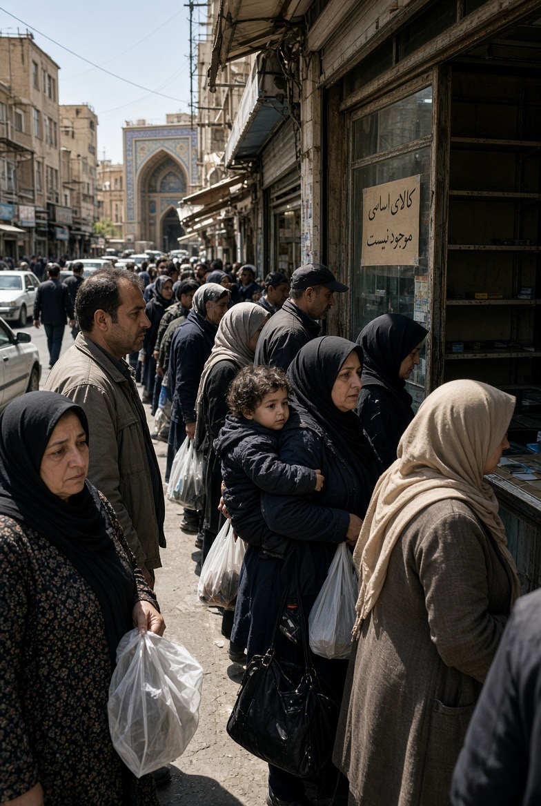

# Dari “Membela Rakyat Iran” ke “Economic D-Day”: Tujuan AS Bergeser Menjadi Regime Change?

*Ilustrasi (pic: Grok AI).*

  
***Jika seseorang mengaku sedang menyelamatkan rakyat dari pemerintahnya, tetapi metode penyelamatannya membuat rakyat kehilangan makanan, obat, pekerjaan, dan daya beli, maka klaim moralnya harus diperiksa***
  

Narasi politiknya kira-kira seperti ini, tekan rezim maka ekonomi akan runtuh, rakyat kehilangan kepercayaan, dan endingnya rezim menyerah atau berubah.

Masalahnya, yang pertama kali merasakan tekanan ekonomi bukan struktur kekuasaan abstrak tetapi mereka manusia yang membeli beras, obat, bahan bakar, dan membayar sewa.

Dan data terbaru menunjukkan Iran memang sedang mengalami tekanan berat. Rial jatuh ke rekor sekitar 2,02 juta per dolar, sementara harga kebutuhan pokok seperti beras dan daging sapi melonjak. AP secara eksplisit mencatat bahwa paket baru Washington datang ketika ekonomi Iran sudah berada dalam krisis berat. 

Jadi kengerian ini bukan sekadar retorika.

## Problem Klasik Sanctions Paradox

Sanksi dirancang untuk menyakiti negara atau rezim. Tetapi ekonomi tidak punya tombol: “Hanya sakiti pemerintah, jangan sentuh rakyat.”

Ketika ekspor minyak ditekan, maka menurunlah pendapatan devisa  dan impor, imbasnya mata uang melemah, harga barang impor serta inflasi melonjak, disusul menurunnya daya beli rakyat, perusahaan dan lapangan kerja.

Dan bahkan kalau obat-obatan secara formal dikecualikan dari sanksi, sistem perbankan internasional dapat membuat perusahaan asing takut bertransaksi dengan Iran.

Fenomena ini disebut over-compliance. Perusahaan memilih “Daripada kena sanksi AS, mending jangan transaksi dengan Iran sama sekali.”

Akibatnya pengecualian kemanusiaan yang tertulis di atas kertas tidak selalu sama dengan akses nyata di lapangan. 

Kajian tentang sanksi AS terhadap Iran telah mendokumentasikan problem tersebut, termasuk dampaknya terhadap akses kesehatan. 

## Trump Sedang “Menghukum Rakyat Iran”?

Secara formal, pemerintah AS akan mengatakan: Tidak. Targetnya rezim, sumber pendapatan, jaringan perdagangan, dan aktor yang mendukung pemerintah Iran.

Dan itu penting untuk diakui. Washington memang tidak mengatakan: “Mari kita buat rakyat Iran kelaparan.” Tetapi dalam analisis kebijakan, niat dan konsekuensi harus dipisahkan.

Sebuah kebijakan dapat menargetkan pemerintah, tetapi menghasilkan biaya besar bagi masyarakat.

Karena itu pertanyaan ilmiahnya bukan “Apakah Trump sengaja ingin menyiksa rakyat Iran?” Kita belum punya dasar untuk menyimpulkan itu.

Pertanyaan yang lebih kuat adalah “Apakah pemerintah AS mengetahui bahwa tekanan ekonomi akan menghasilkan penderitaan sipil, dan apakah skala manfaat strategisnya sebanding dengan biaya kemanusiaannya?”

## Economic D-Day

Bessent menggambarkan strategi baru bernama “economic D-Day”. Washington ingin memutus sumber pendapatan Iran dan meminta negara-negara lain ikut memutus hubungan ekonomi dengan Teheran, dengan ancaman sanksi sekunder. 

Ini menunjukkan perubahan strategi, jika pada fase pertama dilakukan military pressure, maka fase berikutnya adalah di nancial pressure, dengan tujuan memaksa Tehran capitulate.

CBS melaporkan bahwa sanksi baru tersebut dimaksudkan untuk memberikan tekanan ekonomi guna memaksa pemerintahan Iran menyerah dalam perang. 

Jadi ya, kalau kita membaca instrumen kebijakannya, ini sudah jauh lebih besar daripada sekadar “melindungi rakyat Iran”.

## Apakah itu Berarti Regime Change?

Di sinilah kita harus hati-hati.

Tekanan maksimum tidak sama dengan otomatis regime change. Secara strategis ada setidaknya empat kemungkinan:

A. Coercion

Iran dipaksa menerima kesepakatan.

B. Capitulation

Iran menyerah terhadap tuntutan utama AS.

C. Leadership change

Pemimpin berubah tetapi sistem tetap bertahan.

D. Regime change

Struktur politik Republik Islam sendiri runtuh atau digantikan.

Sanksi dapat diarahkan untuk mencapai A atau B tanpa secara eksplisit menargetkan D.

Tetapi kalau AS mengatakan: “Kami akan membuat ekonomi rezim runtuh sampai mereka menyerah.”dan tekanan terus diperluas sampai negara menjadi tidak stabil, maka regime change dapat menjadi konsekuensi yang diharapkan, risiko yang diterima, atau tujuan tersembunyi, tergantung bukti mengenai niat pembuat kebijakan.

Itulah yang harus kita bedakan.

## Tidak Muncul dari Ruang Hampa

Perang 2026 sendiri sudah memperlihatkan bahwa persoalan ini bukan sekadar nuklir.

Council on Foreign Relations mencatat bahwa serangan AS–Israel pada Februari 2026 menargetkan kepemimpinan, fasilitas nuklir dan militer Iran, termasuk pembunuhan Ali Khamenei. 

Setelah itu muncul tekanan untuk mengguncang kemampuan pemerintahan Iran.

Jadi kalau sekarang Washington berkata:“Kami akan memutus seluruh sumber pendapatan Iran.” sangat masuk akal untuk bertanya: Apakah tujuan akhirnya hanya perubahan perilaku Iran, atau perubahan rezim Iran?

Pertanyaan itu sah. Tetapi jawabannya harus berdasarkan bukti, bukan otomatis diasumsikan.

## Regime Change melalui Economic Strangulation: Paradoks Politik

Washington mungkin berharap ekonomi hancur, rakyat marah, rakyat memberontak, akhirnya rezim jatuh.

Tetapi ada kemungkinan lain, ekonomi hancur, rakyat menderita, nasionalisme meningkat, akibatnya rakyat justru berkumpul melawan musuh eksternal.

Ini dikenal dalam literatur sebagai rally-around-the-flag effect.

Rezim yang sedang ditekan dari luar bisa mengatakan: “Lihat! Amerika ingin menghancurkan negara kita.” Dan oposisi terhadap pemerintah dapat berubah menjadi:“Sekarang bukan waktunya menjatuhkan pemerintah. Kita sedang diserang.”

Jadi sanksi tidak otomatis menghasilkan revolusi.

Bahkan seorang mantan pejabat Departemen Keuangan AS baru-baru ini mengatakan sanksi saja tidak cukup untuk menjatuhkan rezim Iran. 

## Rakyat Iran berada di posisi paling absurd

Ini yang paling tragis. 

Mereka dapat tidak menyukai pemerintahnya.
Tetapi kemudian datang tekanan eksternal:“Kami akan menghancurkan ekonomi pemerintahmu supaya kamu bebas.”

Rakyat menjawab: “Masalahnya, saya yang harus membeli makanan dengan rial yang ambruk.” 

Itulah agency problem dalam politik intervensi.

Negara besar berbicara tentang demokrasi, keamanan, nuklir, regime. Sementara rakyat berbicara tentang harga roti, obat, listrik, pekerjaan, rumah. Dua bahasa politik yang tidak selalu bertemu.

## Senjata Politik

Pemerintah Iran sekarang mengatakan rakyat akan menghadapi konsekuensi tekanan AS, tetapi negara sudah menyiapkan langkah menghadapi pemutusan ekspor. Reuters juga mencatat pemimpin Iran mengakui tekanan ekonomi yang berat. 

Jadi ada perang narasi antara Washington: “Kami menekan rezim.” dengan Tehran: “Washington menghukum rakyat Iran.”Sementara Rakyat menjawab: “Harga makanan naik. Kami yang hidup di tengahnya.”

Dan ketiganya bisa memiliki sebagian kebenaran sekaligus.

## Faktor China 

Ini membuat strategi AS jauh lebih rumit.

China merupakan pembeli utama minyak Iran. Reuters melaporkan impor minyak Iran ke China turun tajam pada Agustus setelah tekanan AS meningkat, tetapi jaringan perdagangan tetap bertahan melalui penyuling independen dan mekanisme pembayaran alternatif. 

Jadi Washington sebenarnya sedang mencoba mengubah Iran menjadi negara yang secara ekonomi sulit bertransaksi dengan dunia. Itulah mengapa secondary sanctions sangat penting.

Washington tidak hanya berkata: “Jangan berbisnis dengan Iran.” Tetapi: “Kalau kalian berbisnis dengan Iran, kalian juga bisa kehilangan akses ke sistem ekonomi AS.”

Itu adalah bentuk extraterritorial economic power. Dan Iran menyebutnya sebagai pelanggaran terhadap kedaulatan negara lain. 

## Hormuz

Ini bagian yang sangat ironis.

AS menekan Iran secara ekonomi, Iran menekan lalu lintas Hormuz. AS mengancam negara yang membantu Iran, Iran mengancam kapal yang tidak mematuhi aturan transitnya.

Akibatnya, perdagangan turun, risiko pelayaran,  biaya transportasi, dan harga energi melambung.

Dan Reuters melaporkan lalu lintas Hormuz telah jatuh drastis sementara ketegangan mengenai sanksi meningkat. 

Jadi strategi yang dimaksudkan untuk mengisolasi Iran sekaligus menciptakan risiko bahwa ekonomi global ikut membayar tagihannya.

## Apakah Trump “Sudah Berhenti Membela Rakyat Iran”?

Retorikanya mungkin masih bisa dikemas sebagai pembelaan rakyat Iran, tetapi instrumen kebijakannya semakin sulit dipertahankan sebagai kebijakan yang terutama berorientasi pada kesejahteraan rakyat Iran.

Karena sekarang tujuan operasionalnya semakin jelas, menghancurkan kapasitas ekonomi Iran sampai pemerintah Iran menyerah.

Dan kalau strategi tersebut menerima penderitaan rakyat sebagai biaya yang dapat diterima, maka hal itu telah bergerak dari humanitarian rhetoric ke coercive statecraft.bItu dua hal yang sangat berbeda.

Kalau Washington benar-benar ingin membebaskan rakyat Iran, maka strategi yang paling konsisten bukanlah sekadar potong minyak, tekan bank, jatuhkan rial, tekan perdagangan, lalu berharap rakyat menggulingkan pemerintah.

Strategi yang lebih konsisten dengan tujuan kemanusiaan adalah tekan aktor pemerintah yang spesifik, pengecualian kemanusiaan yang benar-benar berfungsi, jalur pembayaran obat/makanan yang terlindungi, diplomasi, dan negosiasi keamanan.

Karena ada prinsip sederhana, jika seseorang mengaku sedang menyelamatkan rakyat dari pemerintahnya, tetapi metode penyelamatannya membuat rakyat kehilangan makanan, obat, pekerjaan, dan daya beli, maka klaim moralnya harus diperiksa, bukan diterima begitu saja.

Dari perkembangan saat ini, kecurigaan bahwa Washington sedang menggunakan tekanan ekonomi sebagai instrumen untuk memaksa perubahan politik Iran bukanlah tuduhan yang absurd. 

Pergeseran dari serangan militer ke economic D-Day, ancaman terhadap seluruh jaringan perdagangan Iran, dan tuntutan agar negara lain ikut mengisolasi Teheran menunjukkan bahwa Washington sedang menaikkan coercive leverage secara drastis. 

Dan ironi terbesarnya?

Washington ingin membuat rezim Iran merasa tidak punya pilihan, Tehran ingin membuat Washington merasa perang tidak punya jalan keluar, sementara rakyat Iran hanya ingin hidupnya tidak semakin mahal.

Itulah manusia yang sering hilang dari peta strategi negara besar. 

  
**Referensi**

Reuters. (2026, August 24). US announces expansion of sanctions in “economic onslaught” on Iran. 

Associated Press. (2026, August 24). Bessent says new US sanctions aim to block all potential sources of revenue for Iran. 

Laudati, D., & Pesaran, M. H. (2021). Identifying the effects of sanctions on the Iranian economy using newspaper coverage. Cambridge Working Papers in Economics. 

Kokabisaghi, F. (2018). Assessment of the effects of economic sanctions on Iranians’ health. Archives of Public Health, 76, 15. 

Farzanegan, M. R. (2025). The effect of international sanctions on the size of Iran’s middle class. European Journal of Political Economy. 

Farzanegan, M. R., & Batmanghelidj, E. (2023). International sanctions and internal conflict: The case of Iran. SSRN. 

Human Rights Watch. (2019). “Maximum pressure”: U.S. economic sanctions harm Iranians’ right to health. 
