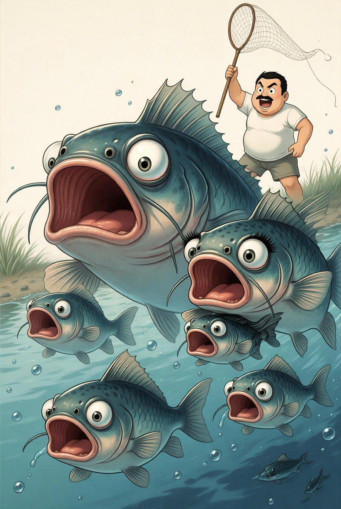

# Dari “Pembantaian” Menuju Pengelolaan Beradab: Pendekatan Humanis dalam Pengendalian Ikan Sapu-Sapu di Ekosistem Perkotaan

*Ilustrasi penusnahan massal (pic: Grok AI).*

  
***Ikan sapu-sapu bukan musuh, melainkan indikator kegagalan manusia dalam menjaga ekosistem***
  

Ledakan populasi ikan sapu-sapu (Pterygoplichthys spp.) di perairan perkotaan seperti Jakarta menimbulkan dilema ekologis dan etis. 

Sebagai spesies invasif, ikan ini terbukti mengganggu keseimbangan ekosistem lokal. Namun, pendekatan pengendalian berbasis pemusnahan massal menimbulkan kritik moral. 

Tulisan ini mengkaji alternatif pengendalian yang lebih humanis tanpa mengorbankan stabilitas ekosistem, melalui pendekatan bioutilization, restorasi ekologi, dan etika lingkungan.

## Pendahuluan

Introduksi spesies non-native oleh aktivitas manusia telah menjadi salah satu penyebab utama krisis biodiversitas global. 

Ikan sapu-sapu, yang awalnya dipelihara sebagai ikan akuarium, kini menjadi dominan di banyak sungai Indonesia.

Dilema muncul: apakah pengendalian harus dilakukan melalui eliminasi agresif, atau dapatkah ditemukan pendekatan yang lebih beradab?

## Karakteristik Ekologis Ikan Sapu-Sapu

Ikan sapu-sapu memiliki keunggulan adaptif:

toleransi tinggi terhadap polusi

reproduksi cepat

minim predator alami

kemampuan mengonsumsi detritus

Karakteristik ini menjadikannya superior di ekosistem yang terganggu.

## Dampak Ekologis

1. Kompetisi dengan spesies lokal

Mengurangi ketersediaan sumber daya bagi ikan asli.

2. Degradasi habitat

Aktivitas menggali menyebabkan erosi tepi sungai.

3. Dominasi populasi

Mengubah struktur komunitas biologis secara signifikan.

## Kritik terhadap Pendekatan Pemusnahan

Pendekatan konvensional: “eradikasi melalui penangkapan dan pemusnahan massal”

dikritik karena:

tidak menyentuh akar masalah (kerusakan ekosistem)

berpotensi tidak efektif jangka panjang

menimbulkan pertanyaan etis tentang perlakuan terhadap makhluk hidup.

Pendekatan Humanis dalam Pengendalian

1. Bioutilization (Pemanfaatan Berkelanjutan)

Mengubah persepsi dari “hama” menjadi “sumber daya”:

bahan pakan ternak

pupuk organik

produk olahan setelah uji keamanan

➡️ mengurangi populasi tanpa pemborosan biologis

2. Restorasi Ekosistem

Fokus utama:

perbaikan kualitas air

pengurangan limbah

reintroduksi spesies lokal

ekosistem sehat akan menekan dominasi invasif secara alami

3. Edukasi dan Pencegahan

Mengatasi akar masalah:

larangan pelepasan ikan asing

peningkatan kesadaran masyarakat

4. Pendekatan Etika Ekologis

Dalam etika lingkungan modern: nilai moral tidak hanya pada individu, tetapi pada keseluruhan sistem kehidupan.

Namun: metode pengendalian tetap harus meminimalkan penderitaan.

## Sintesis Teoretis

Pendekatan humanis tidak berarti:

menolak pengendalian ❌

Melainkan: menggeser paradigma dari “pemusnahan” ke manajemen adaptif dan berkelanjutan.

## Diskusi Kritis 

Paradoks utama: manusia menciptakan kerusakan ekosistem lalu menyalahkan spesies yang paling mampu beradaptasi.

Pemusnahan spesies invasif tanpa memperbaiki lingkungan, sama dengan mengobati gejala, bukan penyakit.

Ikan sapu-sapu bukan musuh, melainkan: indikator kegagalan manusia dalam menjaga ekosistem.

Pendekatan ideal adalah dengan pengendalian populasi, pemanfaatan, restorasi lingkungan, serta pendekatan etis.

  
**Referensi**

Haryono, H. (2017).
Spesies ikan invasif dan dampaknya terhadap keanekaragaman hayati perairan Indonesia. Jurnal Iktiologi Indonesia, 17(1), 1–12.

Nico, L. G., Jelks, H. L., & Tuten, T. (2009).
Non-native suckermouth armored catfishes in Florida. Journal of Fish Biology, 74(5), 124–130.

Hoover, J. J., Killgore, K. J., & Cofrancesco, A. F. (2004).
Suckermouth catfishes: Threats to aquatic ecosystems. ANSRP Bulletin, 4(1), 1–9.

Authman, M. M. N., et al. (2015).
Heavy metal bioaccumulation in fish. Journal of Aquaculture Research, 6(4), 1–13.

Kementerian Kelautan dan Perikanan RI. (2020).
Pedoman pengendalian spesies ikan invasif. Jakarta.
