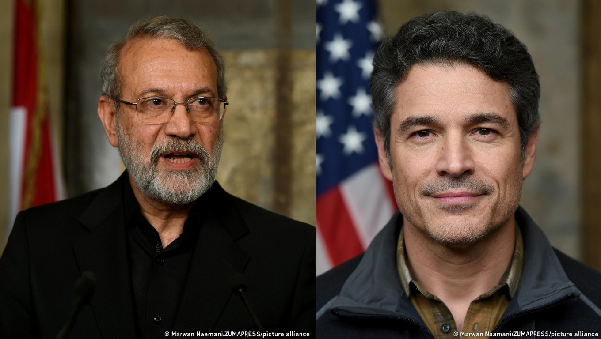

# Decapitation Strike dan Krisis Legitimasi Perang: Pembunuhan Ali Larijani dan Pengunduran Diri Joe Kent dalam Konflik Iran–AS–Israel 2026

*Ali Laranjani dan Joe Kent (pic: Marwan Naamani/ZUMAPRESS).*

  
***Satu misil presisi bisa menghilangkan seorang tokoh negara dalam beberapa detik. Tetapi satu surat pengunduran diri pejabat intelijen bisa membuat alasan perang itu sendiri dipertanyakan oleh dunia***
  

Konflik Iran–AS–Israel tahun 2026 menunjukkan interaksi kompleks antara operasi militer presisi dan kontestasi narasi politik domestik di negara penyerang. 

Artikel ini menganalisis dua peristiwa penting: pembunuhan tokoh keamanan Iran, Ali Larijani, serta pengunduran diri Direktur National Counterterrorism Center, Joe Kent, yang menyatakan Iran tidak menimbulkan ancaman langsung terhadap Amerika Serikat sebelum perang dimulai. 

Studi ini menunjukkan bahwa keberhasilan taktis di medan tempur dapat berjalan bersamaan dengan krisis legitimasi di tingkat politik domestik.

## Pendahuluan

Perang modern tidak hanya berlangsung melalui operasi militer, tetapi juga melalui kompetisi narasi mengenai legitimasi penggunaan kekuatan.

Serangan yang menewaskan tokoh senior Iran, Ali Larijani, menandai eskalasi penting dalam strategi decapitation strike, yaitu upaya melemahkan negara lawan dengan menargetkan elit kepemimpinannya. 

Pada saat yang sama, pengunduran diri pejabat keamanan Amerika, Joe Kent, memunculkan kontroversi mengenai dasar intelijen yang digunakan untuk membenarkan perang.

Kedua peristiwa ini menunjukkan bahwa konflik modern memiliki dua arena utama:

1.	arena militer

2.	arena legitimasi politik.

## Targeted Killing sebagai Strategi Decapitation

Strategi targeted killing bertujuan melemahkan kemampuan strategis musuh dengan menyingkirkan tokoh penting dalam struktur keamanan atau politik.

Pembunuhan Ali Larijani memiliki implikasi strategis karena ia merupakan figur penting dalam arsitektur keamanan Iran dan memiliki pengaruh dalam kebijakan nuklir serta pertahanan nasional.

Literatur keamanan internasional menjelaskan bahwa strategi ini digunakan untuk:

• menciptakan disorganisasi dalam kepemimpinan musuh

• menurunkan kapasitas koordinasi militer

• mengirim sinyal kekuatan intelijen kepada lawan.

Namun efektivitas strategi ini sering diperdebatkan karena struktur negara modern biasanya memiliki mekanisme suksesi dan redundansi kepemimpinan.

## Krisis Legitimasi Ancaman

Di sisi lain, pengunduran diri Joe Kent dari jabatan Direktur National Counterterrorism Center membuka dimensi politik yang berbeda.

Dalam pernyataannya, ia menyatakan bahwa Iran tidak menimbulkan ancaman langsung terhadap Amerika Serikat sebelum perang dimulai.

Pernyataan tersebut memicu debat mengenai:

• validitas intelijen yang digunakan untuk memulai operasi militer

• pengaruh faktor politik dalam keputusan perang

• peran institusi keamanan dalam proses pembuatan kebijakan.

Perdebatan semacam ini bukan fenomena baru dalam politik Amerika dan sering muncul ketika negara memasuki konflik besar.

## Pertarungan Narasi dalam Perang Modern

Peristiwa ini menunjukkan bahwa perang modern tidak hanya mengenai kekuatan militer, tetapi juga mengenai kontrol narasi.

Negara yang melakukan operasi militer harus mempertahankan legitimasi di dua tingkat:

1.	legitimasi internasional

2.	legitimasi domestik.

Ketika pejabat keamanan tinggi mempertanyakan dasar ancaman yang digunakan untuk membenarkan perang, hal tersebut dapat menciptakan keretakan dalam konsensus politik domestik.

Situasi ini memperlihatkan paradoks strategis: keberhasilan taktis di medan tempur tidak selalu menjamin stabilitas politik di dalam negeri.

## Perang sebagai Kompetisi Multi-Dimensi

Konflik Iran–AS–Israel menunjukkan bahwa perang modern beroperasi dalam beberapa dimensi sekaligus:

•	operasi militer presisi

•	perang informasi

•	perdebatan legitimasi politik

•	dinamika opini publik.

Dalam sistem politik demokratis, dimensi terakhir sering memiliki dampak besar terhadap keberlanjutan operasi militer jangka panjang.

Sedikit ironi yang sering muncul dalam geopolitik: di satu sisi negara bisa berhasil menghilangkan seorang tokoh penting lawan dalam hitungan detik melalui misil presisi.

Namun pada saat yang sama, sebuah kalimat dari seorang pejabat yang mundur bisa mengguncang legitimasi perang itu sendiri.

Teknologi modern membuat membunuh seseorang semakin mudah.
Tetapi membuat semua orang percaya bahwa perang itu perlu… tetap jauh lebih sulit.

Satu misil presisi bisa menghilangkan seorang tokoh negara dalam beberapa detik.
Tetapi satu surat pengunduran diri pejabat intelijen bisa membuat alasan perang itu sendiri dipertanyakan oleh dunia.

Militer menghancurkan tubuh.
Politik menghancurkan narasi.

Dan dalam perang modern, kadang narasi yang runtuh lebih berbahaya daripada satu kota yang dibom.

Pembunuhan tokoh keamanan Iran dan pengunduran diri pejabat kontra-terorisme Amerika menunjukkan bahwa konflik 2026 tidak hanya merupakan perang militer, tetapi juga perang legitimasi.

Sementara operasi militer menargetkan struktur kekuasaan musuh, perdebatan domestik mengenai alasan perang dapat mempengaruhi stabilitas politik negara yang melancarkan serangan.

Dengan demikian, konflik modern harus dipahami sebagai interaksi antara kekuatan militer dan dinamika politik internal.

  
**Referensi**

International Institute for Strategic Studies. (2025). The Military Balance 2025. London.

RAND Corporation. (2024). Targeted Killing and Counterterrorism Strategy. Santa Monica.

Brookings Institution. (2024). War Legitimacy and Democratic Accountability. Washington, DC.

Stockholm International Peace Research Institute. (2025). Security Dynamics in the Middle East. Stockholm.
