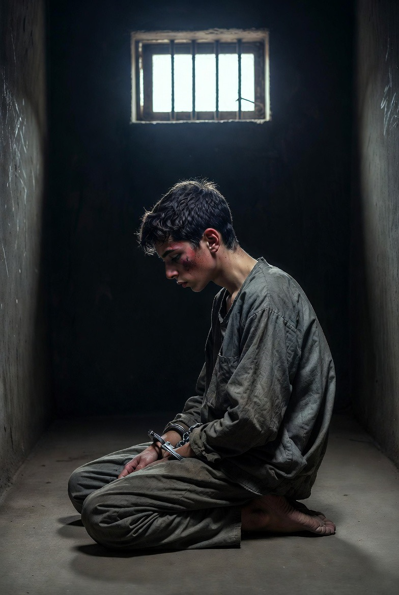

# Dehumanisasi Palestina, Penjara Israel & Krisis Nurani Global : Ketika Manusia Bisa Terbiasa Melihat Penderitaan Kelompok Lain

*Ilustrasi  (pic: Grok AI).*

  
***Yang paling menakutkan bukan hanya ketika manusia bisa membunuh manusia lain. Tapi ketika dunia perlahan belajar… untuk tidak lagi merasa terguncang melihatnya***
  
Konflik Israel–Palestina tidak hanya merupakan konflik teritorial dan keamanan, tetapi juga krisis kemanusiaan dan moral yang berkaitan dengan proses dehumanisasi. 

Tulisan ini membahas bagaimana warga Palestina, khususnya di Gaza dan Tepi Barat, mengalami berbagai bentuk kekerasan struktural: penggusuran, penghancuran rumah, penahanan massal, perlakuan terhadap tahanan anak, dan pembatasan kehidupan sipil. 

Dengan pendekatan hukum humaniter internasional, psikologi sosial, dan teori kolonialisme modern, tulisan ini menganalisis bagaimana proses “pengurangan kemanusiaan” memungkinkan kekerasan menjadi normalisasi sosial.

## Pendahuluan

Dalam banyak konflik modern, kekerasan massal tidak selalu dimulai dari peluru.
Ia sering dimulai dari perubahan cara memandang manusia lain.

Ketika suatu kelompok mulai dianggap:
ancaman permanen,
kurang manusia,
atau sekadar hambatan keamanan,
maka tindakan yang sebelumnya dianggap tidak bermoral mulai terasa “dapat dibenarkan.”

Konflik Israel dan Palestina menjadi salah satu contoh paling diperdebatkan dalam konteks ini.

Pendudukan dan Kekerasan Struktural: Penghancuran Rumah dan Pengusiran

Di Tepi Barat, banyak laporan organisasi HAM mendokumentasikan:
pembuldoseran rumah warga Palestina,
ekspansi permukiman Yahudi,
penggusuran paksa,
dan pembatasan kepemilikan tanah.

Pemerintah Israel sering menyatakan tindakan ini:
berkaitan dengan keamanan,
izin bangunan ilegal,
atau operasi anti-teror.
Namun kritik internasional menilai praktik tersebut menciptakan sistem ketimpangan struktural dan perpindahan paksa populasi.

## Penjara dan Administrative Detention: Penahanan tanpa Pengadilan Penuh

Israel menggunakan sistem administrative detention, di mana seseorang dapat ditahan berbulan-bulan tanpa dakwaan formal terbuka atas alasan keamanan.

Praktik ini dikritik oleh:
Amnesty Internasional 
Human Rights Watch
pelapor khusus PBB
karena dianggap melanggar hak proses hukum yang adil.

Anak-anak Palestina dalam Sistem Miiliter

Laporan internasional juga menyoroti:
anak Palestina ditangkap tentara,
diinterogasi tanpa perlindungan memadai,
mengalami intimidasi,
bahkan dugaan pelecehan dan kekerasan.
Menurut banyak pengamat, ketika anak-anak tumbuh dalam sistem penahanan militer, trauma menjadi warisan generasional.

## Gaza dan Krisis Kemanusiaan:  Pemboman dan Korban Sipil

Dalam perang Gaza:
rumah sakit dihantam,
tenaga medis tewas,
kamp pengungsi terkena serangan,
dan korban sipil sangat besar.

Israel menyatakan:
Hamas beroperasi di area sipil,
sehingga target militer bercampur dengan infrastruktur sipil.
Namun banyak organisasi internasional mempertanyakan:
proporsionalitas serangan,
perlindungan warga sipil,
dan kepatuhan terhadap hukum perang.

Dehumanisasi: Mesin Psikologis Kekerasan

## Apa itu dehumanisasi?

Dalam Psikologi Sosial dehumanization, adalah proses ketika kelompok lain mulai dianggap:
kurang manusia,
tidak sepenuhnya memiliki rasa,
atau sekadar objek ancaman.

Akibatnya:
empati menurun,
kekerasan lebih mudah dibenarkan,
dan penderitaan terlihat “normal.”

Pola sejarah

Fenomena ini muncul di:
Holocaust,
Rwanda,
Bosnia,
kolonialisme,
apartheid,
hingga genosida modern lainnya.

Sebelum kekerasan massal terjadi,
biasanya muncul narasi: “mereka berbeda dari kita.”

## Kolonialisme Modern dan Palestina

Banyak akademisi postkolonial melihat konflik Palestina sebagai bentuk settler colonialism.
yaitu:
pendudukan wilayah,
pemindahan populasi,
dan dominasi politik oleh kelompok pendatang.

Pandangan ini sangat kontroversial dan ditolak keras oleh Israel dan pendukungnya, tetapi semakin sering dibahas di universitas dan forum HAM global.

## Ketimpangan Kekuatan

Konflik ini bersifat asymmetrical conflict. Artinya:

satu pihak memiliki:
negara modern,
militer besar,
dukungan Barat,
teknologi tinggi

sementara pihak lain:
hidup dalam keterbatasan,
blokade,
dan pendudukan.

Dalam konflik seperti ini, tanggung jawab moral pihak yang lebih kuat sering dianggap lebih besar.

## Krisis Nurani Global

Yang membuat dunia begitu emosional terhadap Gaza bukan hanya jumlah korban.
Tetapi rasa bahwa penderitaan itu terjadi terus-menerus di depan mata dunia… namun tidak cukup menghentikan apa pun.

Akibat media sosial:
reruntuhan terlihat real-time,
tubuh anak-anak terlihat langsung,
tangisan keluarga terdengar global.

Dan manusia mulai bertanya: apakah nyawa tertentu memang dianggap lebih murah daripada yang lain?

## Perspektif Etika

“Keamanan” vs “Kemanusiaan”

Israel memakai narasi:
self-defense,
keamanan nasional,
perang melawan terorisme.

Palestina dan para pengkritik berkata:
keamanan tidak boleh membenarkan penghancuran massal sipil,
pendudukan menciptakan kekerasan struktural,
dan hak hidup warga Palestina terus tergerus.

Pertanyaan moral terbesar: kapan pertahanan diri berubah menjadi dominasi yang menghancurkan kemanusiaan pihak lain?

Konflik Israel–Palestina memperlihatkan bahwa:
kekerasan modern tidak hanya bersifat militer,
tetapi juga psikologis, struktural, dan simbolik.

Dehumanisasi memungkinkan:
rumah dihancurkan,
anak dipenjara,
korban sipil dibenarkan,
dan penderitaan berlangsung lama tanpa penghentian efektif.

Dan ketika dunia mulai terbiasa melihat itu setiap hari… bahaya terbesar bukan hanya kematian. Tetapi hilangnya kemampuan manusia untuk terkejut terhadap penderitaan sesama manusia.

  
**Referensi**

Amnesty International. Israel’s apartheid against Palestinians.

Human Rights Watch. A Threshold Crossed.

United Nations OCHA Reports on Occupied Palestinian Territory.

Fanon, F. (1961). The Wretched of the Earth.

Said, E. (1978). Orientalism.

Kelman, H. (1973). Violence without moral restraint.
