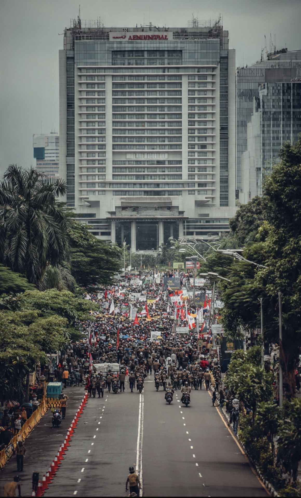

# Demo 27 Agustus 2026: RUU Perampasan Aset, Korupsi, & Negara yang Diminta Membuktikan Political Will

*Ilustrasi (pic: Grok AI).*

  
***Kalau koruptor bisa menyembunyikan aset selama bertahun-tahun, jangan sampai RUU untuk merampas asetnya malah ikutan ngumpet juga selama bertahun-tahun***
  

Beberapa kelompok utama yang turun di Jakarta, antara lain: Aliansi Masyarakat Pati Bersatu (AMPB), Aliansi Gerakan Rakyat Menggugat (GERAM), Aliansi Masyarakat Depok Bersatu (AMDB), Relawan Madura Pengawal Program Presiden Prabowo (RMP4).

Semuanya bukan sebagai satu blok politik, sebab tuntutannya berbeda-beda, mulai dari korupsi, RUU Perampasan Aset, harga kebutuhan pokok, pendidikan, kesehatan, ketenagakerjaan, sampai evaluasi kebijakan pemerintah. 

Tetapi AMPB memang menjadikan RUU Perampasan Aset sebagai salah satu tuntutan utamanya, bersama tuntutan hukuman berat, termasuk hukuman mati bagi koruptor. 

## Apakah Tuntutannya SUDAH Tercapai?

Nah, ini bagian yang jangan sampai tertukar. 

RUU Perampasan Aset belum menjadi UU. Yang sudah terjadi adalah proses legislasi bergerak maju. DPR memasukkan RUU tersebut dalam Prolegnas, kemudian Komisi III melakukan pembahasan dan penyerapan aspirasi. 

DPR menyebut telah melakukan 35 RDPU dan tiga kunjungan kerja daerah. Komisi III menargetkan penyelesaian sampai pengesahan paling lambat Desember 2026. 

Bahkan hari ini, 27 Agustus, RUU tersebut muncul dalam konteks agenda parlemen, tetapi bukan berarti hari ini DPR mengetoknya menjadi UU. 

Tahapan pembahasannya masih harus melewati penyerapan aspirasi, harmonisasi, pembahasan dengan pemerintah, DIM, persetujuan tingkat pertama, lalu pembicaraan tingkat kedua di paripurna. 

Jadi kalau ada headline: “DPR bahas RUU Perampasan Aset hari ini” jangan diterjemahkan menjadi: “RUU Perampasan Aset sudah disahkan.” Belum. Itu dua planet legislasi yang berbeda. 

## Tapi Justru di sinilah Demonstrasinya Menarik

Karena tuntutan massa sebenarnya bukan sekadar “buat UU”. Pesan politiknya lebih dalam: “Kami ingin melihat apakah DPR benar-benar punya political will untuk mengambil aset hasil kejahatan, atau RUU ini akan kembali menjadi penghuni tetap ruang tunggu parlemen.”

Dan sejarah legislasi Indonesia membuat kecurigaan itu tidak muncul dari udara. RUU Perampasan Aset sudah lama menjadi agenda politik dan hukum Indonesia. DPR sendiri mencatat RUU ini telah masuk Prolegnas prioritas. 

Maka problemnya bukan “Apakah RUU ini ada?” Tetapi “Mengapa penyelesaiannya begitu lama?”

## Mengapa RUU ini Dianggap Penting?

Karena hukum pidana konvensional biasanya mengejar orangnya, dibuktikan bersalah, baru dihukum.

Sedangkan pendekatan asset recovery bertanya: “Ke mana uang hasil kejahatan itu pergi?” Ini sangat penting dalam korupsi.

Bayangkan koruptor mencuri: Rp500 miliar, kemudian dihukum, dipenjara, tapi uangnya tetap tersebar melalui perusahaan, rekening, nominee, keluarga, properti, atau aset lain.

Kalau negara hanya berhasil memasukkan manusianya ke penjara tetapi aset hasil kejahatan tidak kembali, negara memperoleh kemenangan simbolik tetapi kehilangan kemenangan material.

Koruptornya masuk sel, uangnya tetap jalan-jalan. Itulah sebabnya asset recovery menjadi komponen penting dalam pemberantasan korupsi modern.

## RUU Perampasan Aset Memiliki Sisi yang Harus Diawasi

Nah, jangan sampai kita ikut berteriak: “Rampas semua aset koruptor!” tanpa membaca mekanisme hukumnya.

Karena negara yang diberi kewenangan mengambil aset dalam jumlah besar juga harus diberi standar pembuktian, due process, judicial oversight, mekanisme keberatan, serta perlindungan pihak ketiga yang tidak bersalah, transparansi, dan mekanisme pengembalian aset jika perampasan ternyata keliru.

Bahkan DPR sendiri menekankan bahwa pembahasan harus hati-hati agar regulasi tersebut tidak berubah menjadi instrumen kekuasaan untuk menekan masyarakat. 

Ini poin yang sangat penting. Negara harus kuat terhadap koruptor, tetapi negara juga harus dibatasi ketika menggunakan kekuatannya. Kalau tidak, kita menyelesaikan satu problem dengan menciptakan problem konstitusional baru.

## Demonstrasi ini Pro-pemerintah atau Anti-Pemerintah?

Ini justru bagian yang lucu secara politik. AMPB secara eksplisit mengatakan aksi mereka bukan tuntutan untuk menurunkan Prabowo-Gibran. Mereka menyatakan mendukung pemerintah tetapi meminta pemerintah menjalankan pemerintahan dengan lebih baik. 

Jadi kategorinya bukan sederhana pro-Prabowo vs anti-Prabowo. Lebih tepatnya,  pressure from below terhadap pemerintah dan parlemen.

Ini fenomena penting dalam demokrasi. Sebuah kelompok dapat mendukung pemerintah secara umum, tetapi juga menekan pemerintah mengenai kebijakan tertentu. Demokrasi memang bukan klub penggemar. 

## Satu Perkembangan Paling Menarik

DPR sudah menerima aspirasi masyarakat Pati pada 24 Agustus, beberapa hari sebelum aksi besar ini. DPR juga menyatakan membuka ruang aspirasi untuk kelompok yang akan melakukan aksi. 

Artinya ada respons institusional, tetapi menerima aspirasi tidak sama dengan memenuhi tuntutan. Ini harus dibedakan secara akademis.

Kita punya tiga level:

| Level | Status |
|------|-------|
| DPR menerima aspirasi | ✅ Sudah |
| RUU masuk dan sedang dibahas | ✅ Sudah |
| RUU disahkan menjadi UU | ❌ Belum |

Dan target resmi DPR sekarang adalah Desember 2026. 

## Demonstrasi ini Sebenarnya Sedang Melakukan Apa?

Secara teori politik, demonstrasi berfungsi sebagai mechanism of political accountability.

Masyarakat menaikkan political cost bagi lembaga yang dianggap lamban. Sebelum demonstrasi: “Nanti kita bahas.” Sesudah tekanan publik: “Baik, kami harus memberikan timeline.”

Dan itulah yang sekarang terjadi, DPR telah menyatakan target penyelesaian pada Desember. Sekarang publik memiliki sesuatu yang bisa diukur: Apakah benar selesai pada Desember atau tidak?

Jadi demonstrasi bukan cuma soal jumlah massa. Yang lebih penting adalah apakah tuntutan berhasil diubah menjadi komitmen institusional yang dapat diverifikasi?

## Jebakan Besar

Kalau Desember tiba lalu DPR berkata: “Kami sudah melakukan pembahasan.” Masyarakat harus bertanya:“Pembahasan atau pengesahan?” karena meeting, RDPU,  harmonisasi, DIM,  dan janji politik, tidak sama dengan law.

UU lahir ketika proses legislasi selesai dan disahkan sesuai mekanisme konstitusional. Jadi tuntutan demonstran baru benar-benar terpenuhi ketika produk hukumnya resmi menjadi undang-undang, bukan ketika DPR membuat konferensi pers bahwa mereka “berkomitmen”. 

Demo 27 Agustus ini paling tepat dibaca sebagai uji political will terhadap DPR dan pemerintah dalam pemberantasan korupsi, dengan RUU Perampasan Aset menjadi salah satu simbol utamanya.

Apakah tuntutannya sudah tercapai? Belum. Apakah RUU-nya mangkrak total? Juga tidak.

Yang benar, RUU sudah masuk agenda prioritas dan sedang dibahas, tetapi belum menjadi UU. DPR menargetkan penyelesaian paling lambat Desember 2026. 

Dan sekarang DPR sudah mendapatkan sesuatu yang jauh lebih berharga daripada spanduk demonstrasi, yakni deadline politik.

Kalau Desember nanti benar-benar diketok, demonstrasi hari ini bisa disebut berhasil mendorong percepatan. Namun bila Desember lewat dan kembali menjadi:“Masih dalam pembahasan, mohon masyarakat bersabar…” maka publik berhak bertanya: “RUU Perampasan Aset ini sebenarnya sedang dibahas, atau sedang diawetkan?”

Karena kalau koruptor bisa menyembunyikan aset selama bertahun-tahun, jangan sampai RUU untuk merampas asetnya malah ikutan ngumpet juga selama bertahun-tahun. 

  
**Referensi**

Dewan Perwakilan Rakyat Republik Indonesia. (2026, August 25). Progres RUU Perampasan Aset: 35 RDPU, tiga kunjungan kerja daerah, dan akan disahkan pada Desember 2026. DPR RI.

Dewan Perwakilan Rakyat Republik Indonesia. (2026, August 27). Rapat Paripurna DPR RI ke-3 Masa Persidangan I Tahun Sidang 2026–2027. DPR RI.

Katadata. (2026, August 26). Besok 27 Agustus 2026 demo apa? Ini daftar kelompok dan tuntutannya. Katadata.

NU Online Jakarta. (2026, August 26). AMPB pastikan aksi demo 27 Agustus fokus pada dua tuntutan pemberantasan korupsi. NU Online.

Dewan Perwakilan Rakyat Republik Indonesia. (2025). RUU Perampasan Aset hingga PPRT disepakati masuk prioritas Prolegnas 2025. DPR RI.
