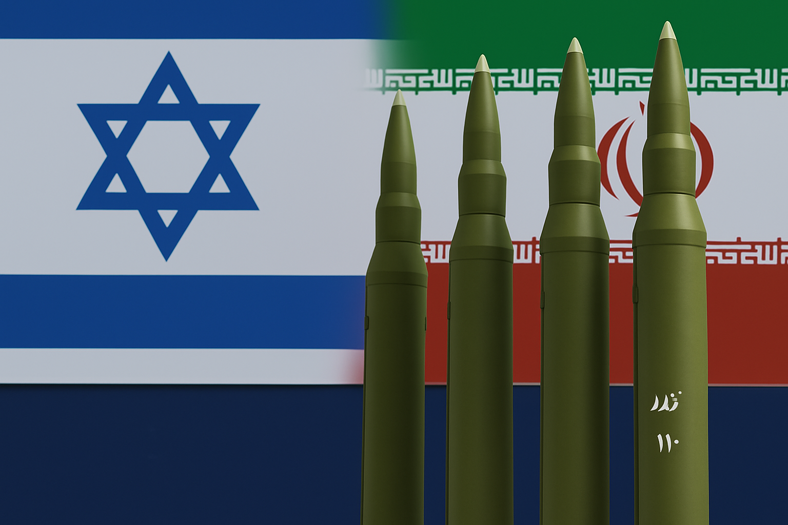

# Deterrence, Trauma, dan Standar Ganda: Membaca Paradoks Israel dalam Eskalasi Iran–Timur Tengah

*Ilustrasi nuklir (pic: Grok AI).*

  
***Selama standar ganda tetap dipertahankan… perdamaian akan selalu terlihat seperti ilusi yang ditunda***
  

Dalam lanskap geopolitik Timur Tengah, Israel sering memposisikan diri sebagai negara yang bertindak defensif demi kelangsungan hidupnya. 

Namun, posisi ini menghadapi kontradiksi serius ketika dibandingkan dengan praktik kebijakan nuklirnya, pendekatan terhadap Iran, dan operasi militernya di kawasan. 

Artikel ini mengkaji paradoks tersebut melalui tiga lensa utama: nuclear ambiguity, security dilemma, dan double standards dalam hukum internasional.

## Ambiguitas Nuklir: Senjata Tanpa Pengakuan

Israel secara luas diyakini memiliki senjata nuklir, namun tidak pernah secara resmi mengonfirmasi atau menolak keberadaannya. Kebijakan ini dikenal sebagai nuclear opacity.

Paradoksnya:

•	Israel mempertahankan deterrence maksimum tanpa akuntabilitas formal

•	Tidak terikat pada rezim inspeksi seperti International Atomic Energy Agency

•	Tidak menjadi anggota penuh perjanjian seperti Non-Proliferation Treaty

Namun di sisi lain:
•	Israel secara agresif menolak kemungkinan negara lain, khususnya Iran, mengembangkan kapasitas nuklir—even untuk tujuan sipil

Ini menciptakan apa yang dalam teori hubungan internasional disebut: “asymmetric legitimacy” — satu negara boleh memiliki apa yang dilarang keras bagi negara lain.

## Security Dilemma: Ketakutan yang Saling Memicu

Israel bukan tanpa alasan.

Trauma historis seperti Holocaust dan pengalaman perang berulang dengan negara tetangga membentuk paradigma keamanan yang sangat defensif.

Dari sudut pandang Israel:

•	Satu serangan nuklir saja bisa eksistensial

•	Wilayah kecil → tidak ada ruang untuk “second strike recovery”

•	Retorika keras dari elite Iran memperkuat persepsi ancaman

Namun di sinilah paradoksnya:

👉 tindakan preventif Israel

👉 justru memperkuat paranoia pihak lawan

Ini adalah bentuk klasik security dilemma: upaya satu pihak untuk merasa aman justru membuat pihak lain merasa terancam.

## Serangan Preventif atau Eskalasi Terencana?

Serangan terhadap Iran dan target regional lainnya sering dibingkai sebagai preemptive strike. 

Namun implikasinya jauh lebih luas:

•	korban sipil meningkat

•	infrastruktur sipil terdampak

•	eskalasi konflik lintas negara

Dalam beberapa laporan, serangan di wilayah seperti Minab disebut menewaskan warga sipil termasuk anak-anak—meski detail dan verifikasi independen sering kali terbatas dalam kondisi perang.

Di titik ini, narasi “defensif” mulai retak.

## Palestina: Akar yang Tidak Pernah Diselesaikan

Peristiwa seperti 7 Oktober 2023 Hamas attack tidak muncul dari ruang hampa.

Ia merupakan:

•	akumulasi puluhan tahun konflik

•	pendudukan

•	kekerasan struktural

Namun respons Israel yang sangat keras sering:

•	memperluas penderitaan sipil

•	memperdalam siklus balas dendam

Di sini muncul ironi moral: kekerasan masa lalu dijadikan justifikasi kekerasan masa kini, tanpa refleksi terhadap akar masalah itu sendiri.

## Double Standard sebagai Struktur, bukan Kebetulan

Hipokrit dalam bahasa akademik bukan sekadar moral gagal. Itu adalah: struktur kekuasaan global yang tidak simetris.

Dimana:

•	sekutu Barat mendapatkan toleransi lebih tinggi

•	narasi keamanan mereka lebih mudah diterima

•	pelanggaran mereka lebih sering dinegosiasikan.

Israel bukan aktor tunggal yang “jahat”, dan Iran bukan aktor tunggal yang “benar”.

Namun:

•	ada standar ganda yang nyata

•	ada ketimpangan legitimasi

•	ada kekerasan yang berulang tanpa resolusi

Dan yang paling berbahaya: setiap pihak merasa dirinya defensif, sementara bagi pihak lain, mereka adalah agresor.

Dalam konflik seperti ini, istilah seperti “hero” dan “teroris” sering bukan deskripsi objektif, melainkan hasil dari siapa yang memegang mikrofon global.

Dan selama standar ganda tetap dipertahankan… perdamaian akan selalu terlihat seperti ilusi yang ditunda.

  
**Referensi**

International Atomic Energy Agency. (2023–2025). Safeguards and verification reports.

Stockholm International Peace Research Institute. (2024). Yearbook: Armaments, Disarmament and International Security.

Cohen, A. (1998). Israel and the Bomb. Columbia University Press.

International Atomic Energy Agency. (2024–2026). Verification and monitoring in Iran.

United Nations. (1968). Non-Proliferation Treaty (NPT).

Congressional Research Service. (2023–2025). Iran’s Nuclear Program: Status and Outlook.

Herz, J. H. (1950). Idealist Internationalism and the Security Dilemma.

Jervis, R. (1978). Cooperation Under the Security Dilemma.

Holocaust – dokumentasi luas oleh: Yad Vashem. United States Holocaust Memorial Museum.

United Nations Office for the Coordination of Humanitarian Affairs. (2023–2026). Occupied Palestinian Territory Reports.

7 Oktober 2023 Hamas attack – dilaporkan luas oleh: BBC, Reuters, Al Jazeera.

Human Rights Watch. (2023–2026). Reports on Israel/Palestine & regional conflict.

Amnesty International. (2024–2026). War crimes & civilian harm documentation.

Médecins Sans Frontières. (2024–2026). Medical field reports.

Al Jazeera. (2026). Iran–Israel escalation coverage.

Reuters. (2026). Middle East conflict updates.

The Guardian. (2026). Regional war analysis.
