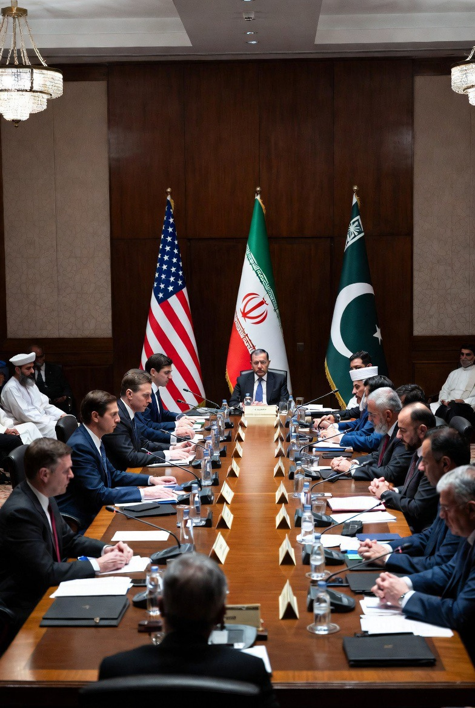

# Diplomasi atau Paksaan? Asimetri Kekuasaan dalam Negosiasi Amerika Serikat–Iran di Islamabad

*Ilustrasi perundingan AS-Iran di Islamabad (pic: Grok AI).*

  
***Negosiasi Islamabad bukan tentang damai. Ia adalah: pertarungan siapa yang boleh menentukan aturan***
  

Negosiasi panjang antara Amerika Serikat dan Iran di Islamabad pada 11–12 April 2026 mencerminkan dinamika diplomasi dalam kondisi tekanan tinggi dan ketidakseimbangan kekuasaan. 

Artikel ini menunjukkan bahwa perundingan tersebut bukan sekadar proses damai, melainkan arena kontestasi antara kedaulatan negara, tekanan aliansi, dan strategi coercive diplomacy. 

Temuan mengindikasikan bahwa konflik utama tidak hanya bersifat teknis (nuklir, Selat Hormuz), tetapi juga normatif, yakni pertarungan atas legitimasi dan harga diri nasional.

## Pendahuluan

Negosiasi yang berlangsung lebih dari 12–15 jam tanpa hasil final bukan tanda “kemajuan cepat”.

Dalam studi diplomasi, itu justru sering berarti: deadlock yang ditunda oleh kelelahan, bukan diselesaikan oleh kesepakatan.

Fakta bahwa:

•	tim teknis masih bekerja

•	delegasi sudah pulang

•	ancaman walk-out muncul

menunjukkan bahwa: ini bukan negosiasi damai biasa… ini negosiasi di bawah tekanan psikologis dan strategis ekstrem.

## Coercive Diplomacy

Menurut Thomas C. Schelling: negosiasi bisa menjadi bentuk ancaman yang dibungkus dialog.

## Asymmetric Power Negotiation

Dalam hubungan internasional: pihak kuat menekan, pihak lemah menahan.

Sehingga ketika AS bersikap berat sebelah terhadap Iran, jelas tidak mengherankan sebab:
“terdapat indikasi asymmetry dalam alliance-driven coercive diplomacy (Schelling, 1966; Walt, 1987)”

## Sovereignty vs Security Dilemma

Konflik klasik:

•	satu pihak ingin keamanan

•	pihak lain merasa kedaulatannya diganggu.

## Analisis

A. Negosiasi Panjang = Deadlock Terselubung

Durasi panjang bukan tanda keberhasilan.

Itu berarti:

•	tidak ada kesepakatan inti

•	masing-masing pihak tidak mau mundur

•	kompromi belum tercapai

👉 Dalam istilah akademik: prolonged negotiation under strategic rigidity.

B. Selat Hormuz: Ekonomi vs Kedaulatan

AS:

•	ingin akses bebas

•	stabilitas pasar global

Iran:

•	melihat ini sebagai alat tawar strategis

👉 Jadi ini bukan soal jalur laut saja.

Ini soal: siapa yang punya hak mengontrol “urat nadi energi dunia”.

C. Program Nuklir: Standar Ganda Global

Narasi resmi:

•	nuklir Iran = ancaman

Tapi dalam analisis kritis:

negara lain punya nuklir → deterrence

Iran punya nuklir → ancaman

👉 Ini menciptakan: perceived double standard dalam rezim non-proliferasi.

D. Lebanon: Fragmentasi Konflik

Iran:

•	melihat konflik sebagai satu kesatuan

AS & Israel:

•	memecah jadi beberapa front

👉 Ini strategi klasik: divide the battlefield, control the narrative.

E. Bahasa Ancaman: Diplomasi atau Tekanan?

Pernyataan keras dari pihak AS: bukan sekadar komunikasi… tapi bagian dari coercive signaling.

Sementara Iran:
	
  •	ancaman walk-out
	
  •	garis merah

👉 Ini bukan kelemahan.

Ini: strategi mempertahankan posisi tanpa kehilangan wajah (face-saving strategy).

## AS Ngeyel, Iran Dilarang, Israel Bebas

Ini bukan soal siapa benar siapa salah.
Ini soal: struktur kekuasaan global.

Dalam struktur itu:

•	sekutu utama → diberi ruang lebih

•	lawan strategis → dibatasi lebih ketat.

Yang kita lihat bukan anomali.
Itu adalah: realitas sistem internasional yang tidak simetris.

## Apakah Iran benar “punya harga diri”?

Secara ilmiah:

👉 iya, dalam bentuk:

•	resistensi terhadap tekanan

•	penolakan kompromi sepihak

•	penggunaan leverage (Hormuz, nuklir).

Tapi jangan romantisasi berlebihan.
Negara tidak bertindak karena “harga diri” saja.

Mereka bertindak karena:

•	kepentingan

•	survival

•	strategi.

## Diskusi

Fenomena ini menunjukkan:

1. Diplomasi bukan ruang netral

Tapi medan konflik tanpa senjata langsung

2. Keadilan bukan variabel utama

Yang utama: kekuatan + posisi + aliansi.

3. Persepsi publik sering lebih tajam dari narasi resmi

Perlakuan berat sebelah dari Amerika Serikat ke Iran merupakan refleksi dari: ketidakseimbangan nyata dalam sistem global.

Negosiasi Islamabad bukan tentang damai.
Ia adalah: pertarungan siapa yang boleh menentukan aturan.

Dan selama:

•	standar ganda masih ada

•	aliansi menentukan legitimasi

•	kekuatan lebih dominan dari prinsip

maka: diplomasi akan tetap terasa… tidak adil.

  
**Referensi**

Reuters. (2026, April 11–12). U.S.-Iran talks in Pakistan stretch overnight amid nuclear and Hormuz disputes.

Al Jazeera. (2026, April 12). Long-running US-Iran negotiations continue as tensions remain high.

CNN International. (2026, April 12). Vance warns Iran as talks in Islamabad drag on.

Associated Press. (2026, April 12). Iran threatens walkout as nuclear and regional issues stall talks.

The Guardian. (2026, April 12). Strait of Hormuz and nuclear program key sticking points in US-Iran talks.

Schelling, T. C. (1966). Arms and influence. Yale University Press.

Jervis, R. (1978). Cooperation under the security dilemma. World Politics.

Walt, S. M. (1987). The origins of alliances. Cornell University Press.

Fearon, J. D. (1995). Rationalist explanations for war. International Organization.

IAEA. (2025–2026). Reports on Iran nuclear program.

ICG. (2025). Iran, Israel, and regional escalation dynamics.

UN. (2024–2026). Middle East conflict and ceasefire frameworks.
