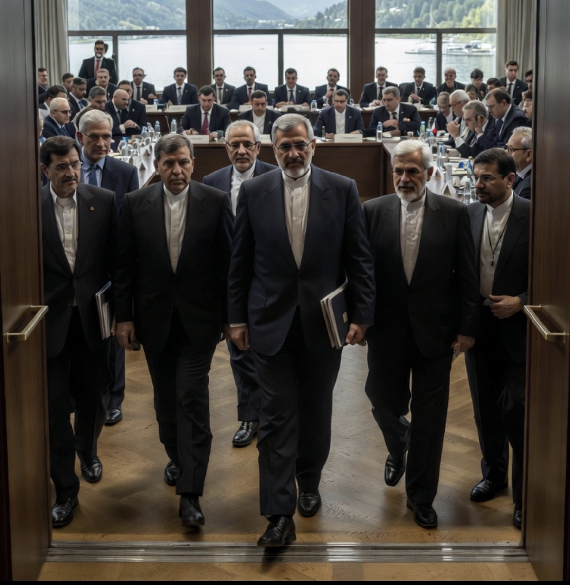

# Diplomasi dengan Satu Tangan, Ancaman dengan Tangan Lain: Mengapa Iran Walk Out dari Swiss?

*Ilustrasi (pic: Grok AI).*

  
***Perdamaian belum lahir, tetapi juga belum mati. Dan kadang, dalam geopolitik, itu sudah merupakan kemajuan yang sangat mahal***
  

Di pegunungan Swiss yang tenang. Danau tenang, rumput hijau, Burgenstock Resort yang mahal dan mewah. JD Vance sedang berkata: “Kami ingin membuka lembaran baru dengan Iran.”

Lalu… Trump menulis di media sosial: “Iran harus segera menghentikan proksinya di Lebanon. Kalau tidak, kami akan menghantam Iran jauh lebih keras lagi.”

Lalu delegasi Iran berdiri, merapikan berkas, dan… walk out.

Bukan keluar dari Swiss, tetapi keluar dari ruangan. Sebuah pesan diplomatik yang artinya: “Kalau kalian mengancam sambil mengajak damai, kami tidak mau menjadi properti foto kalian.”  

## Apakah Walk Out Itu Benar?

Ya, media Iran dan sejumlah media internasional melaporkan negosiasi sempat berlangsung sekitar 80 menit, Iran menghentikan pembicaraan sementara, penyebab utamanya adalah unggahan Trump yang dianggap menghina dan mengancam Iran, Iran mengajukan protes resmi kepada mediator Qatar dan Pakistan.  

Tetapi Iran tidak keluar permanen. Mereka tidak membatalkan MoU, mereka tidak pulang, masih tinggal di Swiss. Karena meskipun marah, mereka juga tahu perang jauh lebih mahal daripada menelan ego.  

## Apa yang Sedang Dikerjakan di Swiss Sekarang?

Banyak orang membayangkan meja besar, jabat tangan, tanda tangan, dan musik kemenangan.

Padahal kenyataannya, Swiss sekarang lebih mirip bengkel perdamaian yang membahas:

1. Nuklir Iran
Mulai dari batas pengayaan uranium, inspeksi, pengawasan internasional, dan jadwal implementasi.

2. Selat Hormuz
Tentang keamanan pelayaran, pembukaan jalur minyak, serta mekanisme komunikasi darurat jika terjadi insiden.

3. Lebanon

Nah, ini justru yang paling sulit. Karena Iran berkata: “Kalau Hezbollah dibom, perdamaian tidak sungguh-sungguh.” Sementara Israel berkata: “Aku tidak ikut MoU kalian.” AS berkata: “Tolong jangan bikin suasana makin sulit.”

Dan mediator Qatar serta Pakistan harus memijat kepala semua pihak.  

## Mengapa Trump Bisa Membuat Semua Orang Kesal?

Karena Trump memakai dua bahasa sekaligus, yaitu bahasa pertama: “Mari berdamai.” Sedangkan bahasa kedua: “Kalau kalian melawan, kami serang lagi.”

Dalam teori hubungan internasional, ini disebut Coercive Diplomacy atau Diplomasi Paksaan. Yaitu menawarkan kompromi sambil menunjukkan palu di tangan.

Kadang berhasil, namun kadang justru membuat lawan berpikir: “Kalau sekarang saja mengancam, bagaimana nanti setelah kami menandatangani?” Dan itulah yang tampaknya dirasakan Iran.  

## Ironi Besarnya

Yang membuat dunia tersenyum pahit adalah Trump tidak hadir penuh di meja negosiasi, tetapi satu cuitannya bisa membuat ruangan berisi diplomat senior mendadak sunyi.

Bayangkan, JD Vance mengatakan: “Mari kita bangun kepercayaan.” Eh tiba-tiba Trump nyeletuk dengan cuitannya :“Kami bisa menghajar kalian lagi.”

Tentu saja Iran memilih: “Kami keluar dulu.”  Sedangkan Qatar mengelus dada: “Ya Allah…” Sementara Pakistan geleng-geleng kepala: “Bisa gak sehari aja tanpa drama?”

Apakah Trump sebenarnya ingin perdamaian? Mungkin iya. Tetapi Trump tampaknya ingin perdamaian yang membuat Iran merasa kalah. Sedangkan Iran ingin perdamaian tanpa merasa dipermalukan.

Dan dua keinginan itu sering kali sulit dipertemukan, karena diplomasi membutuhkan rasa hormat, ancamannya membutuhkan rasa takut.

Tetapi… manusia jarang bisa merasa dihormati dan ditakuti pada saat yang sama.

Iran walk out dari ruang rapat Swiss bukan karena mereka tidak mau damai. Melainkan karena mereka ingin mengatakan: “Kami datang untuk bernegosiasi. Bukan untuk duduk sambil diancam.”

Dan sampai malam ini… mereka masih ada di Swiss. Masih bicara, masih berdebat, masih saling curiga.

Yang berarti… perdamaian belum lahir, tetapi juga belum mati.

Dan kadang, dalam geopolitik, itu sudah merupakan kemajuan yang sangat mahal. 

  
**Referensi**

The Guardian, 21 Juni 2026. US-Iran talks strained as Trump threats spark Iranian walkout.  

Reuters, 22 Juni 2026. US and Iran make encouraging progress at talks although tension remains.  

Axios, 21 Juni 2026. Inside U.S.-Iran talks in Switzerland.  

NPR/AP, 21 Juni 2026. Trump threatens to hit Iran very hard again while Vance is in Switzerland for talks.  
