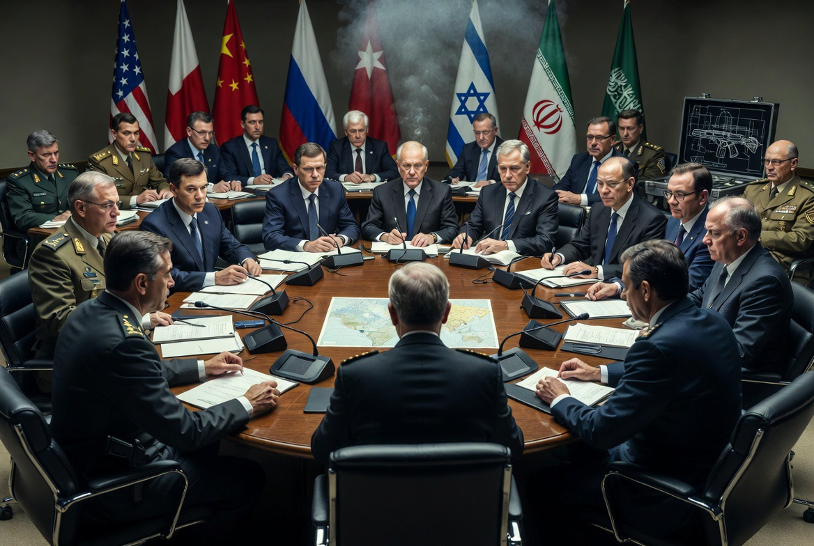

# Diplomasi di Atas Laras Senapan: Mengapa Negara-Negara Tetap Berunding Sambil Terus Menembak?

*Ilustrasi (pic: Grok AI).*

  
***Negara dapat berjabat tangan di ruang konferensi, sementara di tempat lain, keluarga-keluarga masih menghitung orang yang tidak pulang***
  

Dalam teori klasik, diplomasi dan perang sering dipandang sebagai dua keadaan yang berbeda: ketika diplomasi berhasil, perang berhenti; ketika perang dimulai, diplomasi gagal. 

Namun, praktik hubungan internasional abad ke-21 menunjukkan pola yang lebih kompleks. Negara dapat berunding sambil tetap menggunakan kekuatan militer. 

Fenomena ini terlihat dalam berbagai konflik modern, termasuk dinamika AS-Iran, Israel-Lebanon, Rusia-Ukraina, hingga negosiasi di berbagai kawasan. 

Tulisan ini membahas mengapa paradoks tersebut muncul, apa logika strategis di baliknya, dan apa risikonya bagi perdamaian dunia.

## Diplomasi Tidak Selalu Dimulai Setelah Senjata Diam

Banyak orang membayangkan urutannya seperti ini: perang, lalu gencatan senjata, kemudian negosiasi, setelah itu damai.

Padahal, kenyataannya sering menjadi: perang, dilanjut negosiasi, lanjut lagi perang terbatas, kemudian negosiasi lagi, lalu tekanan militer, kembali negosiasi lanjutan.

Dengan kata lain, diplomasi dan operasi militer dapat berjalan secara paralel.

Mengapa?

Karena bagi banyak negara, posisi di meja perundingan dipengaruhi oleh posisi di lapangan.

## Logika “Negosiasi dari Posisi Kuat”

Dalam studi strategi, ada gagasan bahwa negara berusaha datang ke meja perundingan dengan daya tawar maksimal.

Maka, operasi militer kadang dipandang sebagai cara untuk: menunjukkan kemampuan, meningkatkan tekanan, memperkuat posisi tawar, dan memaksa lawan mempertimbangkan konsesi.

Pendukung pendekatan ini percaya bahwa lawan lebih bersedia berunding bila mengetahui biaya melanjutkan konflik akan semakin tinggi.

Namun pendekatan ini juga memiliki risiko besar.

## Bahaya Salah Hitung

Ketika diplomasi dan kekuatan militer berjalan bersamaan, setiap insiden kecil dapat disalahartikan.

Misalnya: serangan yang dimaksudkan sebagai “peringatan” dianggap sebagai awal perang besar, manuver kapal dipersepsikan sebagai provokasi, serta kesalahan identifikasi sasaran memicu balasan yang lebih luas.

Dalam teori hubungan internasional, kondisi seperti ini meningkatkan risiko miscalculation, yaitu salah membaca niat lawan.

## Mengapa Perdamaian Tetap Sulit?

Karena setiap pihak membawa definisi “damai” yang berbeda.

Bagi satu negara, damai berarti ancaman berhenti. Sedangkan bagi negara lain, damai berarti lawan lebih dulu memenuhi syarat politik atau keamanan tertentu.

Ketika definisi damai berbeda, perundingan menjadi jauh lebih rumit.

## Paradoks Kekuatan

Paradoks terbesar politik internasional bukanlah bahwa negara bisa berperang sambil berdiplomasi. 

Paradoks terbesarnya adalah bahwa semua pihak sering mengaku menginginkan perdamaian, tetapi masing-masing ingin perdamaian itu lahir menurut syarat versinya sendiri. 

Selama syarat-syarat itu tidak bertemu, meja perundingan dan laras senapan akan terus hidup berdampingan.

Ada ironi yang terus berulang. Semakin besar kemampuan militer suatu negara, maka semakin besar pula tekanannya untuk menunjukkan bahwa kemampuan itu memiliki efek.

Sebaliknya, semakin lemah suatu negara, maka semakin besar keinginannya mencari jaminan keamanan melalui diplomasi atau aliansi.

Akibatnya, diplomasi sering tidak berdiri sendiri. Ia datang bersama kalkulasi kekuatan.

Ada kalimat terkenal dari Carl von Clausewitz: “War is the continuation of policy by other means.”

Dua abad kemudian, dunia justru memperlihatkan kebalikannya juga, “Diplomasi sering menjadi kelanjutan perang dengan cara yang lebih halus.”

Meja perundingan tidak selalu menggantikan medan tempur. Kadang… ia hanyalah medan tempur yang menggunakan jas, mikrofon, dan naskah perjanjian, sementara kapal perang tetap berlayar dan pesawat tempur tetap siaga.

Inilah wajah geopolitik modern. Bukan dunia yang sepenuhnya damai, bukan pula dunia yang sepenuhnya berperang. Melainkan dunia yang hidup dalam ketegangan yang dikelola (managed tension), di mana negara-negara berusaha menjaga konflik agar cukup keras untuk memberi tekanan, tetapi tidak sampai berubah menjadi perang yang tak terkendali.

Perdamaian yang lahir di tengah dentuman senjata memang terdengar paradoks.

Namun sejarah menunjukkan bahwa banyak perjanjian besar justru lahir ketika para pihak menyadari satu hal, yaitu biaya melanjutkan perang mulai lebih besar daripada keuntungan politik yang mungkin diperoleh.

Sayangnya, jalan menuju kesadaran itu sering dipenuhi korban sipil, kerusakan, dan luka yang bertahan jauh lebih lama daripada masa jabatan para pemimpinnya.

Mungkin itulah pelajaran paling pahit dari diplomasi modern: negara dapat berjabat tangan di ruang konferensi, sementara di tempat lain, keluarga-keluarga masih menghitung orang yang tidak pulang.

  
**Referensi**

Carl von Clausewitz. (1832/1976). On War. Princeton University Press.

Thomas Schelling. (1966). Arms and Influence. Yale University Press.

Henry Kissinger. (1994). Diplomacy. Simon & Schuster.

International Crisis Group. (2025-2026). Middle East Reports.

Council on Foreign Relations. (2026). Global Conflict Tracker.
