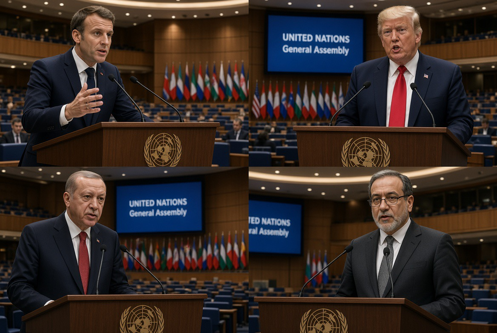

# Diplomat Tak Sanggup Mendengar: Walk out, Pidato, & Kebakaran Diplomatik di PBB

*Ilustrasi (pic: Grok AI).*

  
***Adegan PBB tahun ini menarik bukan cuma karena siapa yang walkout, tetapi juga siapa yang tetap duduk, siapa yang tetap berbicara, dan siapa yang mulai kehilangan monopoli untuk mendefinisikan apa yang disebut “perdamaian”***
  

Pada 22 September 2026, Emmanuel Macron menggunakan pidato terakhirnya di Majelis Umum PBB sebelum meninggalkan jabatan untuk menyerang narasi bahwa situasi Gaza sudah menjadi “perdamaian”.

Macron secara khusus mengatakan bahwa tidak satu pun koridor kemanusiaan Gaza dibuka kembali, meskipun Donald Trump sebelumnya menggambarkan rencana Gaza sebagai keberhasilan diplomatik. 

Macron menyebut keadaan itu sebagai sebuah “spectacle that should shame us all” dan memperingatkan bahwa dunia tidak boleh kembali kepada “law of the jungle”. 

Yang menarik, Macron tidak hanya bicara Gaza. Dia juga menyorot Tepi Barat, Hamas tidak pernah beroperasi di Tepi Barat, katanya, sehingga kekerasan dan ekspansi permukiman Israel di sana tidak dapat dijelaskan sebagai respons terhadap Hamas. 

Secara diplomatik, itu serangan yang cukup telak karena Macron sedang memisahkan, bahwa Gaza bukanlah seluruh Palestina serta bukan Hamas.

Dengan kata lain: “Jangan jadikan Hamas sebagai kunci pembuka semua pintu pembenaran.”

## Lalu Erdogan Naik ke Panggung dan Level Panasnya Naik Lagi 

Sehari sebelumnya, Recep Tayyip Erdoğan memberikan pidato yang jauh lebih keras. Dia menyebut Gaza sebagai “the most inhumane, most shameful concentration camp of our time” dan berbicara tentang apa yang dia sebut sebagai “genocidal mindset” Israel. 

Setelah pidato tersebut, delegasi Israel walked out dari ruangan.  Al Jazeera melaporkan bahwa delegasi Israel meninggalkan ruang sidang ketika Erdoğan menyerang kebijakan Israel di Gaza dan Tepi Barat. 

Dan di sini muncul fenomena politik yang menarik. Walkout itu sendiri adalah pesan, delegasi tidak perlu berteriak, tidak perlu konferensi pers, tidak perlu membalas 30 menit. Mereka cukup berdiri lalu keluar.

Bahasa tubuh diplomatiknya kira-kira: “Kami menolak legitimasi framing pidato tersebut dan tidak akan duduk mendengarkannya.”

## Satu Detail yang Membuat Ironi Ini Makin Juicy 

Ketika Trump berbicara tentang Iran, justru delegasi Iran yang walkout. Trump mengatakan dia menghadapi pilihan antara membuat kesepakatan dengan Iran atau, dalam kata-katanya, “annihilate” Republik Islam tersebut.

Sebagian besar delegasi Iran kemudian meninggalkan ruangan. Hanya seorang diplomat tingkat rendah yang tetap duduk. 

Jadi kita punya dua adegan, yaitu saat Erdogan tampil, Israel walkout, dan saat Trump tampil, Iran walkout.

Secara dramaturgi PBB, yang dituduh keluar, yang diancam keluar, dan yang mengkritik tetap berdiri di podium.

## Jangan Sederhanakan “Yang Walkout Kalah”

Walkout bukan indikator siapa yang benar atau salah, sebab walkout adalah diplomatic signaling.

Dalam hubungan internasional, negara menggunakan tindakan simbolik untuk: menolak legitimasi suatu pernyataan, menunjukkan ketidaksetujuan kepada audiens domestik, memperkuat posisi kepada sekutu, menciptakan gambar media, dan menghindari legitimasi simbolis terhadap lawan.

Jadi kalau Israel walkout saat Erdoğan berbicara, pesan politiknya bukan: “Kami kalah debat.” Melainkan: “Kami menolak menerima framing Erdoğan sebagai kerangka pembicaraan yang sah.” Dan Iran melakukan hal yang sama terhadap Trump.

Walkout itu simetris sebagai teknik diplomasi, meskipun substansi konfliknya tidak otomatis simetris.

## Emosi yang Menarik

Ada perbedaan antara argumentative diplomacy “Pernyataan Anda salah karena A, B, C.” dan performative diplomacy “Pernyataan Anda begitu tidak dapat kami terima sehingga kami keluar.”

Walkout adalah performative diplomacy. Ia tidak membantah isi pidato, ia mementaskan penolakan. Dan PBB sangat cocok untuk teknik semacam ini karena kamera dunia ada di sana. 

Satu kursi kosong bisa menjadi headline global.

## Tetapi Macron Memainkan Permainan yang Berbeda

Macron tidak walkout. Dia melakukan sesuatu yang secara diplomatik justru lebih berbahaya bagi pihak yang dikritik, dia tetap duduk di dalam sistem, lalu menyerang dari dalam sistem.

Macron membela legitimasi PBB, hukum internasional, akses kemanusiaan, hak Palestina, dan solusi dua negara.

Dia bahkan mengakhiri pidatonya dengan: “Long Live the United Nations!”  Ini bukan bahasa revolusioner anti-sistem. Ini bahasa: “Sistem internasional ini masih milik kita semua, dan kalian tidak boleh mengubahnya menjadi arena kekuasaan semata.”

## Macron Justru Menyentil Washington

Trump sebelumnya berdiri di podium yang sama dan menyatakan bahwa perang Gaza telah berakhir serta mengklaim bahwa pemerintahannya telah menyelamatkan ribuan nyawa.

Beberapa jam kemudian Macron berdiri di podium yang sama dan berkata, pada intinya: “Perdamaian macam apa kalau akses kemanusiaan bahkan belum dibuka?” 

Itu bukan sekadar kritik Israel. Itu juga kritik terhadap narasi diplomatik Washington mengenai keberhasilan Gaza.

Dengan kata lain, Macron tidak menyerang hanya kebijakan, dia menyerang framing keberhasilan kebijakan.

## Dan Kemudian Datang Erdogan

Erdogan bahkan lebih frontal. Dia menyebut Gaza sebagai concentration camp, tindakan Israel sebagai apa yang dia sebut state terrorism, dan berbicara mengenai genocidal mindset.  Israel kemudian walkout.

Secara politik, kita dapat membaca ini sebagai dua strategi berbeda:

| Aktor | Strategi |
|------|-------|
|Macron|Kritik dari dalam sistem multilateral|
|Erdoğan|Konfrontasi retoris langsung|
|Israel|Walkout sebagai penolakan|
|Trump|Konfrontasi langsung terhadap Iran|
|Iran|Walkout sebagai penolakan|
|PBB|Menjadi panggung tempat semua sinyal itu dipertontonkan|

Dan jangan lupa, Sekjen PBB António Guterres sendiri dalam pidatonya memperingatkan tentang “specter of ethnic cleansing” di Tepi Barat, sambil mengkritik kekerasan, displacement, dan ekspansi permukiman. 

Jadi kritik terhadap Israel bukan datang dari satu negara saja. Ia sudah menjadi bagian besar dari atmosfer diplomatik General Debate tahun ini.

## Apakah Ini Berarti Israel dan AS “Kebakaran Jenggot”? 

Secara emosional, adegannya memang tampak seperti itu. Tetapi secara analitis, kita tidak bisa menyimpulkan keadaan psikologis suatu pemerintah hanya dari walkout.

Yang bisa kita katakan adalah, walkout menunjukkan bahwa delegasi tersebut menilai pidato lawannya cukup penting atau cukup tidak dapat diterima sehingga mereka memilih demonstrasi penolakan terbuka. Itu fakta perilaku.

Apakah mereka marah? Mungkin.

Apakah mereka merasa terancam secara diplomatik? Mungkin.

Apakah mereka “panik”? Kita tidak punya dasar untuk memastikan.

Dan justru itu lebih menarik.

## Fenomena Lebih Besar dari Sekadar “Walkout”

Yang sedang kita lihat sebenarnya adalah fragmentasi narasi Barat mengenai Gaza dan Israel.

Macron bukan Erdogan, Prancis bukan Turki. Prancis juga bukan Iran. Tetapi Macron, Guterres, Erdogan, Lula, dan beberapa pemimpin lainnya sekarang dapat menggunakan podium PBB untuk menyampaikan kritik yang semakin keras terhadap penghancuran Gaza, akses kemanusiaan, settlement expansion, displacement, dan ketidakpatuhan terhadap prinsip hukum internasional.

Reuters mencatat Macron juga mengatakan bahwa ekspansi permukiman dan kekerasan di Tepi Barat membuat proyek politik Palestina semakin sulit diwujudkan. 

Jadi tekanan diplomatiknya bukan lagi Global South mengkritik Israel semata, ada pula Eropa mengkritik kebijakan Israel.

Dan itu perubahan politik yang lebih signifikan.

## Ironi Terbesar Malam Itu

Pada satu sisi, 

Trump: Saya membawa perdamaian Gaza.

Beberapa jam kemudian:
Macron: Perdamaian yang mana? Koridor kemanusiaan bahkan belum dibuka.

Lalu:
Erdoğan: Gaza adalah concentration camp.

Lalu:
Israel: Kabur ah!

Kemudian:
Trump: Iran bisa saya annihilate.

Lalu:
Iran: Males gue denger!

Kalau PBB adalah teater, kursi kosong tahun ini lebih cerewet daripada sebagian pidatonya. Namun di balik kelucuannya ada sesuatu yang serius, walkout tidak menyelesaikan konflik, tetapi menunjukkan bahwa bahasa diplomasi telah memasuki fase ketika pihak-pihak yang berkonflik tidak lagi hanya memperebutkan wilayah dan kebijakan. Mereka sedang memperebutkan siapa yang berhak mendefinisikan kenyataan di hadapan dunia.

Dan Macron memilih senjata yang berbeda, bukan keluar dari ruangan, tetapi tetap berdiri di podium dan berkata kepada seluruh ruangan: “Jangan sebut ini perdamaian kalau manusia masih tidak bisa mendapatkan akses kemanusiaan.” 

Itu sebabnya adegan PBB tahun ini menarik bukan cuma karena siapa yang walkout. Yang lebih penting adalah siapa yang tetap duduk, siapa yang tetap berbicara, dan siapa yang mulai kehilangan monopoli untuk mendefinisikan apa yang disebut “perdamaian”. 

<be> 
**Referensi**

Reuters. (2026, September 22). In UN farewell, Macron denounces Trump’s Gaza diplomacy as spectacle of shame. 

Al Jazeera. (2026, September 22). Erdogan slams Israel’s ‘genocidal mindset’ in blistering UN address. 

Associated Press. (2026, September 22). Trump in address to world leaders at the UN defends his decision to start the war against Iran. 

Reuters/Israel Hayom. (2026, September 22). Coverage of the UN General Assembly speeches by Guterres, Erdogan, Lula, Macron and others. 
