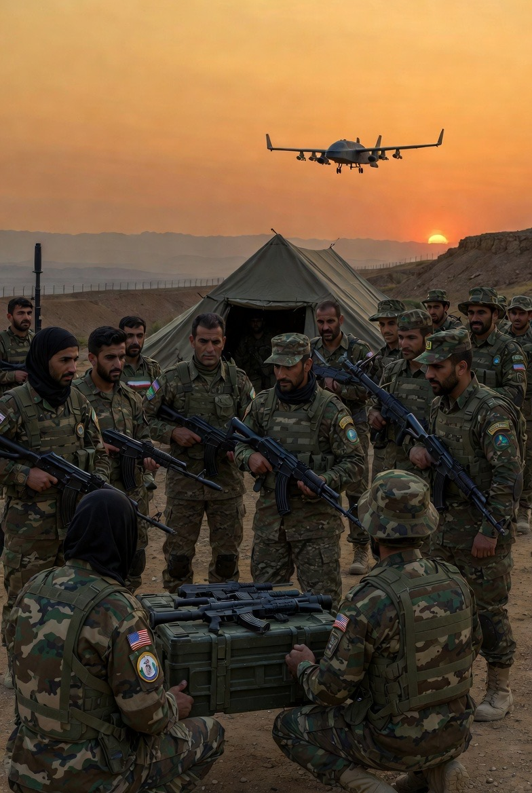

# Divide & Rule Strategy: Rencana AS Memakai Milisi Kurdi Iran untuk Melawan Negaranya sendiri

*Ilustrasi pemberontakan (pic: Grok AI).*

  
***Negara besar sering tidak perlu berperang sendiri. Mereka cukup membiayai orang lain untuk berperang***
  

Satu pola klasik dalam politik kekuasaan. Bukan teori konspirasi baru, bukan juga penemuan abad 21. 

Pola itu sudah dipakai sejak kerajaan Romawi masih sibuk menaklukkan separuh dunia. Namanya memang terkenal: divide et impera. Pecah belah lawan supaya mereka sibuk bertengkar sesama sendiri.

Masalahnya, pola ini tidak hanya milik “mental kolonial Barat”. Hampir semua kekuatan besar dalam sejarah memakainya ketika mereka punya kepentingan strategis. Kadang diam-diam, kadang terang-terangan.

Mari kita bongkar sedikit tanpa romantisasi geopolitik.

## Kasus Kurdi dan Iran

Beberapa laporan media menyebut adanya diskusi antara AS dan milisi Kurdi mengenai kemungkinan operasi terhadap Iran. Bahkan disebutkan kemungkinan dukungan intelijen atau senjata jika rencana itu berjalan.  

Logikanya sederhana dalam strategi militer:

•	Iran punya banyak kelompok etnis di wilayah perbatasan

•	Kurdi adalah salah satunya

•	jika kelompok lokal bangkit melawan pusat, maka negara target menjadi terpecah fokusnya

Strategi seperti ini pernah digunakan di banyak tempat: Irak, Suriah, Afghanistan, bahkan Balkan.

## Taktik “milisi lokal” di Gaza

Hal serupa juga muncul dalam konflik Gaza.

Beberapa laporan menyebut pemerintah Israel mendukung kelompok bersenjata lokal yang memusuhi Hamas, termasuk kelompok yang dituduh menjarah bantuan kemanusiaan.  

Bahkan pemerintah Israel sendiri pernah mengakui bahwa mereka mengaktifkan klan atau kelompok bersenjata lokal untuk melemahkan Hamas.  

Dalam satu insiden, kelompok milisi bersenjata yang diduga mendapat perlindungan Israel bahkan menjarah sebagian besar konvoi bantuan PBB di Gaza.  

Tujuan strateginya biasanya:

•	melemahkan otoritas lawan

•	menciptakan kekacauan internal

•	memecah basis dukungan lawan

## Apakah ini Mental Kolonial?

Sebagian analis memang menyebut pola ini sebagai warisan strategi imperial.

Logika kolonial klasik:

1.	jangan lawan musuh secara langsung jika bisa

2.	gunakan rival lokal

3.	buat konflik internal

Inggris melakukan ini di India.
Belanda melakukannya di Nusantara.
Amerika melakukannya di beberapa konflik modern.
Rusia juga melakukannya.
Iran sendiri menggunakan milisi proksi di Irak, Suriah, Lebanon, dan Yaman.

Dengan kata lain, ini bukan soal satu negara “jahat” dan yang lain “malaikat”.

Ini alat kekuasaan yang digunakan oleh siapa pun yang punya kemampuan geopolitik.

## Kenapa Negara Besar suka Strategi ini

Jawabannya sangat pragmatis.

Strategi ini memberikan tiga keuntungan besar:

1. Biaya rendah

Tidak perlu perang besar dengan pasukan sendiri.

2. Plausible deniability

Bisa bilang “itu bukan kami”.

3. Risiko politik lebih kecil

Korban perang bukan warga negara sendiri.

Sangat sinis. Sangat efektif. Sangat tua.

Risiko dari strategi pecah belah

Ironinya, strategi ini sering berbalik menyerang penciptanya.

Contohnya dalam sejarah:

•	Mujahidin Afghanistan yang dulu didukung AS kemudian berubah menjadi Taliban.

•	Milisi Irak setelah invasi 2003 memicu perang sektarian panjang.

•	Banyak kelompok proksi akhirnya menjadi aktor independen yang tidak bisa dikontrol.

Geopolitik sering seperti memelihara serigala untuk menjaga rumah. Pada awalnya mereka berguna. Pada akhirnya mereka tetap serigala.

Strategi pecah belah bukan fenomena baru dan bukan monopoli satu negara.

Namun dalam konflik modern, penggunaan milisi proksi, kelompok lokal bersenjata, dan operasi intelijenmemang menjadi bagian penting dari perang tidak langsung (proxy warfare).

Secara moral, banyak orang melihatnya sebagai praktik manipulatif atau neokolonial.
Secara strategis, negara besar melihatnya sebagai alat yang efisien.

Dunia diplomasi sering berbicara tentang stabilitas dan perdamaian.
Di ruang belakangnya, para perencana perang masih membaca buku strategi yang sama dari ribuan tahun lalu.

Manusia memang luar biasa. Teknologi berubah drastis. Satelit, drone, AI, semuanya canggih.

Strateginya?
Masih saja trik Romawi kuno dengan kostum abad 21. 

  
**Referensi**
Abrahms, M., & Conrad, J. (2017). The strategic logic of militias. International Security, 42(2), 95–136.
https://doi.org/10.1162/ISEC_a_00290

Allison, G. (2017). Destined for war: Can America and China escape Thucydides’s trap? Boston: Houghton Mifflin Harcourt.
Arreguín-Toft, I. (2005). How the weak win wars: A theory of asymmetric conflict. Cambridge: Cambridge University Press.

Byman, D. (2018). Understanding proxy warfare. Washington, DC: Brookings Institution Press.

Gause, F. G. (2014). The international relations of the Persian Gulf. Cambridge: Cambridge University Press.

Mearsheimer, J. J. (2001). The tragedy of great power politics. New York: W. W. Norton & Company.

Mumford, A. (2013). Proxy warfare. Cambridge: Polity Press.

Schelling, T. C. (1966). Arms and influence. New Haven: Yale University Press.

Walt, S. M. (1987). The origins of alliances. Ithaca: Cornell University Press.

Byman, D. (2020). Iran’s regional strategy and proxy networks. Foreign Affairs.

International Crisis Group. (2023). Iran’s regional influence and proxy strategy. Brussels: ICG Report.

Wehrey, F. (2019). Beyond Sunni and Shia: The roots of sectarianism in a changing Middle East. Oxford University Press.

Al Jazeera. (2024). Israel accused of backing armed clans against Hamas in Gaza.

Reuters. (2024). U.S. relations with Kurdish forces and regional security dynamics.

International Crisis Group. (2024). Proxy conflicts and escalation risks in the Middle East.

Shaw, M. N. (2021). International law (9th ed.). Cambridge University Press.

United Nations. (1945). Charter of the United Nations. New York: United Nations.
