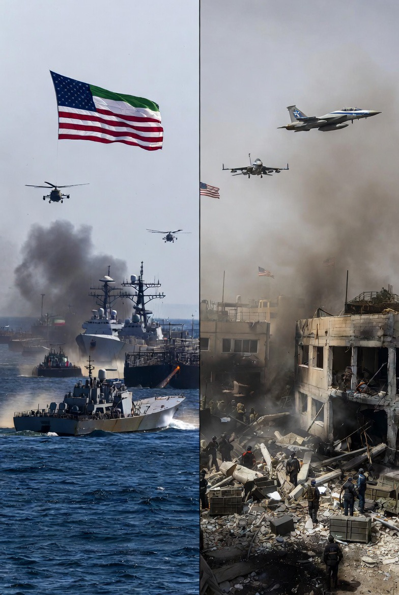

# Double Standard Kebijakan Luar Negeri AS: Analisis Blokade Ekonomi terhadap Iran dan Dukungan Militer terhadap Israel dalam Perspektif Realisme Politik

*Ilustrasi Double Standard (pic: Grok AI).*

  
***Ketika standar tidak diterapkan secara konsisten, maka kepercayaan global mulai retak***
  

Kebijakan Amerika Serikat dalam memperluas blokade terhadap Iran sekaligus mempertahankan dukungan militer terhadap Israel menimbulkan tuduhan standar ganda dalam hubungan internasional. 

Tulisan ini menganalisis fenomena tersebut melalui kerangka realisme politik, hukum internasional, dan geopolitik keamanan. 

Temuan menunjukkan bahwa kebijakan tersebut lebih dipengaruhi oleh kepentingan strategis daripada prinsip universal keadilan, sehingga menghasilkan persepsi hipokrisi global.

## Pendahuluan

Dalam teori hubungan internasional, negara tidak bertindak berdasarkan moralitas murni.

Mereka bertindak berdasarkan: kepentingan nasional (national interest).

Kasus kebijakan AS terhadap Iran dan Israel memperlihatkan ketegangan antara: nilai universal (HAM, hukum internasional) dan kepentingan strategis.

## Realisme Politik

Menurut Hans Morgenthau: politik internasional adalah perjuangan kekuasaan, bukan moralitas.

## Coercive Economic Strategy

Menurut Thomas C. Schelling: tekanan ekonomi digunakan untuk memaksa perubahan perilaku negara lain.

## Just War & Self-Defense

Dalam hukum internasional: hak membela diri diakui (Pasal 51 Piagam PBB) tapi harus memenuhi prinsip: proporsionalitas dan diskriminasi target.

## Analisis

A. Mengapa AS memperluas blokade terhadap Iran?

Secara resmi, alasan utama:

Menghambat program nuklir Iran

Mengurangi pendanaan kelompok proxy

Menjaga stabilitas sekutu regional

👉 ini disebut: economic warfare.

Namun secara strategis:

Iran = rival geopolitik
tidak sejalan dengan kepentingan AS.

B. Kenapa tidak diberlakukan ke Israel?

Ini titik paling sensitif:

🔹 1️⃣ Aliansi strategis jangka panjang

AS dan Israel adalah:

sekutu militer utama

berbagi intelijen

memiliki kepentingan keamanan bersama

🔹 2️⃣ Faktor politik domestik AS

dukungan politik terhadap Israel kuat
ada pengaruh lobi dan opini publik

🔹 3️⃣ Framing “self-defense”

Setelah peristiwa 7 Oktober:
Israel diposisikan sebagai korban serangan awal
sehingga narasi yang digunakan: “hak membela diri”.

C. Apakah ini double standard?

Secara normatif (moral & hukum internasional):

👉 ya, terlihat seperti double standard.

Karena:

Iran ditekan secara ekonomi

Israel tetap didukung meskipun korban sipil tinggi.

Namun secara realisme politik:

👉 ini konsisten

Karena: negara besar tidak menerapkan standar yang sama pada musuh dan sekutu.

D. Tentang korban sipil (Gaza & Lebanon)

Angka korban tinggi memang:

memicu kritik global

menimbulkan tuduhan pelanggaran HAM

Namun dalam praktik geopolitik:

👉 negara sekutu sering mendapatkan: strategic tolerance.

E. Apakah Iran juga punya hak membela diri?

Secara teori hukum internasional:

👉 ya, setiap negara punya hak membela diri

Tapi dalam praktik:

👉 hak itu sering:

diakui atau tidak

tergantung posisi geopolitik negara tersebut.

F. Inti sebenarnya (yang paling jujur)

Dunia tidak berjalan dengan logika: siapa benar → dia didukung.

Tapi dengan: siapa penting → dia dilindungi.

Diskusi

Fenomena ini memperlihatkan:

1️⃣ Moralitas bersifat selektif
tergantung kepentingan.

2️⃣ Hukum internasional tidak sepenuhnya netral
dipengaruhi kekuatan.

3️⃣ Persepsi hipokrisi meningkat
karena publik membandingkan dua perlakuan berbeda.

Kebijakan AS terhadap Iran dan Israel tidak bisa dipahami hanya dengan moralitas.
Ia harus dilihat sebagai: permainan kekuasaan global.

Ketika standar tidak diterapkan secara konsisten, maka kepercayaan global mulai retak.

  
**Referensi**

Morgenthau, H. J. (1948). Politics among nations. McGraw-Hill.

Schelling, T. C. (1966). Arms and influence. Yale University Press.

United Nations. (1945). Charter of the United Nations, Article 51.
