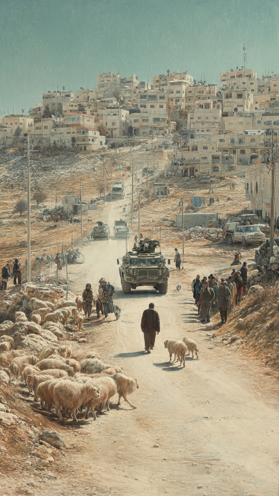

# Dua Remaja Palestina Tewas demi Mempertahankan Domba & Struktur Kekuasaan Timpang di Tepi Barat

*Ilustrasi (pic: Meta AI).*

  
***Domba cuma aktor pendukung, tanah adalah panggungnya, serta kekuasaan adalah sutradaranya. Dan dua remaja itu yang membayar harga paling mengerikan***
  

Yang membuat kasus ini begitu mengerikan justru bukan sekadar “rebutan domba”. Kalau kita berhenti pada kalimat “dua remaja mati karena konflik soal ternak”, kita kehilangan struktur politik di belakangnya.

Menurut laporan Reuters dan WAFA, pasukan Israel masuk ke al-Mughayyir untuk memberikan keamanan kepada polisi dan seorang warga Israel yang hendak mengambil kembali ternak. Warga Palestina kemudian menghadang rombongan tersebut; versi militer Israel menyebut terjadi “violent disturbance” dan pelemparan batu, lalu pasukan menembak orang yang dianggap sebagai provokator utama. 

Jadi ada dua narasi kausal:

Versi Palestina: pemukim datang, ternak hendak diambil, warga mempertahankan miliknya, pasukan Israel ikut masuk, terjadi penembakan.

Versi militer Israel: pasukan mengamankan proses pengambilan ternak, terjadi gangguan kekerasan/lemparan batu, pasukan menembak pihak yang dianggap sebagai penghasut.

Perbedaan ini bukan kosmetik. Siapa yang dianggap sebagai aktor pertama menentukan bagaimana kematian itu diberi legitimasi.

## Mengapa Konflik Domba Bisa Menjadi Mematikan?

Domba bukan cuma domba. Di masyarakat pedesaan seperti al-Mughayyir, ternak adalah aset ekonomi, sumber pangan, sumber pendapatan, bagian dari akses terhadap tanah penggembalaan, dan pada akhirnya bagian dari kemampuan sebuah keluarga untuk tetap tinggal di wilayah tersebut.

Dan di sinilah konteksnya menjadi jauh lebih gelap.

Human Rights Watch pada Agustus 2026 mendokumentasikan bahwa serangan pemukim di Tepi Barat semakin menargetkan livelihood dan ketahanan pangan Palestina, termasuk pembatasan akses terhadap padang penggembalaan dan air, pencurian atau pembunuhan ternak, serta penghancuran lahan pertanian. 

Jadi ketika ternak diambil, dampaknya bukan: “Yah, kehilangan beberapa ekor domba.” Melainkan bisa menjadi kehilangan modal ekonomi yang membuat keluarga mampu bertahan di tanahnya.

## Al-Mughayyir Bukan Desa yang Tiba-tiba Muncul dalam Berita

Ini yang membuat kasus dua remaja tersebut semakin tragis.

HRW mendokumentasikan 43 serangan pemukim di al-Mughayyir sepanjang 2025, jumlah yang sama dengan total insiden selama dua tahun sebelumnya. 

Organisasi tersebut juga mencatat bahwa sejak 2023, warga al-Mughayyir telah kehilangan orang-orang dalam serangan yang melibatkan pemukim maupun tentara. 

Bahkan HRW melaporkan bahwa penduduk mengatakan 98% tanah desa, termasuk padang penggembalaan dan kebun zaitun, telah dicuri aksesnya atau dibatasi oleh pemukim. Desa itu juga dikelilingi sejumlah outpost pemukim. 

Kalau angka tersebut akurat, maka kita sedang melihat sesuatu yang jauh lebih besar daripada insiden individual. Ini adalah konflik atas ruang hidup.

## Coercive Environment

Dalam hukum dan studi konflik, pengusiran tidak harus selalu berbentuk: “Semua orang keluar sekarang.” Ada bentuk yang lebih gradual, yakni akses tanah dipersempit, ternak tidak bisa digembalakan, lahan pertanian rusak, ternak dicuri/dibunuh, rumah diserang, jalan dibatasi, keamanan tidak tersedia, kehidupan menjadi tidak layak, penduduk akhirnya pergi.

HRW menyebut pola seperti ini sebagai coercive environment, yaitu keadaan ketika kombinasi kekerasan, pembatasan, dan ketiadaan perlindungan membuat masyarakat merasa tidak memiliki pilihan selain meninggalkan rumahnya. 

Dan ini konsep yang jauh lebih penting daripada sekadar bertanya: “Siapa yang menang dalam perkelahian domba?”

## Yang Paling Mengganggu: Posisi Aparat Negara

Sekarang kita sampai pada bagian yang secara politik sangat sensitif, bahwa pemukim adalah warga sipil, sedangkan tentara adalah aparat negara.

Dalam sistem hukum modern, keduanya seharusnya memiliki fungsi berbeda.

Kalau seorang pemukim melakukan kekerasan, polisi seharusnya melindungi korban dan menindak pelaku. Kalau tentara hadir, fungsi mereka seharusnya menjaga keamanan sesuai hukum yang berlaku.

Tetapi apabila pemukim dan pasukan hadir bersamaan, sementara warga Palestina yang melawan kehilangan nyawa, muncul pertanyaan yang sangat serius: Apakah aparat negara bertindak sebagai pelindung warga sipil, atau sebagai kekuatan yang memungkinkan perubahan fakta di lapangan?

Kita tidak boleh langsung menyimpulkan niat kriminal dari satu insiden. Namun pertanyaan strukturalnya sah, terutama karena HRW menemukan pola bahwa serangan pemukim sering terjadi bersamaan dengan unit tentara Israel atau ketika tentara berada di lokasi tetapi gagal menghentikannya. 

## Bagaimana dengan Argumen “Mereka Melempar Batu”?

Ini juga harus kita analisis secara fair.

Kalau warga memang melempar batu kepada tentara atau polisi, itu bukan tindakan yang otomatis menjadi legal hanya karena dilakukan dalam konteks konflik.

Namun ada pertanyaan kedua: Apakah penggunaan kekuatan mematikan proporsional terhadap ancaman yang dihadapi?

Dalam prinsip penggunaan kekuatan oleh aparat keamanan, pertanyaan penting bukan hanya: “Apakah terjadi kekerasan?” tetapi: “Seberapa besar ancamannya, dan apakah kekuatan mematikan memang diperlukan untuk menghadapi ancaman tersebut?”

Militer Israel mengatakan mereka menembak “key instigators” setelah terjadi gangguan kekerasan dan menyatakan insiden itu sedang diselidiki. 

Karena itu, investigasi independen terhadap posisi korban, jarak, jenis senjata, arah tembakan, rekaman video, dan identitas penembak menjadi krusial.

Untuk korban berusia 16 tahun, standar pembenaran penggunaan kekuatan mematikan harus diperiksa dengan sangat ketat.

## Paradoks Moral yang Luar Biasa Pahit

Bayangkan logikanya:

Pemukim:
“Ini ternak kami.”
Penduduk:
“Ini ternak kami.”
Negara:
“Aku datang untuk mengamankan pengambilan ternak.”

Lalu dua remaja mati.

Pertanyaan politik yang jauh lebih besar kemudian muncul: Bagaimana sebuah sengketa kepemilikan ternak dapat memperoleh eskalasi sampai aparat bersenjata hadir dan dua manusia kehilangan nyawa?

Jawabannya bukan terletak pada dombanya, namun terletak pada ketimpangan kekuasaan atas tanah, mobilitas, senjata, aparat keamanan, dan akses hukum.

## Mengapa Tepi Barat Berbeda dari Gaza

Gaza sering kita lihat melalui bom, gedung, korban, rumah sakit, dan blokade.

Tepi Barat bekerja dengan mekanisme yang lebih granular, yaitu tanah, jalan, pos, ladang, ternak, rumah, pemukim, aparat, dan displacement.

Tidak selalu ada perang besar, tetapi masyarakat dapat mengalami erosi ruang hidup sedikit demi sedikit.

Dan justru karena prosesnya granular, dunia luar terkadang tidak menyadari betapa radikal perubahan geografisnya.

## Pola yang Jauh Lebih Luas

HRW melaporkan bahwa serangan pemukim telah menyebabkan 107 komunitas Palestina mengalami pengungsian sebagian atau seluruhnya sejak Januari 2023, dengan sekitar 5.900 orang terdampak. 

OCHA juga mencatat rata-rata 6,6 serangan pemukim per hari pada 2026 yang menyebabkan korban atau kerusakan properti. 

Jadi dua remaja al-Mughayyir bukan sekadar statistik baru. Mereka masuk ke dalam pola violence, dispossession, dan displacement.

Dan itulah yang membuat peristiwa ini secara akademik jauh lebih serius daripada headline “dua remaja tewas dalam bentrokan.”

## Jangan Jatuh ke Simplifikasi

Ketika warga Palestina melempar batu kepada aparat memang kita tidak perlu membenarkannya. Demikian juga kalau pemukim mencuri ternak, kita tidak perlu menghaluskannya menjadi “sengketa”. Apalagi jika tentara menembak, kita harus menilai apakah penggunaan kekuatan itu lawful, necessary, and proportionate.

Dan kalau pemerintah Israel gagal mencegah kekerasan pemukim, maka tanggung jawab negara harus diperiksa.

Universalitas hukum baru berarti sesuatu kalau korban yang berbeda tetap memperoleh nilai kehidupan yang sama.

Yang paling mengerikan dari al-Mughayyir justru bukan bahwa dua remaja mati karena domba.

Mereka mati dalam konteks konflik yang jauh lebih besar mengenai siapa yang boleh tinggal, siapa yang boleh menggembala, siapa yang menguasai tanah, siapa yang dilindungi aparat, dan siapa yang harus membuktikan haknya dengan mempertaruhkan nyawa.

Dan laporan HRW menunjukkan bahwa persoalan ternak dan penggembalaan memang merupakan bagian dari pola tekanan ekonomi dan teritorial terhadap komunitas Palestina di Tepi Barat. 

Karena itu, kalau kita mau menggunakan bahasa ilmiah, jangan sebut ini sekadar “konflik domba”. Lebih tepatnya adalah “A lethal escalation of a land-and-livelihood conflict under conditions of asymmetric power.”

Domba cuma aktor pendukung, tanah adalah panggungnya, serta kekuasaan adalah sutradaranya. Dan dua remaja itu yang membayar harga paling mengerikan. 

Dan satu hal lagi, kita belum boleh mengatakan secara definitif bahwa kedua remaja itu “dibunuh karena mencegah pencurian domba” sebagai fakta hukum final. Itu adalah kesimpulan dari kesaksian lokal; militer Israel memberikan versi berbeda dan mengatakan insiden sedang diselidiki. 

Yang sudah kuat terverifikasi adalah dua remaja Palestina tewas ditembak dalam insiden yang melibatkan pemukim dan pasukan Israel di al-Mughayyir ketika terjadi perselisihan terkait ternak. 

Itu justru alasan kita harus marah dengan kepala tetap dingin. Karena kalau fakta dikunci terlalu cepat, kita memberi hadiah gratis kepada propaganda dari pihak mana pun.

  
**Referensi**

Human Rights Watch. (2026, August 20). West Bank: Israel-backed settler violence drives displacement.

Reuters. (2026, September 2). Two Palestinian teens killed in West Bank raid by Israeli settlers and army.

The Guardian. (2026, September 3). Israelis shoot dead two Palestinian teenagers after settlers encircle village.

WAFA. (2026, September 2). Two Palestinian youths killed by Israeli forces, colonists in al-Mughayyir, northeast of Ramallah.
