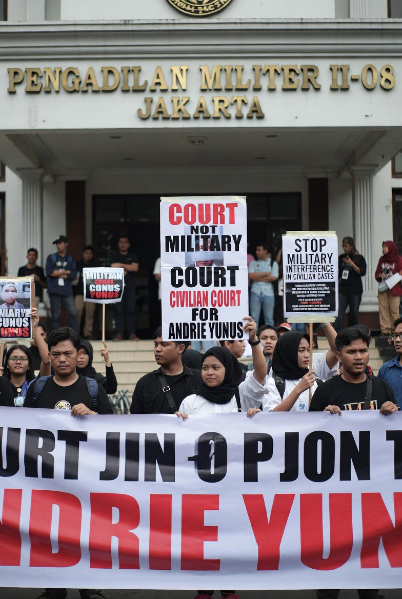

# Dualisme Yurisdiksi dan Impunitas Struktural: Analisis Sidang Militer Kasus Penyiraman Air Keras Aktivis Andrie Yunus

*Ilustrasi pengadilan militer (pic: Grok AI).*

  
***Perspektif Reformasi Peradilan Militer, Supremasi Sipil, dan Rule of Law di Indonesia***
  

Kasus penyiraman air keras terhadap aktivis Andrie Yunus yang disidangkan di pengadilan militer kembali memunculkan perdebatan lama mengenai yurisdiksi peradilan militer di Indonesia. 

Tulisan ini menganalisis mengapa tindak pidana umum yang dilakukan anggota TNI masih sering diproses melalui peradilan militer, meskipun Pasal 65 Undang-Undang Nomor 34 Tahun 2004 tentang TNI mengamanatkan bahwa prajurit TNI yang melakukan tindak pidana umum harus diadili di peradilan umum. 

Artikel ini menunjukkan bahwa stagnasi reformasi terjadi akibat benturan antara norma reformasi pasca-Orde Baru dengan struktur hukum lama yang belum dicabut sepenuhnya, khususnya Undang-Undang Peradilan Militer Tahun 1997. 

Akibatnya, muncul dualisme yurisdiksi yang memengaruhi akuntabilitas, transparansi, dan persepsi publik terhadap keadilan.

## Pendahuluan

Kasus Andrie Yunus menjadi sensitif bukan hanya karena bentuk kekerasannya terhadap aktivis sipil, tetapi karena:

pelaku berasal dari institusi militer

tindakannya masuk kategori pidana umum

proses hukumnya tetap berada dalam sistem peradilan militer.

Dan publik langsung bereaksi:

“Kalau korbannya sipil dan tindak pidananya umum, kenapa tidak diadili di pengadilan sipil?”

Pertanyaan itu bukan emosional semata.

Itu pertanyaan konstitusional.

## Dasar Hukum yang Menjadi Konflik

1. Pasal 65 UU TNI Tahun 2004

Undang-Undang Nomor 34 Tahun 2004 tentang TNI Pasal 65 ayat (2):

“Prajurit tunduk kepada kekuasaan peradilan militer dalam hal pelanggaran hukum militer dan tunduk kepada kekuasaan peradilan umum dalam hal pelanggaran hukum pidana umum.”

Secara normatif:

👉 penganiayaan

👉 penyiraman air keras

👉 kekerasan terhadap sipil

= tindak pidana umum.

2.Masalahnya: aturan lama belum dicabut

Masalah muncul karena Indonesia masih memakai:

Undang-Undang Nomor 31 Tahun 1997 tentang Peradilan Militer

UU ini berasal dari era sebelum reformasi TNI penuh.

Di dalam praktiknya:

hampir semua perkara anggota TNI
tetap diproses dalam yurisdiksi militer.

## Mengapa Ketentuan Pasal 65 Belum Jalan?

1. Tidak ada aturan turunan yang kuat

Pasal 65 membutuhkan:

revisi UU Peradilan Militer

sinkronisasi KUHAP

mekanisme koordinasi sipil-militer

Namun hingga kini:

👉 reformasi itu tidak pernah selesai penuh.

Akibatnya:

norma reformasi ada
tapi mesin hukumnya masih lama

2. Resistensi institusional

Peradilan militer tidak hanya soal hukum.

Ia juga menyangkut:

disiplin internal

hirarki komando

kontrol institusi.

Sebagian kalangan militer khawatir:

👉 pengadilan sipil dianggap tidak memahami konteks militer

👉 atau dianggap mengganggu kohesi internal.

3. Warisan Orde Baru

Pada masa Orde Baru:

militer memiliki posisi politik dominan

sistem hukum memberi ruang otonomi besar bagi TNI.

Reformasi 1998 mencoba mengubah itu, tetapi:

👉 perubahan institusi lebih lambat daripada perubahan teks hukum.

## Dampak Sosial dan Politik

1. Persepsi impunitas

Saat kasus pidana umum diproses di pengadilan militer, publik sering merasa:

proses kurang transparan

hukuman lebih ringan

solidaritas korps terlalu kuat.

Muncul kesan:

“militer mengadili dirinya sendiri”

Dan ini berbahaya bagi legitimasi hukum.

2. Krisis supremasi sipil

Dalam negara demokrasi modern:

👉 militer seharusnya tunduk pada otoritas sipil

Jika tindak pidana terhadap warga sipil tetap dominan diadili secara internal, maka:

supremasi sipil tampak lemah

reformasi demokrasi terlihat setengah selesai.

## Perspektif Komparatif

Banyak negara demokrasi modern:

membatasi yurisdiksi militer hanya untuk pelanggaran dinas

sementara pidana umum masuk pengadilan sipil.

Contoh:

Jerman

Jepang

sebagian besar negara Eropa Barat

Karena prinsipnya:

warga sipil harus dilindungi oleh sistem hukum sipil.

##,Analisis Kritis

Kasus Andrie Yunus menunjukkan bahwa Indonesia mengalami:

⚠️ dualisme hukum

Di atas kertas:

reformasi sudah ada.

Di praktik:

sistem lama masih dominan.

Ini menghasilkan apa yang disebut:

“legal ambiguity with institutional inertia”.

yakni:

norma berubah
tapi institusi bergerak lambat.

Kasus penyiraman air keras terhadap Andrie Yunus memperlihatkan ketegangan antara agenda reformasi TNI dan realitas kelembagaan hukum Indonesia. 

Meskipun UU TNI 2004 mengamanatkan tindak pidana umum anggota TNI diadili di peradilan umum, implementasinya terhambat oleh belum direvisinya sistem peradilan militer secara menyeluruh. 

Akibatnya, dualisme yurisdiksi terus berlangsung dan memunculkan pertanyaan serius tentang transparansi, akuntabilitas, dan supremasi sipil dalam demokrasi Indonesia.

Negara demokrasi sering bilang: “semua warga negara setara di depan hukum”.
Tapi dalam praktik…
beberapa institusi masih membawa gravitasi politiknya sendiri.

Dan hukum, kadang lambat bergerak saat berhadapan dengan kekuasaan.

  
**Referensi**

Undang-Undang Nomor 34 Tahun 2004 tentang TNI.

Undang-Undang Nomor 31 Tahun 1997 tentang Peradilan Militer.

Asshiddiqie, J. (2006). Konstitusi dan Konstitusionalisme Indonesia. Jakarta: Konstitusi Press.

Crouch, H. (2010). Political Reform in Indonesia After Soeharto. Institute of Southeast Asian Studies.

Mietzner, M. (2009). Military Politics, Islam, and the State in Indonesia. Institute of Southeast Asian Studies.
