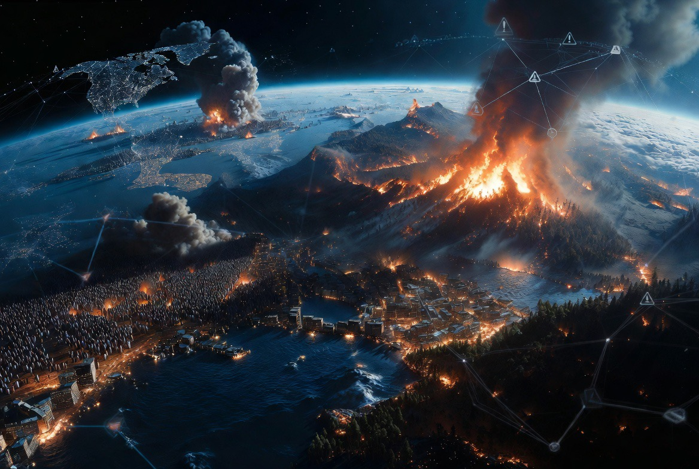

# Dunia Memasuki Era Polycrisis: Ketika Krisis Tidak Lagi Datang Sendiri

*Ilustrasi (pic: Grok AI).*

  
***“Masalah terbesar abad ke-21 bukanlah satu krisis yang sangat besar, melainkan banyak krisis yang saling menggigit.”***
  

Istilah polycrisis semakin populer dalam kajian hubungan internasional, ekonomi, dan kebijakan publik. 

Konsep ini menggambarkan situasi ketika berbagai krisis, seperti konflik geopolitik, perubahan iklim, gangguan energi, inflasi, migrasi, keamanan siber, hingga disrupsi teknologi, tidak terjadi secara terpisah, melainkan saling berinteraksi. 

Akibatnya, dampak keseluruhan menjadi jauh lebih besar daripada jika setiap krisis terjadi sendiri-sendiri.

# Apa Itu Polycrisis?

Secara sederhana, poly berarti banyak. Crisis berarti krisis. Tetapi polycrisis bukan sekadar banyak masalah. Melainkan banyak masalah yang saling memperburuk satu sama lain.

Misalnya: Perang menyebabkan gangguan energi, dan gangguan energi meningkatkan inflasi, inflasi memicu keresahan sosial, keresahan sosial memengaruhi stabilitas politik, ketidakstabilan politik memperlambat investasi, ekonomi melemah. Lalu kemampuan negara menghadapi bencana iklim ikut menurun.

Lingkarannya terus berputar.

## Mengapa Dunia Baru Menyadarinya Sekarang?

Karena dunia menjadi jauh lebih terhubung. Satu kapal yang tertahan di Selat Hormuz dapat memengaruhi harga BBM di Asia.

Satu wabah penyakit dapat mengganggu rantai pasok global. Satu serangan siber dapat melumpuhkan layanan publik di negara lain. Globalisasi membuat manfaat menyebar cepat.

Tetapi… risiko juga menyebar sama cepatnya.

## Contoh Polycrisis Tahun 2026

Kalau kita melihat berbagai peristiwa yang sering kita bahas bersama, pola itu terlihat jelas.

**Geopolitik**
Ketegangan AS-Iran, konflik di Timur Tengah. persaingan AS-China, juga Laut China Selatan. Semuanya memengaruhi perdagangan dan keamanan.

**Energi**
Gangguan di sekitar Selat Hormuz, membuat harga minyak naik, biaya transportasi meningkat, inflasi bertambah, akibatnya pertumbuhan ekonomi melambat.

**Iklim**
Gelombang panas ekstrem, mengakibatkan konsumsi listrik melonjak, tekanan pada jaringan energi, produktivitas menurun, berdampak biaya kesehatan meningkat.

**Teknologi**
Perkembangan AI, membuat produktivitas naik. Tetapi muncul kekhawatiran mengenai pekerjaan, keamanan siber, dan penyalahgunaan informasi.

## Mengapa Polycrisis Lebih Berbahaya?

Pemerintah biasanya merancang kebijakan untuk menghadapi satu krisis. Tetapi dalam polycrisis, satu solusi dapat memperburuk masalah lain.

Contohnya: Menaikkan produksi energi fosil dapat membantu ekonomi jangka pendek, namun meningkatkan emisi karbon dalam jangka panjang.

Sebaliknya, transisi energi terlalu cepat dapat menimbulkan tekanan ekonomi bila infrastruktur belum siap.

## Bagaimana Negara Bertahan?

Para peneliti kini lebih sering berbicara tentang resiliensi. Bukan berarti negara tidak akan terkena krisis, melainkan seberapa cepat negara mampu beradaptasi, pulih, dan belajar.

Negara yang tangguh bukanlah negara tanpa masalah. Melainkan negara yang tetap berfungsi ketika banyak masalah datang bersamaan.

Polycrisis mengubah cara kita memandang dunia. Dulu orang bertanya: “Apa masalah terbesar tahun ini?” Sekarang pertanyaannya berubah menjadi: “Masalah mana yang akan memicu masalah berikutnya?”

Itulah perbedaan paling mendasar. Jika abad ke-20 dipenuhi perang besar, maka pada abad ke-21 dipenuhi krisis yang saling terhubung.

Perang tidak hanya menghasilkan korban. Ia juga menghasilkan inflasi, inflasi memengaruhi politik, politik memengaruhi investasi, investasi memengaruhi lapangan kerja, perubahan iklim memperburuk semuanya.

Dan media sosial membuat seluruh dunia menyaksikan krisis itu secara langsung dalam hitungan detik.

Mungkin inilah wajah baru peradaban, bukan dunia yang kekurangan solusi, tetapi dunia yang setiap solusi harus mempertimbangkan puluhan dampak lain secara bersamaan.

Polycrisis bukanlah ramalan kehancuran dunia. Ia adalah peringatan bahwa tantangan modern semakin saling berkaitan.

Karena itu, negara yang hanya fokus pada satu masalah berisiko tertinggal menghadapi masalah lain yang muncul hampir bersamaan.

Di era polycrisis, musuh terbesar manusia bukan hanya perang, wabah, inflasi, atau perubahan iklim. Musuh terbesarnya adalah ketika semua itu datang bersamaan, lalu memaksa dunia mencari jawaban yang tidak bisa lagi diselesaikan oleh satu negara atau satu disiplin ilmu saja.

Dalam dunia polycrisis, keberhasilan tidak lagi ditentukan oleh siapa yang paling kuat, tetapi oleh siapa yang paling adaptif, mampu bekerja sama, dan cepat belajar. 

Di sinilah diplomasi, ilmu pengetahuan, tata kelola pemerintahan, serta solidaritas internasional menjadi sama pentingnya dengan kekuatan ekonomi dan militer.

  
**Referensi**

Edgar Morin. (1999). Homeland Earth: A Manifesto for the New Millennium.

Adam Tooze. (2022). Chartbook (esai-esai tentang konsep polycrisis).

World Economic Forum. (2025). Global Risks Report 2025.

Organisation for Economic Co-operation and Development. (2023). Emerging Systemic Risks and Resilience.

United Nations. (2024). Our Common Agenda.

