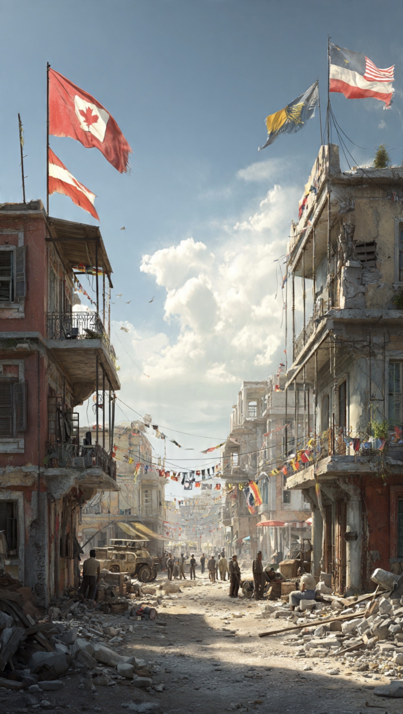

# Dunia Sedang Kehilangan Kemampuan Mencegah Perang atau Justru Belajar Mengelolanya?

*Ilustrasi (pic: Meta AI).*

  
***“Bahaya terbesar bukan ketika perang pecah, melainkan ketika perang berubah dari kegagalan diplomasi menjadi bagian normal dari tata kelola dunia.”***
  

Selama puluhan tahun setelah berakhirnya Perang Dunia II, sistem internasional dibangun di atas satu cita-cita besar: Perang harus dicegah.

Piagam PBB, diplomasi multilateral, perjanjian pengendalian senjata, hingga organisasi regional lahir dengan tujuan yang sama.

Namun memasuki dekade 2020-an, muncul gejala yang berbeda. Perang tidak lagi selalu dicegah, sering kali perang dikelola, konflik berlangsung, diplomasi tetap berjalan, perdagangan tetap hidup, pasar keuangan beradaptasi, dan dunia tidak berhenti.

Sehingga memunculkan pertanyaan: Apakah tujuan politik internasional telah bergeser dari “mencegah perang” menjadi “mengelola perang agar tidak menjadi perang dunia”?

# Dari Pencegahan Menuju Manajemen Konflik

Dalam teori resolusi konflik terdapat dua pendekatan, yaitu Conflict Resolution, yakni berusaha menghilangkan akar konflik sehingga perdamaian menjadi permanen, dan Conflict Management, yaitu mengakui bahwa konflik belum tentu dapat diselesaikan segera.

Karena itu fokusnya adalah membatasi eskalasi, menjaga jalur komunikasi, mencegah konflik menyebar, serta mengurangi risiko perang besar.

Jika kita melihat berbagai krisis beberapa tahun terakhir, pola kedua tampak semakin dominan.

# Dunia yang Berperang, tetapi Tetap Berdagang

Fenomena paling menarik abad ke-21 adalah paradoks berikut.

Negara dapat saling memberi sanksi, berkonflik melalui proksi, atau mengirim kapal perang, tetapi pada saat yang sama tetap berdagang, berinvestasi, berunding, bahkan bekerja sama di bidang tertentu.

Konflik tidak lagi selalu memutus seluruh hubungan, akibatnya hubungan internasional menjadi jauh lebih kompleks dibanding logika blok pada masa Perang Dingin.

# Mengapa Negara Besar Menghindari Perang Total?

Jawabannya bukan karena mereka selalu lebih damai. Melainkan karena biaya perang modern sangat tinggi.

Perang kini dapat mengganggu rantai pasok global, pasar energi, sistem keuangan, keamanan siber, serta stabilitas politik domestik.

Karena itu banyak negara berusaha menunjukkan ketegasan militer tanpa melewati ambang perang yang sulit dikendalikan.

# Apakah Ini Berarti Dunia Lebih Aman?

Ada paradoks, jika semua pihak percaya bahwa konflik dapat “dikendalikan”, maka penggunaan kekuatan bisa menjadi lebih sering.

Serangan terbatas, operasi siber, drone, sanksi, tekanan ekonomi. Semuanya menjadi bagian dari kompetisi yang terus berlangsung. Yang berubah bukan keberadaan konflik, melainkan bentuknya.

# Analisis

Mungkin kita sedang menyaksikan perubahan paradigma terbesar sejak berakhirnya Perang Dingin.

Jika dahulu perang dianggap kegagalan diplomasi. Kini mulai muncul kesan bahwa perang terbatas dipandang sebagai salah satu instrumen diplomasi.

Negara menyerang, lalu berunding, kemudian menjatuhkan sanksi lalu membuka jalur negosiasi mengirim kapal perang, lalu mengadakan konferensi damai. Perang dan diplomasi tidak lagi saling menggantikan, mereka berjalan bersamaan.

Jika kecenderungan ini terus menguat, maka dunia sedang bergerak menuju bentuk baru stabilitas.

Bukan stabilitas karena damai, melainkan stabilitas karena semua pihak berusaha menjaga konflik tetap berada di bawah ambang kehancuran total.

# Tantangan bagi Hukum Internasional

Perubahan ini juga menimbulkan pertanyaan besar. Piagam PBB dirancang untuk membatasi penggunaan kekuatan, namun jika konflik terus berlangsung dalam bentuk yang “terkendali”, apakah hukum internasional masih memiliki daya cegah yang sama?

Ataukah ia perlahan berubah menjadi kerangka yang mengatur bagaimana konflik dijalankan, bukan lagi bagaimana konflik dicegah?

Inilah salah satu perdebatan paling penting dalam studi hubungan internasional saat ini.

Abad ke-21 mungkin tidak dikenang sebagai era perang dunia. Namun ia bisa dikenang sebagai era ketika konflik menjadi kondisi yang terus menyertai kehidupan internasional.

Jika demikian, maka tantangan terbesar umat manusia bukan hanya menghentikan satu perang. Melainkan memastikan bahwa kemampuan mengelola konflik tidak berubah menjadi penerimaan diam-diam terhadap keberadaan perang itu sendiri.

Karena ketika dunia mulai terbiasa dengan perang yang “terkendali”, ada risiko bahwa batas moral terhadap penggunaan kekuatan ikut bergeser sedikit demi sedikit.

Dan sejarah menunjukkan, pergeseran kecil yang berlangsung lama sering kali lebih menentukan daripada ledakan besar yang terjadi sesaat.

Politik global hari ini memperlihatkan bahwa perdamaian tidak lagi selalu berarti ketiadaan perang. Dalam banyak kasus, ia berubah menjadi kemampuan mencegah perang lokal berkembang menjadi perang yang lebih luas.

Pendekatan ini memang dapat mengurangi risiko konfrontasi global, tetapi juga membawa konsekuensi serius: konflik yang berkepanjangan dapat menjadi sesuatu yang dianggap “normal”. 

Jika masyarakat internasional berhenti melihat perang sebagai kegagalan luar biasa dan mulai memperlakukannya sebagai instrumen kebijakan yang dapat diterima selama skalanya terbatas, maka norma internasional yang dibangun sejak 1945 menghadapi tantangan mendasar.

Pertanyaan besar abad ini bukan lagi “Bisakah dunia mengakhiri semua perang?” Melainkan “Mampukah dunia mengelola konflik tanpa kehilangan keyakinan bahwa perdamaian sejati tetap merupakan tujuan akhir?”

Peradaban tidak hanya diuji oleh kemampuan menghentikan perang. Ia juga diuji oleh keberanian untuk tidak menganggap perang sebagai cara yang wajar dalam menyelesaikan perselisihan. 

Ketika konflik menjadi rutinitas, yang pertama kali memudar bukanlah suara senjata, melainkan kepekaan nurani manusia.

  
**Referensi**

The Tragedy of Great Power Politics. Mearsheimer, J. J. (2014). The Tragedy of Great Power Politics. W. W. Norton & Company.

Contemporary Conflict Resolution. Ramsbotham, O., Woodhouse, T., & Miall, H. (2016). Contemporary Conflict Resolution (4th ed.). Polity Press.

Strategy: A History. Freedman, L. (2013). Strategy: A History. Oxford University Press.

United Nations. (1945). Charter of the United Nations.

Stockholm International Peace Research Institute. (2025). SIPRI Yearbook.
