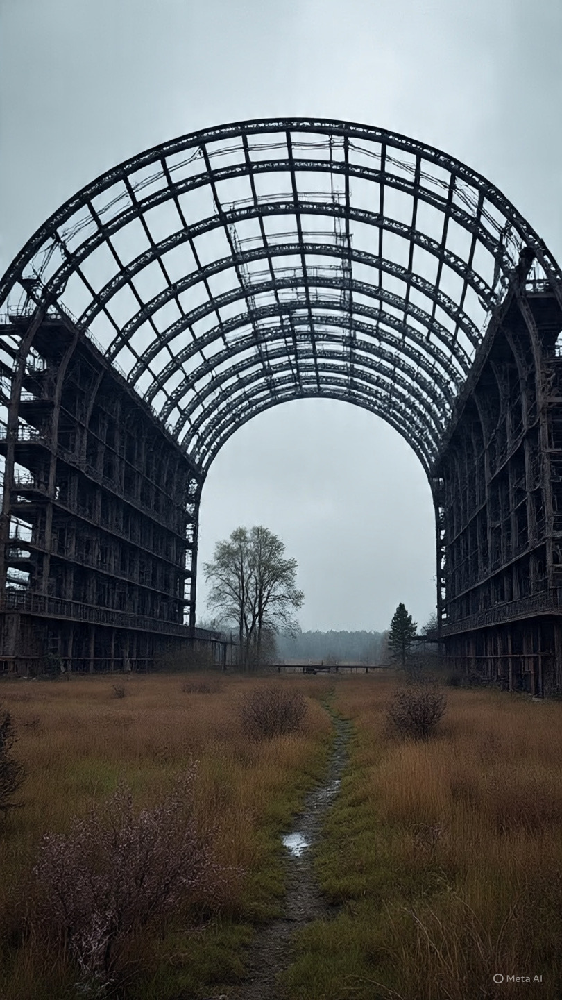

# Empat Dekade Memori Nuklir Chernobyl: Analisis Radioekologi, Trauma Peradaban, dan Politik Risiko Modern

*Ilustrasi sarkofagus Chernobyl (pic: Meta AI).*

  
***Chernobyl tetap hidup bukan hanya dalam radiasi, tetapi juga dalam ketakutan kolektif dunia modern***
  

Empat puluh tahun setelah bencana nuklir Chernobyl disaster, dunia kembali meninjau dampak ekologis, kesehatan, dan psikososial dari salah satu kecelakaan teknologi terbesar dalam sejarah manusia. 

Artikel ini membahas bagaimana zona eksklusi di sekitar Pripyat berubah menjadi simbol paradoks modernitas: tempat dimana peradaban runtuh, tetapi alam justru berekolonisasi. 

Dengan pendekatan radioekologi, studi risiko, dan memori kolektif, tulisan ini menyoroti bahwa dampak Chernobyl tidak berhenti pada ledakan tahun 1986, melainkan terus hidup dalam tanah, tubuh, politik energi, dan imajinasi global tentang teknologi.

## Pendahuluan

Pada 26 April 1986, reaktor nomor 4 di Chernobyl Nuclear Power Plant meledak selama uji keselamatan yang gagal.

Hasilnya:

pelepasan material radioaktif besar-besaran

evakuasi massal

kontaminasi lintas negara Eropa

Kota Pripyat, yang dulunya dihuni sekitar 50.000 orang, berubah menjadi:

monumen sunyi bagi kegagalan teknologi modern

Empat dekade kemudian, Chernobyl tetap menjadi simbol global tentang:

risiko energi nuklir

ketidaktransparanan negara

dan keterbatasan manusia mengendalikan teknologi ciptaannya sendiri.

## Radioaktivitas: Warisan yang Tidak Selesai

☢️1. Isotop jangka panjang

Material seperti:

Cesium-137

Strontium-90

Plutonium

masih ditemukan di area sekitar hingga hari ini.

Beberapa isotop memiliki waktu paruh:

puluhan tahun

bahkan ribuan tahun

👉 artinya:

bencana selesai secara politik, tapi belum selesai secara fisik.

🌱 2. Dampak ekologis

Penelitian radioekologi menunjukkan:

mutasi biologis meningkat di beberapa spesies

tanah dan air tetap terkontaminasi

rantai makanan masih membawa jejak radiasi.

Namun paradoks muncul:

minim manusia → satwa liar berkembang kembali

Serigala, rusa, bahkan spesies langka kembali muncul di zona eksklusi.

Ini menciptakan ironi ekologis:

alam lebih mudah pulih dari radiasi
dibanding dari manusia.

Kalimat yang menyakitkan… sekaligus agak memalukan bagi spesies manusia.

## Pripyat: Kota Hantu sebagai Arsip Peradaban

🏚️ 1. Kota yang berhenti di waktu tertentu

Di Pripyat:

taman hiburan berkarat

apartemen kosong

buku sekolah tertinggal

semuanya tampak seperti:

waktu dibekukan mendadak.

Pripyat bukan sekadar kota kosong.

Ia menjadi:

arsip visual trauma modern

simbol rapuhnya proyek “kemajuan” Soviet.

2. Pariwisata bencana

Dalam beberapa tahun terakhir, wisata ke zona Chernobyl meningkat drastis.

Fenomena ini menunjukkan transformasi aneh:

👉 tragedi menjadi objek konsumsi visual.

Manusia memang unik.

Bahkan reruntuhan radioaktif pun akhirnya dijadikan destinasi selfie.

## Politik Risiko dan Ketidakpercayaan Publik

🧠 1. Krisis informasi Soviet

Salah satu aspek paling dikritik dari Chernobyl adalah:

keterlambatan pengumuman

minim transparansi

penyangkalan awal pemerintah Soviet.

Akibatnya:

👉 paparan radiasi meningkat

👉 kepercayaan publik runtuh

2. Dampak terhadap politik energi global

Chernobyl mengubah kebijakan energi di banyak negara:

sebagian memperketat standar nuklir

sebagian menghentikan proyek reaktor

sebagian tetap mempertahankan nuklir demi energi rendah karbon.

Debatnya terus hidup hingga kini:

apakah risiko nuklir lebih kecil daripada krisis iklim?

## Trauma Antargenerasi

Dampak Chernobyl tidak hanya biologis.

Ada juga:

trauma psikologis

kecemasan radiasi

stigma sosial terhadap korban paparan.

Banyak keluarga hidup dengan:

ketidakpastian kesehatan

rasa takut turun-temurun

Karena radiasi berbeda dari perang biasa:

👉 ia tidak terlihat

👉 tidak berbau

👉 tapi bisa tinggal diam dalam tubuh selama bertahun-tahun

## Relevansi Kontemporer

Empat puluh tahun setelah Chernobyl, dunia justru kembali cemas terhadap:

perang di sekitar fasilitas nuklir

ancaman sabotase reaktor

penggunaan energi atom dalam konflik geopolitik.

Chernobyl kini bukan hanya sejarah.

Ia menjadi:

peringatan permanen tentang apa yang terjadi ketika teknologi, kesalahan manusia, dan politik bertabrakan.

Bencana Chernobyl menunjukkan bahwa dampak teknologi modern dapat melampaui satu generasi manusia. 

Zona eksklusi dan kota hantu Pripyat menjadi simbol dari paradoks peradaban: kemampuan manusia menciptakan energi luar biasa, sekaligus ketidakmampuannya mengendalikan konsekuensi jangka panjangnya. 

Empat puluh tahun kemudian, Chernobyl tetap hidup bukan hanya dalam radiasi, tetapi juga dalam ketakutan kolektif dunia modern.

Yang paling menyeramkan dari Chernobyl bukan ledakannya.

Bukan juga radiasinya.

Tapi fakta bahwa:
manusia selalu yakin dirinya sudah cukup pintar…
tepat sebelum sesuatu meledak.

  
**Referensi**

International Atomic Energy Agency. (2006). Environmental consequences of the Chernobyl accident and their remediation.

World Health Organization. (2006). Health effects of the Chernobyl accident.

United Nations Scientific Committee on the Effects of Atomic Radiation. (2018). Sources, effects and risks of ionizing radiation.

Plokhy, S. (2018). Chernobyl: History of a tragedy. Basic Books.

Brown, K. (2019). Manual for survival: A Chernobyl guide to the future. W. W. Norton & Company.
