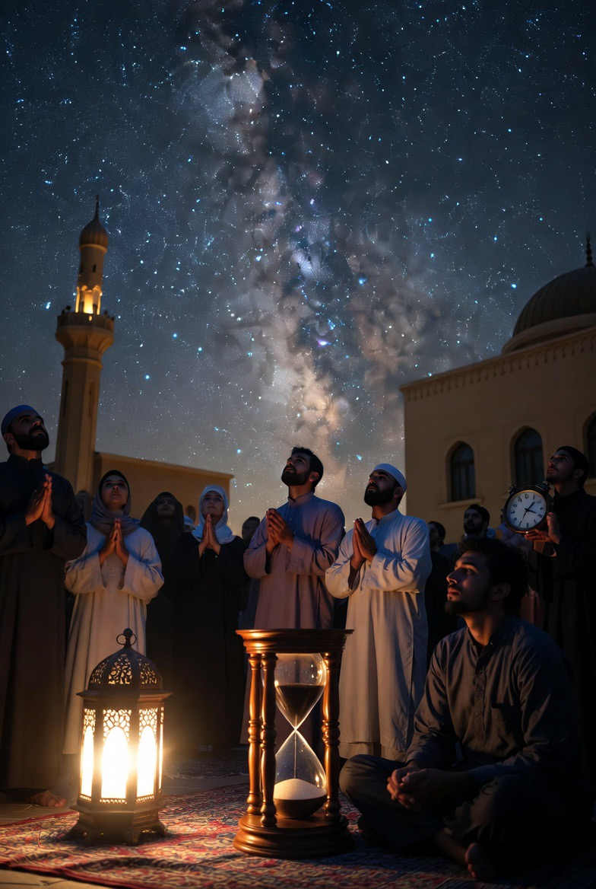

# Epistemologi Lailatul Qadr: Simbolisme “Seribu Bulan”, Strategi Teologis Ketidakpastian, dan Filsafat Waktu dalam Islam

*Ilustrasi (pic: Grok AI).*

  
***Nilai suatu waktu tidak ditentukan oleh durasinya, tetapi oleh intensitas kehadiran manusia di hadapan Tuhan***
  

Lailatul Qadr merupakan salah satu konsep spiritual paling misterius dalam Islam. Dalam Qur’an Surah Al-Qadr, malam tersebut digambarkan “lebih baik dari seribu bulan”. Namun Al-Qur’an tidak menyebutkan tanggal pasti kemunculannya. 

Artikel ini menganalisis fenomena tersebut melalui tiga pendekatan: 

(1) strategi teologis ketidakpastian waktu dalam tradisi Islam, 

(2) simbolisme angka dalam bahasa Arab Qur’ani, dan 

(3) filsafat pengalaman waktu religius. 

Studi ini menunjukkan bahwa ketidakpastian waktu Lailatul Qadr berfungsi sebagai mekanisme spiritual yang mendorong intensitas ibadah, sementara metafora “seribu bulan” kemungkinan merupakan simbol hiperbolik yang menunjukkan kualitas spiritual yang melampaui kalkulasi waktu biasa.

## Pendahuluan

Dalam Surah Al-Qadr disebutkan:
“Lailatul Qadr lebih baik daripada seribu bulan.”

Ayat ini menjadikan malam tersebut pusat refleksi spiritual umat Islam sepanjang Ramadan.

Namun dua pertanyaan teologis muncul:

1.	Mengapa tanggalnya tidak disebutkan secara eksplisit?

2.	Apakah angka seribu bulan harus dipahami secara literal atau simbolik?

Pertanyaan ini membuka diskusi lintas disiplin antara tafsir, linguistik, dan filsafat waktu religius.

## Ketidakpastian Waktu sebagai Strategi Teologis

Dalam hadis,  Nabi Muhammad SAW menyatakan bahwa Lailatul Qadr dicari pada malam-malam ganjil di sepuluh malam terakhir Ramadan.

Para ulama klasik menafsirkan ketidakpastian ini sebagai strategi spiritual.

Menurut tafsir karya Ibn Kathir dalam Tafsir Ibn Kathir, tanggal Lailatul Qadr tidak dipastikan agar manusia tidak beribadah hanya pada satu malam saja.

Fenomena ini sebenarnya juga muncul dalam tradisi Islam lain, misalnya:

•	waktu mustajab doa pada hari Jumat

•	nama Allah yang paling agung (Ism al-A’zam).

Ketidakpastian di sini berfungsi sebagai mekanisme pedagogis spiritual.

## Simbolisme Angka “Seribu Bulan”

Secara matematis:

1000 bulan ≈ 83 tahun.

Ini kira-kira setara dengan umur manusia normal.

Beberapa mufasir klasik menafsirkan bahwa satu malam Lailatul Qadr dapat menyamai nilai ibadah sepanjang umur manusia.

Namun pendekatan linguistik menunjukkan kemungkinan lain.

Dalam retorika Arab klasik, angka besar sering digunakan sebagai hiperbola simbolik.

Contoh dalam bahasa Arab Qur’ani:

•	“seribu tahun”

•	“tujuh puluh kali”

Angka tersebut tidak selalu literal, tetapi menandakan kelimpahan yang sangat besar.

Pendekatan ini juga didiskusikan oleh ulama tafsir modern seperti Fazlur Rahman.

## Filsafat Waktu Spiritual

Dalam pengalaman religius, waktu tidak selalu dipersepsi secara linear.

Filsafat fenomenologi menjelaskan bahwa kesadaran manusia dapat mengalami waktu secara kualitatif, bukan hanya kuantitatif.

Pemikir fenomenologi seperti Martin Heidegger menjelaskan bahwa pengalaman eksistensial dapat mengubah persepsi waktu.

Dalam konteks Lailatul Qadr: satu malam dapat memiliki nilai spiritual yang melampaui durasi kronologisnya.

Konsep ini menciptakan apa yang dapat disebut “densitas spiritual waktu”.

## Interpretasi Integratif

Jika ketiga perspektif digabungkan, muncul pemahaman baru:

1. Ketidakpastian tanggal

berfungsi sebagai motivasi ibadah berkelanjutan.

2. Angka seribu bulan

kemungkinan merupakan metafora kelimpahan spiritual.

3. Malam tersebut

mencerminkan konsep waktu sakral yang berbeda dari waktu duniawi.

Dengan demikian, Lailatul Qadr bukan sekadar peristiwa kalender, tetapi pengalaman spiritual yang memperluas makna waktu manusia.

Analisis teologis dan filosofis menunjukkan bahwa misteri Lailatul Qadr memiliki fungsi spiritual yang mendalam.

Ketidakpastian waktunya mendorong konsistensi ibadah, sementara metafora “seribu bulan” menggambarkan kualitas spiritual yang melampaui ukuran waktu biasa.

Dengan demikian, konsep ini mengajarkan bahwa dalam spiritualitas Islam, nilai suatu waktu tidak ditentukan oleh durasinya, tetapi oleh intensitas kehadiran manusia di hadapan Tuhan.

  
**Referensi**

Ali, A. Y. (2004). The Qur’an: Text, translation and commentary. Islamic Book Trust.

Ibn Kathir, I. (2003). Tafsir Ibn Kathir. Darussalam.

Rahman, F. (2009). Major themes of the Qur’an. University of Chicago Press.

Heidegger, M. (1962). Being and time. Harper & Row.
