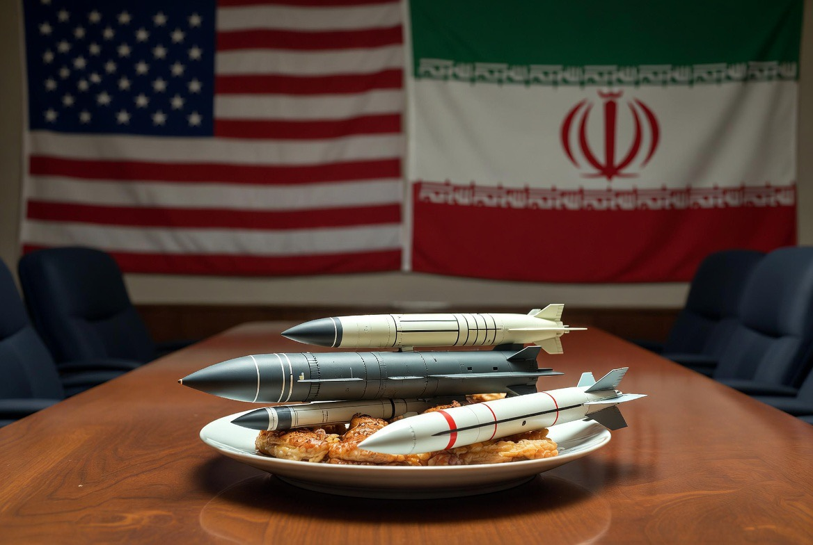

# Era “Diplomasi di Bawah Ancaman”: Meja Perundingan di Bawah Bayang-Bayang Rudal

*Ilustrasi (pic: Grok AI).*

  
***“Diplomasi klasik berbicara dengan pena. Diplomasi modern semakin sering berbicara dengan pena di satu tangan dan ancaman di tangan lainnya.”***
  

Dalam imajinasi publik, diplomasi identik dengan ruang konferensi, jabat tangan, kompromi, dan kesepakatan damai.

Namun realitas abad ke-21 semakin berbeda. Negosiasi masih berlangsung, tetapi bersamaan dengan itu terjadi mobilisasi kapal induk, pengerahan rudal, sanksi ekonomi, perang siber, hingga ultimatum publik.

Diplomasi tidak menghilangkan ancaman, dan ancaman justru menjadi bagian dari bahasa diplomasi.

# Dari “Gunboat Diplomacy” ke “Integrated Coercive Diplomacy”

Pada abad ke-19 dikenal istilah gunboat diplomacy, ketika kapal perang dikirim untuk menekan negara lain agar menerima tuntutan politik.

Kini bentuknya jauh lebih kompleks. Instrumen tekanannya meliputi embargo ekonomi, pembekuan aset, ancaman tarif, operasi siber, demonstrasi kekuatan militer, hingga kampanye informasi.

Dalam literatur modern, pendekatan seperti ini sering dibahas sebagai coercive diplomacy, yaitu penggunaan ancaman yang dikombinasikan dengan tawaran jalan keluar.

# Mengapa Negara Besar Memilih Cara Ini?

Perang total sangat mahal. Sebaliknya, diplomasi tanpa daya tekan sering dianggap kurang efektif. Maka lahirlah pendekatan di tengah: “Berunding sambil menunjukkan bahwa kita mampu menggunakan kekuatan.”

Tujuannya bukan selalu menyerang. Melainkan memengaruhi kalkulasi lawan.

# Geopolitik Kontemporer

Dalam berbagai krisis internasional beberapa tahun terakhir, pola yang sering terlihat adalah: sanksi diumumkan sebelum perundingan, latihan militer dilakukan menjelang negosiasi, ultimatum diberikan bersamaan dengan tawaran dialog, dan jalur diplomatik tetap dibuka meskipun operasi militer berlangsung.

Artinya, diplomasi dan tekanan tidak lagi dipandang sebagai dua tahap yang terpisah. Keduanya berjalan secara paralel.

# Efektif atau Berbahaya?

Pendukung pendekatan ini berargumen bahwa ancaman yang kredibel dapat mencegah perang yang lebih besar karena lawan memilih berkompromi.

Namun para pengkritik mengingatkan adanya risiko besar. Jika kedua pihak sama-sama meningkatkan tekanan, maka salah tafsir, salah hitung, atau kecelakaan militer dapat memicu eskalasi yang tidak direncanakan.

Sejarah menunjukkan beberapa perang besar justru dipicu oleh kegagalan membaca sinyal lawan.

# Analisis

Mungkin perubahan paling besar abad ini bukan pada teknologi senjata, melainkan pada cara negara berbicara.

Dulu diplomasi dimulai dengan kalimat: “Mari kita mencari solusi.” Kini sering diawali dengan: “Kalau tidak menerima usulan kami, konsekuensinya akan berat.”

Perbedaannya tampak sederhana. Namun secara filosofis sangat besar, karena diplomasi perlahan bergeser dari seni membangun kepercayaan menjadi seni membentuk tekanan.

# Dampak terhadap Negara Menengah

Negara-negara seperti Indonesia, India, Brasil, Turki, dan banyak negara berkembang menghadapi tantangan baru.

Mereka harus menjaga hubungan ekonomi, mempertahankan otonomi politik, serta menghindari terseret rivalitas kekuatan besar.

Diplomasi menjadi semakin rumit karena tekanan datang dari banyak arah sekaligus.

# Masa Depan Diplomasi

Jika tren ini berlanjut, diplomat masa depan tidak cukup memahami hukum internasional, negosiasi, ataupun budaya politik.

Mereka juga harus memahami siber, kecerdasan buatan, ekonomi global, psikologi krisis, hingga strategi militer.

Diplomasi berubah menjadi disiplin yang semakin multidimensi.

Dunia mungkin tidak sedang meninggalkan diplomasi, yang berubah adalah bentuknya.

Diplomasi tetap hidup, namun ia semakin sering berlangsung di bawah bayang-bayang ancaman.

Pertanyaannya bukan lagi “Apakah ancaman boleh digunakan?” Melainkan “Bagaimana memastikan ancaman tidak berubah menjadi perang yang sesungguhnya?”

Karena sejarah mengajarkan satu pelajaran penting, bahwa ancaman dapat memaksa lawan duduk di meja perundingan. Tetapi ancaman yang kehilangan kendali juga dapat membakar meja perundingan itu sendiri.

Politik global menunjukkan bahwa diplomasi modern semakin sering dipadukan dengan instrumen tekanan. 

Dalam jangka pendek, pendekatan ini dapat meningkatkan daya tawar dan mempercepat tercapainya konsesi tertentu. Namun dalam jangka panjang, penggunaan ancaman secara berlebihan berisiko mengikis kepercayaan antarnegera dan memperbesar peluang salah perhitungan.

Paradoksnya, semakin sering ancaman digunakan sebagai bahasa diplomasi, semakin penting pula keberadaan mekanisme komunikasi yang mampu mencegah eskalasi. 

Tanpa itu, dunia dapat terjebak dalam situasi ketika setiap negosiasi membawa peluang perdamaian sekaligus risiko perang.

Diplomasi seharusnya menjadi jembatan yang menghindarkan manusia dari perang. Namun ketika ancaman menjadi bahasa yang paling sering digunakan di meja perundingan, jembatan itu perlahan berubah menjadi tali yang direntangkan di atas jurang. 

Dunia memang masih berjalan, tetapi setiap langkahnya semakin bergantung pada kemampuan para pemimpinnya untuk tidak terpeleset.

  
**Referensi**

Arms and Influence. Schelling, T. C. (1966). Arms and Influence. Yale University Press.

Strategy: A History. Freedman, L. (2013). Strategy: A History. Oxford University Press.

The Tragedy of Great Power Politics. Mearsheimer, J. J. (2014). The Tragedy of Great Power Politics. W. W. Norton & Company.

United Nations. (1945). Charter of the United Nations.

International Crisis Group. (2025-2026). Reports on international crisis management.
