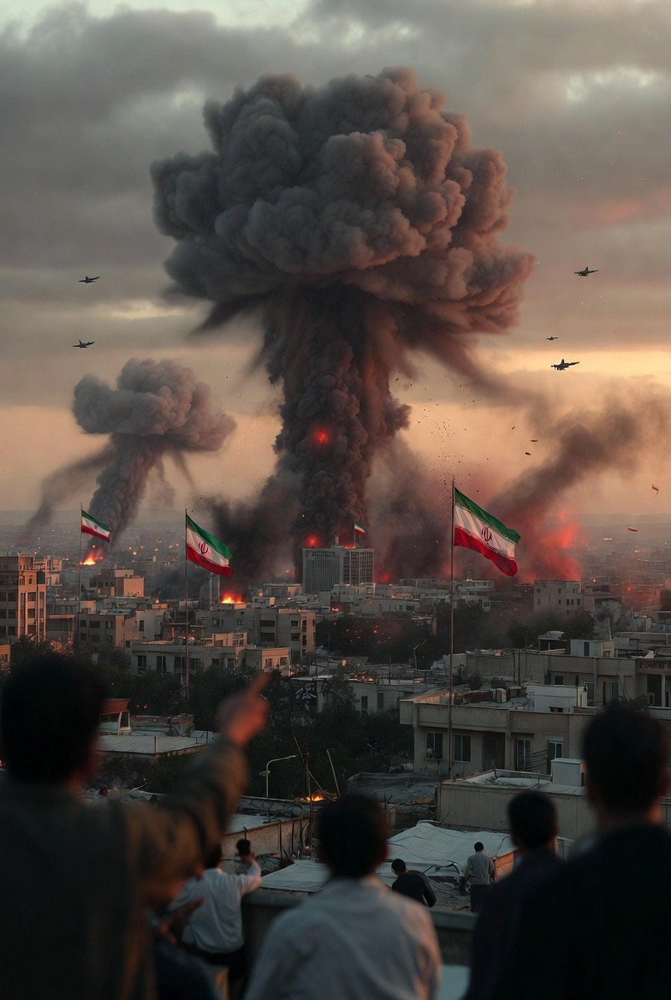

# Eskalasi Israel terhadap Iran: Kalkulasi Strategis, Respons Proksi, dan Posisi Rusia–China

*Ilustrasi eskalasi (pic: Grok AI).*

  
***Jika eskalasi ini terus berlanjut, dampak paling cepat terasa bukan di medan perang, tapi menjalar jauh melampaui Tel Aviv dan Teheran***
  

Dalam kerangka James Fearon (1995), perang dapat muncul karena commitment problem saat satu pihak takut lawan akan jauh lebih kuat di masa depan.

Jika Israel menilai Iran mendekati ambang kapabilitas nuklir, maka: Menyerang sekarang bisa dianggap lebih “murah” daripada menunggu.

Itu bukan hanya soal arogansi. Itu soal kalkulasi distribusi kekuatan.

## Offensive Realism

Menurut John Mearsheimer, negara dalam sistem anarkis berusaha memaksimalkan keamanan melalui dominasi regional.

Israel:

•	Negara kecil secara geografis

•	Ancaman eksistensial dianggap nyata

•	Tidak punya kedalaman strategis

Dalam konteks itu, doktrin serangan preventif adalah konsisten dengan pola historisnya.

## Security Dilemma

Robert Jervis menunjukkan bahwa tindakan defensif satu pihak sering dibaca ofensif oleh pihak lain.

Iran melihat:

•	Serangan = agresi

Israel melihat:

•	Program nuklir Iran = ancaman eksistensial

Spiralnya terbentuk tanpa perlu niat “jahat” absolut.

## Apa yang Mungkin Dilakukan Israel Selanjutnya?

Berdasarkan literatur konflik terbatas modern:

A. Limited Strike Doctrine

Kemungkinan tinggi:

•	Serangan presisi pada target militer

•	Upaya menghindari perang darat penuh

•	Penguatan pertahanan udara domestik

Tujuan: membatasi konflik pada durasi pendek dan ruang sempit.

B. Cyber & Intelligence Escalation

Israel punya reputasi kuat dalam operasi siber dan intelijen. Eskalasi bisa berbentuk:

•	Serangan siber pada infrastruktur Iran

•	Operasi rahasia melalui jaringan regional

Itu memungkinkan tekanan tanpa perang konvensional penuh.

## Proksi Iran

Iran memiliki jaringan proksi regional yang luas.

Kemungkinan respons:

•	Serangan roket melalui kelompok di Lebanon

•	Aktivasi milisi di Irak

•	Tekanan di Laut Merah

Ini menciptakan proxy escalation equilibrium.

## Apakah Rusia dan China Akan Membela Iran?

Ini pertanyaan paling menarik secara struktural.

Rusia

Rusia memiliki hubungan militer dan energi dengan Iran. Namun:

•	Rusia sedang terlibat konflik lain dan menghadapi tekanan ekonomi

•	Intervensi langsung melawan Israel berisiko konfrontasi tidak langsung dengan AS

Prediksi realistis:

➡ Dukungan diplomatik dan retorika keras

➡ Bantuan teknis terbatas

➡ Tidak masuk perang langsung

China

China memiliki kepentingan utama pada stabilitas energi dan perdagangan.

China cenderung:

•	Mengutuk eskalasi

•	Mendorong de-eskalasi

•	Menghindari keterlibatan militer langsung

China bukan aktor yang suka perang jarak jauh kecuali kepentingan vitalnya langsung diserang.

## Dimensi Moral & Simbolik

Serangan saat periode keagamaan sering dipakai sebagai narasi moral dalam konflik.

Namun dalam studi perang modern: Kalender religius jarang menjadi variabel penentu keputusan militer.

Militer beroperasi pada:

•	Intelijen

•	Timing strategis

•	Window of vulnerability

Bukan pada sensitivitas simbolik, meskipun dampak persepsi global tetap besar.

## Probabilistic Assessment

Berdasarkan teori dan distribusi kekuatan:

🟢 Konflik terbatas lebih mungkin daripada perang besar

🟡 Eskalasi proksi hampir pasti

🔴 Intervensi militer langsung Rusia–China sangat kecil probabilitasnya

Sistem internasional saat ini terlalu rapuh untuk perang multipolar terbuka.

## Tentang “Arogan” atau “Pongah”

Dalam analisis ilmiah, kita tidak pakai kategori moral sebagai variabel kausal utama.

Negara tidak bertindak karena “besar kepala”.
Mereka bertindak karena:

•	Persepsi ancaman

•	Struktur kekuatan

•	Kalkulasi risiko

Moralitas adalah medan retorika.
Struktur adalah medan keputusan.

Jika eskalasi ini terus berlanjut, dampak paling cepat terasa bukan di medan perang, tapi:

•	Harga minyak

•	Stabilitas pasar

•	Politik domestik negara-negara sekutu

Dan itu akan menjalar jauh melampaui Tel Aviv dan Teheran.

  
**Referensi**

Fearon, J. D. (1995). Rationalist explanations for war. International Organization, 49(3), 379–414.

Powell, R. (2006). War as a commitment problem. International Organization, 60(1), 169–203.

Levy, J. S. (1987). Declining power and the preventive motivation for war. World Politics, 40(1), 82–107.

Waltz, K. N. (1979). Theory of international politics. Reading, MA: Addison-Wesley.

Mearsheimer, J. J. (2001). The tragedy of great power politics. New York, NY: W. W. Norton.

Jervis, R. (1978). Cooperation under the security dilemma. World Politics, 30(2), 167–214.

Snyder, G. H. (1997). Alliance politics. Ithaca, NY: Cornell University Press.

Leeds, B. A. (2003). Alliance reliability in times of war. International Organization, 57(4), 801–827.

Schelling, T. C. (1966). Arms and influence. New Haven, CT: Yale University Press.

Snyder, G. H. (1961). Deterrence and defense. Princeton, NJ: Princeton University Press.

Kaye, D. D. (2012). Iran and the challenge to nonproliferation. Survival, 54(5), 7–32.

Maloney, S. (2015). The roots of Iranian foreign policy. Survival, 57(4), 49–66.

Gause, F. G. (2014). Beyond sectarianism: The new Middle East Cold War. Brookings Doha Center Analysis Paper.

Stockholm International Peace Research Institute. (2024). SIPRI Military Expenditure Database.

International Institute for Strategic Studies. (2024). The Military Balance.

RAND Corporation. (Various years). Reports on U.S.–Iran military balance and escalation dynamics.
