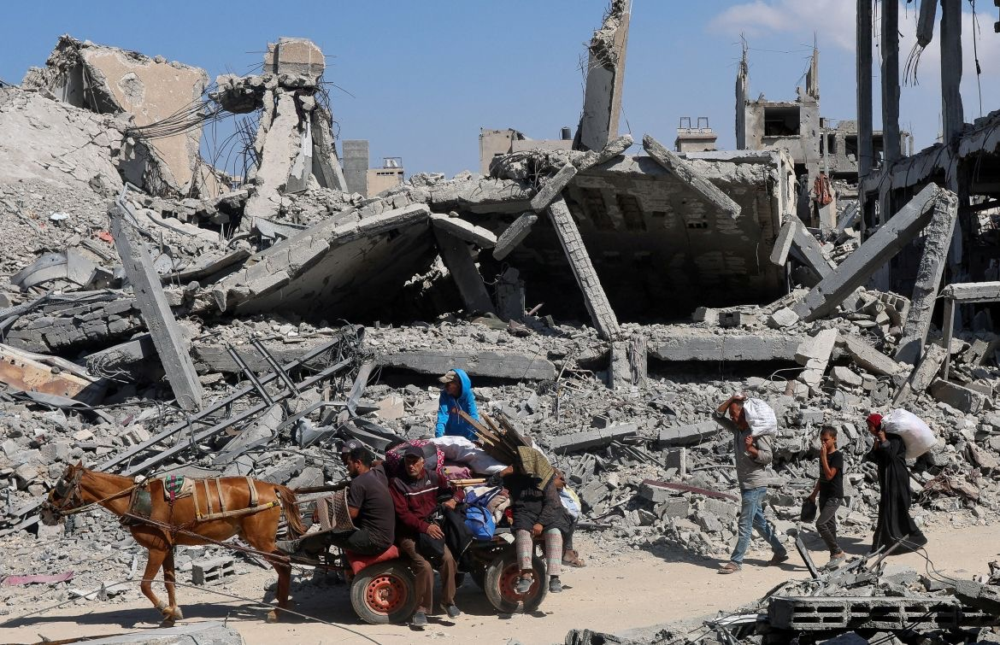

# Eskalasi Kekerasan Gaza & Tepi Barat di Tengah Perang Iran–Israel: Analisis Interseksi Konflik Regional dan Kekerasan Lokal dalam Perspektif Asimetri Kekuasaan

*Ilustrasi Gaza (pic: Grok AI).*

  
***Perang besar sering memberi ruang bagi kekerasan yang lebih sunyi… tapi lebih bebas. Dan yang sunyi itu, biasanya yang paling lama dibiarkan***
  

Artikel ini menganalisis fenomena peningkatan kekerasan di Gaza dan Tepi Barat selama berlangsungnya perang Iran–Israel (2026). 

Dengan menggunakan pendekatan konflik asimetris dan teori distraksi geopolitik, penelitian ini menunjukkan bahwa eskalasi konflik regional tidak meredam kekerasan lokal, tetapi justru memperparahnya. 

Data menunjukkan peningkatan serangan militer, kekerasan pemukim, serta pembatasan mobilitas warga Palestina, yang terjadi bersamaan dengan menurunnya perhatian internasional. 

Studi ini berargumen bahwa konflik regional menciptakan “ruang oportunistik” bagi intensifikasi kontrol teritorial dan kekerasan struktural.

## Pendahuluan

Konflik Iran–Israel 2026 sering dipahami sebagai perang antarnegara dengan dampak regional. 

Namun, dinamika di lapangan menunjukkan bahwa konflik ini juga berdampak langsung terhadap wilayah Palestina, khususnya Gaza dan Tepi Barat.

Pertanyaan utama penelitian ini adalah:
mengapa kekerasan terhadap warga Palestina justru meningkat di tengah konflik regional yang lebih besar?

## Asymmetric Conflict Theory

Menjelaskan hubungan antara aktor dengan:

•	kapasitas militer tidak seimbang

•	kontrol wilayah berbeda

•	kemampuan perlindungan sipil yang timpang

## Geopolitical Distraction Theory

Konflik besar dapat:

•	mengalihkan perhatian internasional

•	menurunkan tekanan diplomatik

•	menciptakan ruang bagi tindakan lokal yang lebih agresif

## Structural Violence

Kekerasan tidak hanya berbentuk serangan langsung, tetapi juga:

•	pembatasan akses

•	penundaan bantuan medis

•	pengusiran dan displacement

## Data Empiris: Peningkatan Kekerasan

1. Tepi Barat: lonjakan kekerasan pemukim dan militer

•	lebih dari 100 insiden kekerasan pemukim sejak perang Iran dimulai  

•	warga Palestina tewas akibat penembakan dan serangan langsung

•	ambulans terhambat akibat penutupan jalan dan checkpoint  

👉 bahkan:

•	serangan terjadi dengan dugaan dukungan atau pembiaran aparat  

2. Intensifikasi operasi militer

•	razia harian

•	penangkapan massal

•	pembatasan mobilitas

👉 warga Palestina semakin “terkunci” di wilayahnya sementara kekerasan meningkat.

3. Gaza: serangan tetap berlangsung

•	serangan udara terus terjadi

•	korban sipil tetap tinggi

👉 bahkan saat fokus global beralih ke Iran, Gaza tetap menjadi “front aktif”.

4. Dampak langsung perang Iran ke Palestina

Ironisnya:

•	warga Palestina juga menjadi korban serangan dari konflik Iran

•	termasuk korban misil yang jatuh di Tepi Barat  

👉 mereka bukan pihak utama… tapi tetap terkena dampaknya.

## Mekanisme Eskalasi: Kenapa Kekerasan Meningkat?

1. Distraksi global

•	perhatian dunia fokus ke Iran

•	tekanan internasional terhadap Israel menurun

👉 menciptakan “ruang tanpa pengawasan”

2. Pembatasan mobilitas sebagai alat kontrol

•	checkpoint meningkat drastis

•	akses medis terganggu

•	komunitas terisolasi

👉 memperbesar dampak setiap serangan.

3. Oportunisme kekuasaan lokal

•	pemukim memanfaatkan situasi perang

•	ekspansi dan kekerasan meningkat

👉 konflik besar → membuka peluang konflik kecil membesar.

4. Normalisasi kekerasan berlapis

•	kekerasan militer

•	kekerasan pemukim

•	kekerasan struktural

👉 semuanya terjadi simultan.

## Konflik Regional sebagai Katalis Kekerasan Lokal

Temuan utama: konflik besar tidak menggantikan konflik kecil, tetapi mempercepat dan memperparahnya.

Dalam konteks ini:

•	Palestina menjadi “secondary theater”

•	namun dengan dampak kemanusiaan yang sangat tinggi

Implikasi Geopolitik dan Kemanusiaan

•	erosi perlindungan sipil

•	meningkatnya displacement

•	potensi radikalisasi akibat tekanan ekstrem

👉 konflik menjadi semakin sulit diselesaikan.

Perang Iran–Israel tidak hanya memperluas konflik regional, tetapi juga memperparah kekerasan di Gaza dan Tepi Barat. 

Peningkatan kekerasan ini bukan kebetulan, melainkan hasil interaksi antara distraksi global, ketimpangan kekuasaan, dan dinamika lokal yang oportunistik. 

Oleh karena itu, konflik Palestina tidak dapat dipisahkan dari konteks geopolitik yang lebih luas.

  
**Referensi**

Reuters. (2026). Israeli settler violence rises in West Bank under Iran war curbs.

Associated Press. (2026). Palestinians caught in Iran war spillover.

UN OCHA. (2026). Humanitarian Situation Report.

The New Humanitarian. (2026). Iran war and West Bank escalation.lll 
