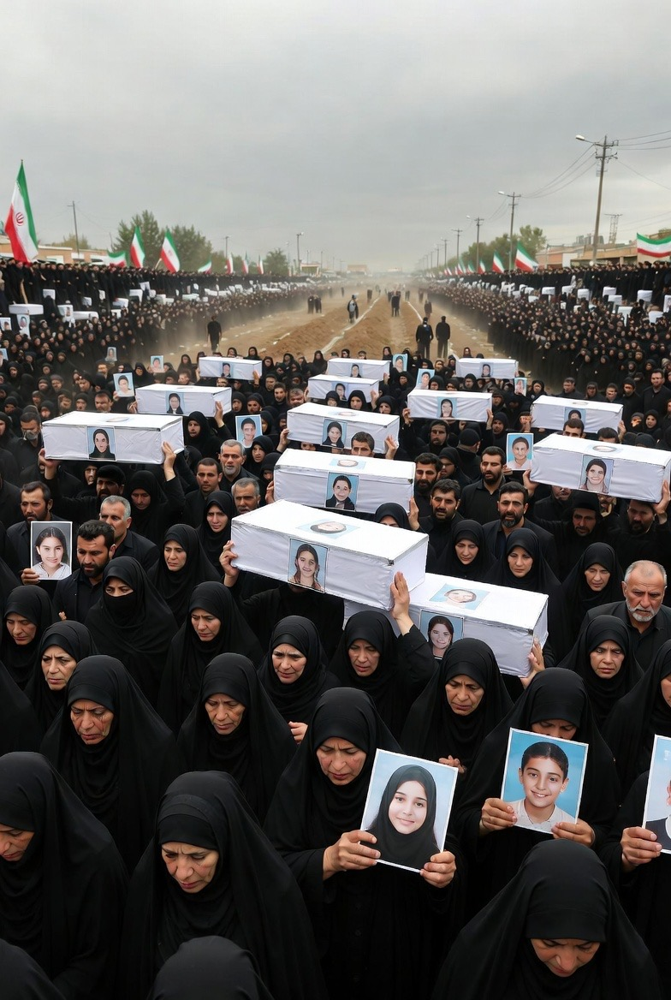

# Eskalasi Konflik Iran–Israel–AS 2026: Serangan terhadap Infrastruktur Sipil, Narasi Propaganda, dan Politik Persepsi Global

*Ilustrasi anak-anak tewas dalam serangan Israel-AS (pic: Grok AI).*

  
***Tragedi Minab menjadi pengingat bahwa dalam konflik geopolitik, anak-anak sering menjadi korban paling sunyi dari ambisi negara-negara besar***
  

Konflik Iran–Israel–Amerika Serikat yang memuncak pada awal 2026 menandai fase baru dalam geopolitik Timur Tengah. 

Salah satu insiden paling kontroversial adalah serangan misil terhadap sekolah dasar perempuan di Minab, Iran, yang menewaskan lebih dari seratus anak. 

Dalam perang, semua pihak bersumpah mereka tidak menargetkan anak-anak. Anehnya, anak-anak tetap yang paling sering mati. 

Sistem militer dunia sudah sangat canggih. Moral manusia yang mengendalikannya masih versi beta.

Tulisan ini menganalisis peristiwa tersebut dalam tiga dimensi utama: hukum humaniter internasional, propaganda perang, dan reaksi global terhadap kekerasan terhadap warga sipil. 

Penelitian menunjukkan bahwa serangan terhadap fasilitas sipil dalam perang modern sering kali menjadi titik fokus konflik naratif antara negara-negara yang bertikai.

## Pendahuluan

Perang modern jarang lagi berupa pertempuran terbuka antara tentara di medan perang. Sebaliknya, konflik abad ke-21 ditandai oleh serangan presisi, perang informasi, dan legitimasi moral global.

Serangan udara AS dan Israel terhadap Iran pada Februari 2026, yang dilaporkan menewaskan pemimpin Iran Ayatollah Ali Khamenei, memicu eskalasi militer besar. 

Dalam konteks tersebut, serangan terhadap sekolah dasar perempuan di Minab menjadi peristiwa simbolik yang memicu kemarahan internasional.

Kasus ini menyoroti persoalan klasik dalam studi konflik:

•	Apakah korban sipil merupakan kesalahan teknis?

•	Ataukah bagian dari strategi militer yang lebih luas?

## Hukum Humaniter Internasional

Konvensi Jenewa menegaskan bahwa fasilitas pendidikan termasuk objek sipil yang dilindungi.

Serangan terhadapnya dapat dianggap sebagai kejahatan perang jika:

•	dilakukan secara sengaja, atau

•	dilakukan secara sembrono tanpa memperhitungkan korban sipil.

## Collateral Damage dalam Perang Modern

Dalam doktrin militer Barat, korban sipil sering dijelaskan sebagai collateral damage, yaitu dampak tidak langsung dari serangan terhadap target militer.

Namun kritik terhadap konsep ini menyatakan bahwa istilah tersebut sering menjadi eufemisme teknokratis untuk tragedi kemanusiaan.

## Propaganda dan Perang Naratif

Perang abad ke-21 tidak hanya berlangsung di medan tempur tetapi juga di ruang media global.

Setiap pihak berusaha:

•	mengontrol narasi moral konflik

•	memobilisasi opini publik internasional.

## Analisis Kasus: Serangan Sekolah Minab

1. Kronologi

Pada 28 Februari 2026, misil menghantam sekolah perempuan di kota Minab, Iran selatan. Serangan terjadi saat jam belajar pagi dan menyebabkan runtuhnya bangunan sekolah.

2. Korban

Laporan media internasional memperkirakan lebih dari 100 hingga 165 anak dan staf tewas, menjadikannya salah satu insiden korban sipil terbesar dalam konflik tersebut.

3.Respons Internasional

•	Iran menyebut serangan tersebut sebagai kejahatan perang.

•	Amerika Serikat menyatakan tidak menargetkan sekolah secara sengaja dan sedang menyelidiki insiden tersebut.

•	Perserikatan Bangsa-Bangsa menyerukan investigasi independen.

4. Dimensi Geopolitik

Insiden ini memicu demonstrasi dan kecaman di berbagai negara, termasuk di Asia Selatan, Amerika Latin, dan beberapa negara Eropa.

Dalam politik internasional, kematian anak-anak sering menjadi katalis perubahan opini publik terhadap perang.

## Politik Persepsi Global

Serangan terhadap fasilitas sipil memiliki efek yang jauh melampaui dampak militer langsung.

Tragedi semacam ini dapat:

1.	Mengubah opini publik internasional.

2.	Memperkuat legitimasi moral pihak yang diserang.

3.	Melemahkan posisi diplomatik pihak penyerang.

Dalam banyak kasus sejarah, satu insiden sipil dapat menjadi simbol moral sebuah perang.

Serangan terhadap sekolah di Minab menunjukkan kompleksitas konflik modern, di mana teknologi militer presisi tidak selalu mampu mencegah tragedi kemanusiaan.

Peristiwa ini menegaskan tiga realitas penting:

1.	Perang modern tetap memproduksi korban sipil dalam skala besar.

2.	Narasi moral menjadi senjata politik utama dalam konflik global.

3.	Investigasi independen sangat penting untuk menentukan tanggung jawab dan mencegah impunitas.

Tragedi Minab menjadi pengingat bahwa dalam konflik geopolitik, anak-anak sering menjadi korban paling sunyi dari ambisi negara-negara besar.

  
**Referensi**

Reuters. (2026). UN calls for investigation into deadly strike on Iran school.

The Guardian. (2026). US investigating strike on Iranian girls’ school.

Time. (2026). More than 1,000 civilians killed in US-Israeli bombing of Iran.

Al Jazeera. (2026). Iran mourns 165 girls killed in school strike.

Wikipedia. (2026). 2026 Minab school airstrike.
