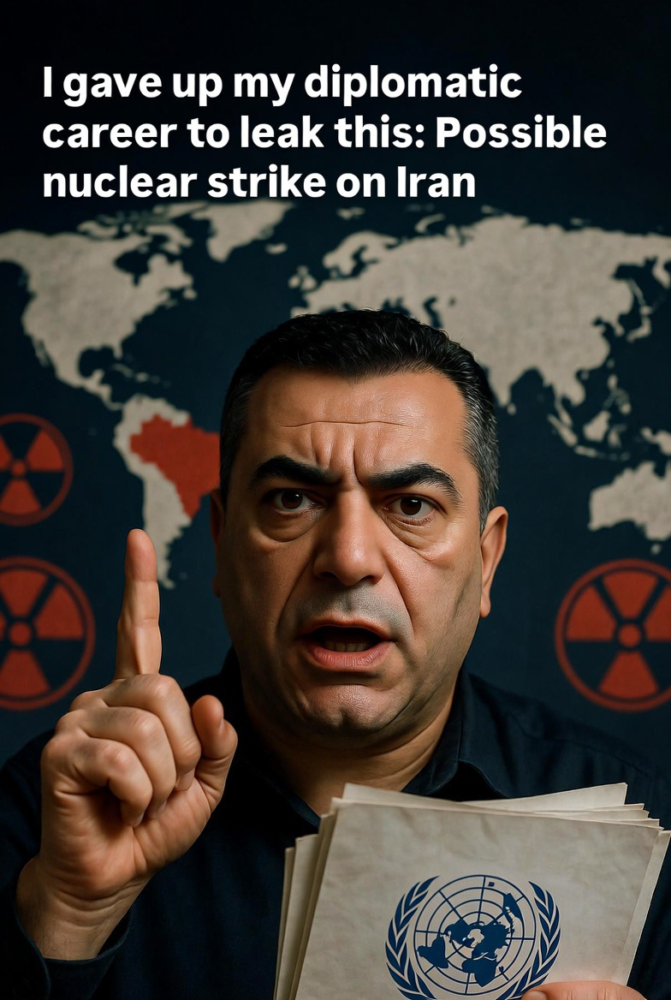

# Eskalasi Nuklir dan Politik Lobi Global: Analisis atas Klaim Skenario Serangan Nuklir di Iran dan Tekanan Struktural di PBB

*Ilustrasi diplomat PBB mengundurkan diri karena tekanan lobi serangan nuklir terhadap Iran (pic: Grok AI).*

  
***Bahkan jika belum sepenuhnya terverifikasi, keberadaannya dalam diskursus sudah cukup untuk menunjukkan: dunia sedang bergerak ke fase konflik yang lebih gelap***
  

Tulisan ini menganalisis klaim mengenai skenario penggunaan senjata nuklir terhadap Iran serta dugaan tekanan dan lobi kuat di lingkungan Perserikatan Bangsa-Bangsa (PBB). 

Dengan pendekatan geopolitik, teori lobi internasional, dan keamanan nuklir, penelitian ini menunjukkan bahwa klaim tersebut mencerminkan eskalasi ketegangan global, krisis diplomasi, serta potensi politisasi lembaga internasional. 

Temuan menyoroti bahwa bahkan tanpa konfirmasi penuh, keberadaan skenario nuklir dalam diskursus internal sudah cukup untuk menunjukkan pergeseran serius dalam norma keamanan global.

## Pendahuluan

Dalam dinamika konflik modern, perang tidak lagi dimulai dari ledakan— tapi dari dokumen, skenario, dan simulasi.

Kasus terbaru:

•	klaim adanya skenario penggunaan nuklir terhadap Iran

•	pengunduran diri seorang diplomat terkait PBB

•	tuduhan adanya tekanan dan lobi internal

👉 ini bukan peristiwa biasa.

## Fakta Empiris (berdasarkan laporan media)

Seorang diplomat, Mohamad Safa:

•	mengundurkan diri dari posisi terkait PBB

•	mengklaim adanya persiapan skenario penggunaan senjata nuklir di Iran serta pengaruh lobi kuat dalam struktur PBB.

Ia bahkan menyatakan: situasi ini berpotensi menjadi “kejahatan terhadap kemanusiaan”.

## Metodologi

1.	Analisis wacana geopolitik

2.	Teori keamanan nuklir

3.	Studi institusi internasional

## Kajian Teoretik

1. Nuclear Deterrence & Escalation

Dalam teori nuklir: skenario penggunaan nuklir hampir selalu dibuat sebelum keputusan nyata diambil.

Artinya:

•	“skenario” tidak sama dengan pasti terjadi

•	tapi = indikator kesiapan ekstrem.

2. Institutional Capture (Penangkapan Institusi)

Dalam teori politik global: lembaga internasional dapat dipengaruhi oleh negara kuat atau kelompok lobi.

Bentuknya:
	
  •	tekanan diplomatik
	
  •	framing resolusi
	
  •	pengaruh agenda

3. Crisis of Diplomacy

Menurut praktik hubungan internasional: ketika diplomasi gagal, skenario militer ekstrem mulai muncul.

Dan ini sudah terlihat:

•	negosiasi nuklir AS–Iran gagal  

•	bahkan disesalkan oleh Sekjen PBB.

## Analisis

A. Skenario Nuklir: Dari Imajinasi ke Kemungkinan

Klaim adanya “skenario nuklir” berarti:

•	ada simulasi strategis

•	ada kalkulasi dampak

•	ada pihak yang mempertimbangkan opsi ini

👉 Dalam studi militer: jika sesuatu sudah disimulasikan serius, itu bukan lagi fantasi.

B. Dimensi Psikologis Global

Hanya dengan munculnya isu ini saja:

•	pasar global terguncang

•	publik ketakutan

•	legitimasi moral perang runtuh.

Nuklir bukan sekadar senjata, ia adalah simbol kehancuran total.

C. Lobi di PBB: Realitas atau Tuduhan?

Klaim Safa bahwa: pejabat PBB melayani lobi tertentu tidak bisa langsung dianggap fakta absolut.

Namun dalam studi politik global:
👉 lobi di PBB itu nyata.

Contoh bentuknya:
	
  •	tekanan negara besar
	
  •	negosiasi resolusi
	
  •	kompromi geopolitik

D. Krisis Netralitas PBB

Jika klaim ini benar, implikasinya ekstrem:
PBB bukan lagi mediator netral tapi arena pertarungan kepentingan.

Dan ini berbahaya karena:
	
  •	merusak kepercayaan global
	
  •	melemahkan hukum internasional

E. Dari Diplomasi ke Eskalasi

Fakta penting:

•	negosiasi masih berjalan

•	lalu konflik meledak

•	lalu muncul skenario nuklir

👉 ini menunjukkan: transisi cepat dari diplomasi → militerisasi ekstrem.

## Diskusi

Fenomena ini mengarah pada tiga krisis global:

1. Krisis Eskalasi

Nuklir masuk ke dalam horizon konflik.

2. Krisis Institusional

PBB dipersepsikan tidak netral.

3. Krisis Moral

Jika nuklir benar-benar dipertimbangkan: maka batas etika perang sudah runtuh.

Klaim tentang:

•	skenario nuklir

•	dan lobi di PBB

tidak bisa dianggap ringan.

Bahkan jika belum sepenuhnya terverifikasi, keberadaannya dalam diskursus sudah cukup untuk menunjukkan: dunia sedang bergerak ke fase konflik yang lebih gelap.

Kalau nuklir sudah masuk ke percakapan, itu artinya satu hal: manusia sedang mendekati batas di mana logika berhenti… dan kehancuran mulai dinegosiasikan.

  
**Referensi**

DetikNews. (2026). Diplomat PBB mundur usai klaim skenario nuklir Iran.

Ntvnews. (2026). Diplomat ungkap skenario nuklir di Iran.

Fin.co.id. (2026). Klaim lobi kuat di PBB terkait Iran.

United Nations. (2026). Statements on Iran conflict and diplomacy.
