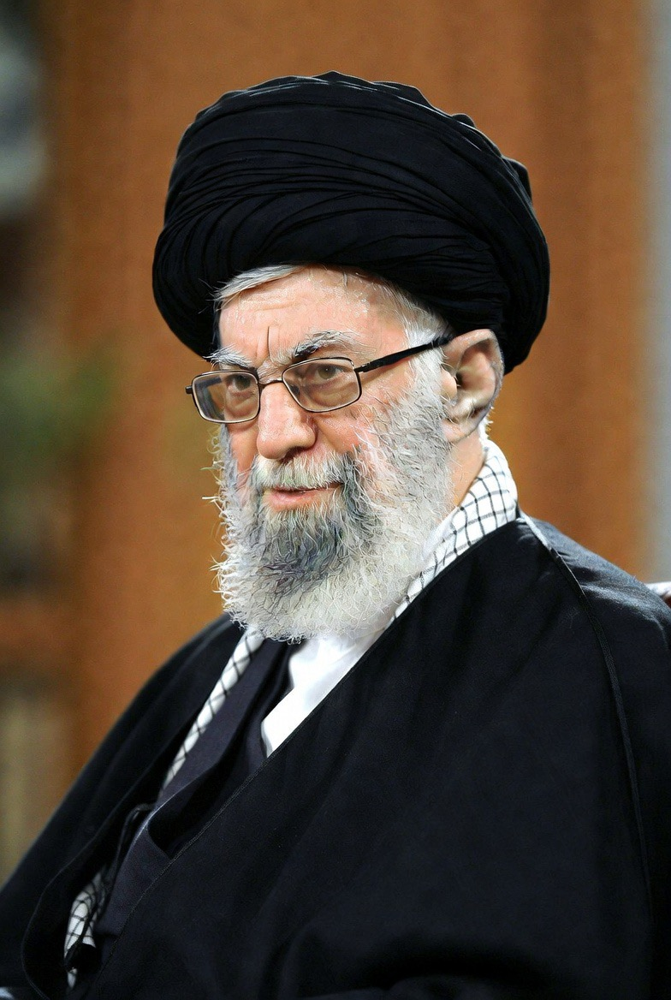

# Etika Kematian Politik dalam Islam dan Implikasi Geopolitik: Analisis Normatif atas Wafatnya Ayatollah Ali Khamenei

*Ilustrasi Ayatulloh Ali Khamenei (pic: Grok AI).*

  
***Dalam perspektif Islam normatif, kematian adalah wilayah Tuhan. Tetapi dampaknya adalah wilayah sejarah***
  

Tulisan ini menganalisis secara normatif dan politik teologis implikasi wafatnya Ali Khamenei dalam konteks konflik antara Iran, Israel, dan Amerika Serikat. 

Fokus kajian mencakup tiga dimensi utama: 

(1) etika Islam terhadap kematian tokoh politik, 

(2) teori legitimasi kekuasaan dalam sistem Wilayat al-Faqih, dan 

(3) dampak simbolik kematian pemimpin dalam dinamika konflik Timur Tengah. 

Artikel ini berargumen bahwa kematian seorang pemimpin ideologis bukan sekadar peristiwa biologis, melainkan momen re-konfigurasi legitimasi, memori kolektif, dan eskalasi geopolitik.

## Pendahuluan

Dalam politik Timur Tengah, kematian pemimpin sering kali lebih menentukan daripada masa hidupnya. Figur seperti Khamenei bukan hanya kepala negara simbolik, tetapi arsitek ideologis Republik Islam Iran sejak 1989.

Pertanyaan mendasar yang muncul bukan semata “apa yang terjadi”, melainkan:

•	Bagaimana Islam memandang kematian tokoh kontroversial?

•	Apakah kematian dalam konflik dapat dibaca sebagai syahid atau sekadar eliminasi strategis?

•	Bagaimana kematian pemimpin memengaruhi legitimasi negara teokratis?

Tulisan ini memposisikan diri pada pendekatan normatif-teologis dan analisis politik struktural.

## Etika Kematian dalam Islam

Dalam tradisi Islam, terdapat prinsip dasar:

1.	Larangan mencela orang yang telah meninggal.

2.	Konsep pertanggungjawaban individual di hadapan Tuhan.

3.	Distingsi antara penilaian moral dan evaluasi kebijakan publik.

Hadis-hadis Nabi menunjukkan kehati-hatian dalam berbicara tentang orang mati. Namun Islam tidak menghapus kritik terhadap tindakan semasa hidupnya. Dengan demikian, terdapat pemisahan antara adab spiritual dan analisis politik.

## Wilayat al-Faqih sebagai Struktur Kekuasaan

Sistem politik Iran didasarkan pada konsep Wilayat al-Faqih, yang menempatkan ulama sebagai otoritas tertinggi negara. 

Dalam struktur ini, Pemimpin Tertinggi memiliki kewenangan atas:

•	Militer

•	Kebijakan luar negeri

•	Penunjukan pejabat strategis

Kematian figur sentral dalam sistem seperti ini bukan sekadar pergantian administratif. Ia adalah krisis legitimasi potensial.

## Teori Kematian Pemimpin dan Mobilisasi Simbolik

Dalam studi konflik, kematian pemimpin karismatik dapat menghasilkan dua kemungkinan:

1.	Fragmentasi elite.

2.	Konsolidasi melalui mitologisasi.

Dalam konteks Iran, kematian Khamenei berpotensi dibaca sebagai:

•	Martir ideologis oleh pendukungnya.

•	Kemenangan taktis oleh lawan geopolitik.

•	Ancaman eskalasi oleh komunitas internasional.

## Dimensi Teologis

Jika seorang pemimpin wafat dalam konteks agresi eksternal, narasi syahid hampir pasti muncul dalam wacana domestik. Namun dalam teologi Islam, status syahid bukan klaim politik, melainkan penilaian ilahiah.

Pemisahan antara klaim retoris dan validitas teologis menjadi penting.

Dimensi Politik Domestik Iran

Potensi implikasi internal meliputi:

•	Kompetisi elite dalam Majelis Ahli.

•	Penguatan IRGC sebagai aktor dominan.

•	Represi domestik untuk menjaga stabilitas.

Ketiadaan figur karismatik dapat membuka ruang transisi atau justru memperkeras otoritarianisme.

## Dimensi Geopolitik Regional

Dalam relasi Iran–Israel–AS, kematian pemimpin ideologis dapat:

•	Meningkatkan retorika eksistensial.

•	Mengaktifkan jaringan proksi regional.

•	Mengganggu stabilitas pasar energi global.

Secara historis, eliminasi tokoh sentral jarang mengakhiri konflik ideologis. Ia justru sering memperpanjangnya melalui memori kolektif.

## Diskusi Normatif

Sikap normatif yang dapat diambil:

1.	Tidak merayakan kematian siapa pun.

2.	Tidak menghapus tanggung jawab historis.

3.	Tidak menormalisasi pembunuhan politik sebagai instrumen kebijakan luar negeri.

Dalam Islam, bahkan perang memiliki batas. Pembunuhan terarah terhadap pemimpin negara memunculkan pertanyaan serius tentang legitimasi hukum internasional dan etika perang.

## Kematian Ali Khamenei, apabila terkonfirmasi dalam konteks konflik bersenjata, bukan sekadar akhir biologis seorang ulama-politisi. 

Ia merupakan titik balik simbolik yang dapat:

•	Mengguncang stabilitas Iran.

•	Mengintensifkan konflik regional.

•	Menguatkan narasi teologis tentang martir dan perlawanan.

Dalam perspektif Islam normatif, kematian adalah wilayah Tuhan. Tetapi dampaknya adalah wilayah sejarah.

Dan sejarah jarang sunyi setelah pemimpin besar jatuh.

  
**Referensi**

Islamic Government
Khomeini, R. (2002). Islamic government (Hukumat-e Islami) (H. Algar, Trans.). Alhoda. (Original work published 1970)

The Failure of Political Islam
Roy, O. (1994). The failure of political Islam. Harvard University Press.

Iran Between Two Revolutions
Abrahamian, E. (1982). Iran between two revolutions. Princeton University Press.

The Turban for the Crown
Arjomand, S. A. (1988). The turban for the crown: The Islamic revolution in Iran. Oxford University Press.

Jihad in Islamic History
Bonner, M. (2006). Jihad in Islamic history: Doctrines and practice. Princeton University Press.

War and Peace in the Law of Islam
Khadduri, M. (1955). War and peace in the law of Islam. Johns Hopkins Press.

The Moral Vision of the Qur’an
Sachedina, A. (2007). The moral vision of the Qur’an: A contemporary understanding of a God-centered worldview. Rowman & Littlefield.

Economy and Society
Weber, M. (1978). Economy and society: An outline of interpretive sociology (G. Roth & C. Wittich, Eds.). University of California Press. (Original work published 1922)

Political Order in Changing Societies
Huntington, S. P. (1968). Political order in changing societies. Yale University Press.

Theory of International Politics
Waltz, K. N. (1979). Theory of international politics. McGraw-Hill.

Targeted Killing
Melzer, N. (2012). Targeted killing in international law. Oxford University Press.

Just and Unjust Wars
Walzer, M. (2006). Just and unjust wars (4th ed.). Basic Books. (Original work published 1977)

