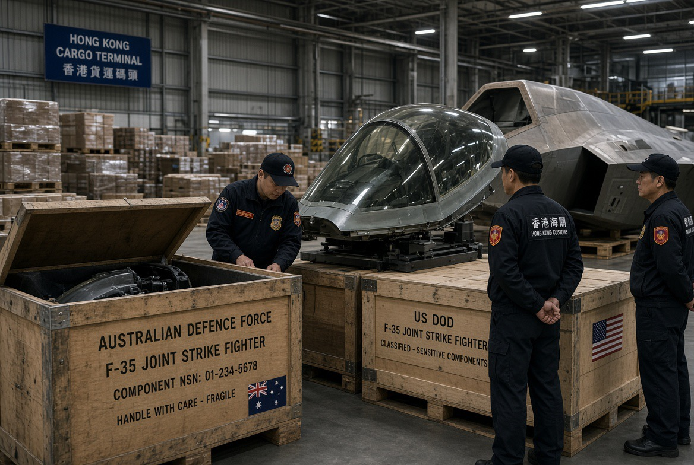

# F-35 Nyasar ke Hongkong: Ketika Rantai Logistik Membocorkan Pesawat Siluman

*Ilustrasi (pic: Grok AI).*

  
***Amerika membuat pesawat yang sulit dilihat radar, tetapi untuk sementara, yang lebih sulit ditemukan justru siapa yang membiarkan komponennya masuk ke wilayah China***
  

Sebuah pengiriman komponen F-35 milik Australia dikirim ke AS untuk pemeriksaan, kemungkinan perbaikan atau disposal. Pengiriman tersebut dialihkan ke Hong Kong dalam perjalanan. 

Pentagon kemudian mengakui adanya “shipment issue” atas komponen F-35 yang tidak lagi layak pakai dan mengatakan sedang berusaha mengambil kembali barang tersebut serta menyelidiki kejadian itu. 

Australia mengonfirmasi insiden tersebut. Menteri Pertahanan Richard Marles mengatakan Canberra bekerja dengan AS dan Lockheed Martin menyatakan pemahamannya bahwa komponen tersebut bukan equipment/parts yang sensitif. 

Tapi kemudian muncul perkembangan baru. Bloomberg melaporkan bahwa pemerintah China telah mengambil alih komponen tersebut, berdasarkan orang-orang yang telah diberi pengarahan mengenai insiden itu. 

Komponen yang dilaporkan mencakup cockpit canopy dan weapons-bay door, keduanya dilaporkan memiliki material penyerap radar. 

Jadi statusnya sekarang, insiden pengiriman dan investigasi AS-Australia terkonfirmasi. Sedangkan komponen berada di Hong Kong terkonfirmasi oleh pemerintah Australia sebagai fakta insiden. Sementara China memegang komponen dilaporkan Bloomberg, belum dikonfirmasi terbuka oleh Beijing. Namun kabar China berhasil memperoleh rahasia inti F-35 belum terbukti.

Nah, ini penting.

## Kok Bisa F-35 Lewat Jalur Komersial?

Di sinilah bagian yang justru lebih menarik daripada teori spionase, sebab F-35 mempunyai sistem sustainment global yang sangat kompleks.

Australia bukan sekadar membeli 72 pesawat lalu selesai. Australia juga merupakan hub regional suku cadang F-35 untuk jaringan Indo-Pasifik. Komponen bergerak lintas negara untuk maintenance dan repair.

CNA melaporkan bahwa warehouse Australia memang digunakan untuk mendukung F-35 di antara lain Singapura, Jepang dan Korea Selatan, serta pergerakan komponennya dapat menggunakan penerbangan komersial. 

Jadi, F-35 itu pesawat stealth. Tetapi rantai logistiknya tetap harus berurusan dengan manusia, perusahaan kurir, warehouse, manifest, transit airport, customs, subcontractor, dan sistem komputer. 

Meskipun stealth technology bisa menghilang dari radar tetapi paket spare part tetap punya airway bill.

## Bukan Pertama Kalinya Rantai Suku Cadang F-35 Bermasalah

Ini yang bikin Pentagon gak bisa cuma bilang: “Oops, salah kirim.” Sebab GAO pada 2023 menemukan masalah serius dalam akuntabilitas global spare parts F-35.

Sejak Mei 2018, salah satu kontraktor F-35 mencatat lebih dari satu juta spare parts hilang, dengan nilai sekitar US$85 juta. Kurang dari 2% kehilangan tersebut telah ditinjau oleh F-35 Joint Program Office. Bahkan lebih dari 900.000 komponen senilai lebih dari US$66 juta belum dilaporkan kepada JPO untuk ditinjau. 

Dan ini bukan berarti satu juta komponen rahasia hilang. GAO menyebut kategorinya mencakup hal-hal seperti engine components, landing gear, actuator doors, bolts, screws, fasteners, dan berbagai spare parts lainnya. Jadi jangan dibayangkan ada satu gudang berisi sejuta “otak F-35” yang raib. 

Masalahnya adalah accountability. Siapa memiliki apa? Di mana? Siapa yang memindahkannya? Siapa yang mengotorisasi disposal? Siapa yang mencatat perpindahannya? Siapa yang bertanggung jawab kalau benda itu keluar jalur?

## Mengapa Hong Kong Membuat Alarm Berbunyi?

Hong Kong bukan sekadar titik transit netral dalam persepsi keamanan AS, sebab Hong Kong adalah wilayah administratif khusus China.

Jadi kalau komponen F-35 yang berhubungan dengan teknologi low-observable tiba-tiba berakhir di sana, pertanyaannya berubah dari: “Kenapa logistiknya kacau?” menjadi: “Apakah China sekarang memiliki akses terhadap hardware yang bisa dipelajari?” Dan itu pertanyaan yang sah.

Bahkan kalau komponennya unserviceable, ia masih bisa mempunyai nilai intelligence. Karena reverse engineering tidak selalu membutuhkan benda yang bisa dipasang kembali ke pesawat.

## Tapi Cuma Canopy dan Weapons-Bay Door, Emang Penting?

Cockpit canopy F-35 memiliki material/coating yang berkontribusi pada karakteristik low observability. Weapons-bay door juga merupakan bagian dari desain yang harus mempertahankan karakteristik stealth ketika tertutup.

Kalau pihak yang sangat kompeten memperoleh benda fisik tersebut, mereka mungkin dapat mempelajari hal-hal seperti material, coating, konstruksi, manufacturing tolerances, struktur permukaan, teknik bonding, karakteristik material penyerap radar, dan cara komponen tersebut diintegrasikan dengan desain pesawat.

Tetapi itu tidak sama dengan mendapatkan source code F-35, radar software, electronic warfare database, mission data, dan seluruh desain pesawat. Itu lompatan yang terlalu jauh. Dan Lockheed Martin mengatakan komponen yang hilang tersebut unserviceable dan dinilai low risk for exploitation. 

Jadi ada dua narasi yang sama-sama perlu ditolak:
Narasi A: “China mendapatkan F-35!”
Ini terlalu berlebihan.
Narasi B: “Cuma barang rusak, jadi gak ada masalah sama sekali.”
Ini juga terlalu ceroboh.

Posisi yang paling masuk akal adalah bahwa komponen fisik F-35 yang berhubungan dengan teknologi low-observable berakhir di yurisdiksi China. Itu menciptakan risiko intelligence yang nyata, tetapi besarnya risiko belum diketahui dan belum ada bukti publik bahwa rahasia inti F-35 berhasil diekstraksi.

## Apakah China “Nyolong Teknologi”?

Belum bisa dikatakan, ini bagian yang harus kita bedakan secara brutal:

| Pertanyaan | Status |
|------|-------|
| Apakah komponen F-35 dikirim dari Australia?|✅ Ya|
|Apakah seharusnya menuju AS?|✅ Ya|
|Apakah akhirnya sampai Hong Kong?|✅ Ya|
|Apakah Pentagon menyelidiki?|✅ Ya|
|Apakah Australia ikut menyelidiki?|✅ Ya|
|Apakah ada laporan China menguasai komponen itu?|⚠️ Ya, dilaporkan Bloomberg|
|Apakah pengalihan itu disengaja?|❓ Belum diketahui|
|Apakah China sengaja mengatur pengalihan?|❓ Belum ada bukti publik|
|Apakah China membedah komponen?|❓ Belum diketahui|
|Apakah rahasia inti F-35 berhasil dicuri?|❌ Belum ada bukti|

Dan ini justru alasan kenapa investigasi Pentagon penting karena “accidental diversion” dan “deliberate acquisition” menghasilkan dua cerita intelijen yang sangat berbeda.

## Satu Hal yang “Ngeri-ngeri Sedap” 

Bukan hanya China mungkin memperoleh komponen F-35. Melainkan sistem persenjataan paling kompleks Amerika ternyata bergantung pada jaringan supply chain global yang sangat luas.

F-35 dirancang sebagai ekosistem multinasional. Ada Amerika, Australia, Inggris, Italia, Belanda, Norwegia, Denmark, Kanada, dan pelanggan lainnya. 

Artinya, keunggulan F-35 sekaligus menciptakan ketergantungan logistik lintas batas. Dan semakin global rantainya, maka semakin banyak pintu yang harus dijaga.

Musuh tidak selalu harus meretas Pentagon. Kadang cukup bertanya: “Paket ini terakhir berada di mana?” 

## China Memiliki Sejarah Tuduhan Espionage terhadap F-35

Selama bertahun-tahun terdapat tuduhan bahwa China memperoleh informasi terkait F-35 melalui cyber espionage.Beijing membantah tuduhan tersebut.

Tetapi bahkan tanpa menerima seluruh tuduhan itu sebagai fakta, ada prinsip intelligence yang sederhana bahwa hardware fisik adalah sumber informasi.

Sebuah pesawat bisa memberikan informasi melalui:
dokumen,
software,
komunikasi,
sensor,
dan material fisik.
Karena itu, kalau komponen low-observable masuk ke tangan lawan strategis maka kekhawatiran kontra-intelijennya bukan sesuatu yang dibuat-buat.

## Ada Ironi Besar

F-35 adalah contoh ekstrem high-tech warfare. Tetapi kelemahannya dalam kasus ini bukan radar, rudal, AI, atau cyberattack. Melainkan SUPPLY CHAIN.

Dan GAO baru tiga bulan lalu, dalam laporan 2026, masih menemukan masalah sustainment F-35 yang besar. 

Dari FY2021 sampai FY2025, mission-capable rate turun dari 67% menjadi 44%, sedangkan full-mission-capable rate turun dari 38% menjadi 25%. GAO juga mengatakan program masih menghadapi ketergantungan besar kepada kontraktor dan kekurangan spare parts. 

Jadi F-35 punya paradoks, bahwa semakin canggih pesawatnya, maka semakin penting ekosistem banal di belakangnya.
Jetnya futuristik, tetapi manusia yang mengurus inventarisnya tetap manusia. 

## China sedang “Mengintip” F-35?

Potensinya ada, buktinya belum lengkap, dan justru di sinilah kita harus berhati-hati.

Kalau nanti investigasi menemukan pengalihan disengaja, pihak China terlibat, komponen sengaja diperoleh, dilakukan eksploitasi teknis, maka kasusnya berubah total.

Tetapi kalau ternyata manifest error, subcontractor salah routing, customs/logistics failure, komponen ditemukan di Hong Kong, China kemudian mengambil possession, maka masalah utamanya adalah kegagalan keamanan supply chain, bukan operasi spionase China.

Dan kalau China sekarang memang memegangnya, pertanyaan paling penting bukan cuma: “China mencurinya gak?” Tetapi: “Mengapa sebuah komponen pesawat tempur generasi kelima bisa berpindah dari jaringan pertahanan Australia-AS ke wilayah China tanpa sistem keamanan menghentikannya?”

Itu pertanyaan yang jauh lebih memalukan bagi sistem logistik F-35. 

Berita ini belum membuktikan China berhasil mencuri teknologi inti F-35, namun juga tak pantas dianggap cuma paket nyasar. Karena sekarang ada tiga lapisan masalah:

1. Security:
Komponen F-35 berakhir di Hong Kong.

2. Intelligence:
Ada kemungkinan komponen fisik tersebut mempunyai nilai untuk analisis stealth, meskipun pemerintah Australia dan Lockheed menyatakan risikonya rendah/tidak sensitif. 

3. Supply-chain governance:
Kasus ini terjadi dalam program yang memang sudah lama dikritik GAO karena persoalan tracking, accountability, kehilangan parts, dan ketergantungan pada kontraktor. 

Amerika membuat pesawat yang sulit dilihat radar, tetapi untuk sementara, yang lebih sulit ditemukan justru siapa yang membiarkan komponennya sampai ke Hong Kong.

  
**Referensi:**

Bloomberg, 24 September 2026

Pentagon / F-35 Joint Program Office, dikutip 21 September 2026

ABC Australia, 22 September 2026

Lockheed Martin, dikutip Breaking Defense, 23 September 2026

U.S. Government Accountability Office, 23 Mei 2023.
   
