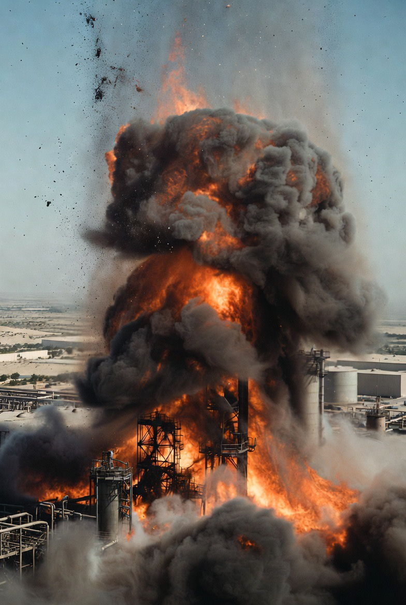

# False Flag, Blame Politics, dan Fragmentasi Teluk: Membaca Tuduhan Sabotase Kilang UEA dalam Konflik Iran–Israel–AS

*Ilustrasi ledakan minyak UEA (pic: Grok AI).*

  
***Yang terpenting bukan siapa yang menembakkan peluru pertama melainkan siapa yang paling diuntungkan setelah asapnya hilang***
  

Tuduhan terhadap Iran atas ledakan kilang minyak di UEA memicu spekulasi tentang operasi false flag, politik divide et impera, dan rekonstruksi aliansi keamanan Teluk. 

Tulisan ini menganalisis dinamika tersebut melalui perspektif teori konflik, strategi intelijen, dan geopolitik energi. 

Temuan menunjukkan bahwa dalam konflik berlapis seperti Timur Tengah, peristiwa sabotase sering menjadi alat narasi untuk membentuk aliansi, bukan sekadar kejadian militer murni.

## Pendahuluan

Pola klasik dalam geopolitik bukan sekadar “kejadian aneh”:

terjadi serangan → langsung ada pihak yang dituduh → lalu terbentuk aliansi baru.

Terdapat satu kemungkinan bahwa ini bukan sekadar serangan tetapi skenario.

Ini menarik. Tapi kita bedah pelan, tajam, tanpa mabuk asumsi.

## Apa Itu False Flag Operation?

Dalam studi intelijen:

false flag = operasi yang dibuat agar terlihat dilakukan oleh pihak lain.

Contoh historis (yang terbukti atau sangat diperdebatkan):
Gulf of Tonkin incident,
Operation Northwoods.

Tujuannya:
menciptakan legitimasi perang,
membentuk opini publik,
memancing respons lawan,
atau membangun aliansi.

Secara hipotesis:
“Iran dijadikan kambing hitam”

secara teori:
bukan hal mustahil dalam sejarah politik.

## Mengapa Kilang UEA Jadi Target Strategis?

UEA adalah:
produsen minyak besar,
pemain penting OPEC,
mitra dekat Barat
dan sekarang semakin dekat dengan Israel.

Menyerang kilang UEA berarti:
mengguncang pasar energi global,
memicu ketakutan regional,
dan membuka ruang eskalasi.

Ini target “sempurna” untuk permainan narasi.

## Analisis Hipotesis Divide et Impera

Israel tidak mau dimusuhi sendirian → perlu memecah Teluk → Iran dijadikan musuh bersama.

Secara teori geopolitik, ini dikenal sebagai: Balance Manipulation Strategy.

Logikanya:
Ciptakan ancaman bersama,
Dorong negara lain merasa terancam,
Bangun aliansi keamanan,
Konsolidasikan posisi strategis.

Dan dalam banyak kasus, ancaman eksternal sering menyatukan pihak yang sebelumnya tidak sepenuhnya sejalan.

## Israel–UEA (Telepon, Latihan, Iron Dome)?

Normal sekali dalam logika keamanan, kalau UEA merasa diserang (atau percaya diserang Iran) maka:
kerja sama militer meningkat,
latihan bersama wajar,
sistem pertahanan diperkuat.

Pengiriman sistem seperti Iron Dome bisa dibaca sebagai:
perlindungan,
sinyal politik,
sekaligus ekspansi pengaruh militer Israel.

Jadi walaupun penyebab serangan belum jelas, efeknya tetap mempererat hubungan Israel–UEA.

## Apakah Ada Bukti Iran Tidak Melakukannya?

Nah, ini titik krusial.

Dalam analisis ilmiah, kita tidak boleh lompat dari “mencurigakan” menjadi “pasti false flag”.

Karena saat ini:
belum ada bukti publik kuat yang mengonfirmasi pelaku alternatif,
tuduhan terhadap Iran juga belum sepenuhnya diverifikasi terbuka,
dan informasi masih sangat kabur (fog of war).

Jadi posisi paling jujur ada beberapa kemungkinan, dan semuanya masih terbuka.

## Tiga Skenario Realistis

1. Iran benar-benar pelaku

Motif:
balasan terhadap blokade
tekanan ke negara Teluk
ganggu suplai minyak.

2. Proxy actor (kelompok lain)

Motif:
memperkeruh konflik
menyeret negara besar masuk lebih dalam.

3. Operasi manipulatif / false attribution

Motif:
membangun aliansi anti-Iran,
legitimasi eskalasi,
konsolidasi kekuatan regional.

## Kenapa Dunia Langsung Curiga?

Karena kita hidup di era post-trust geopolitics. Di mana:
negara sering memanipulasi narasi,
media tidak selalu netral,
konflik penuh operasi bayangan,
dan publik sudah belajar dari sejarah.

Akibatnya, setiap kejadian besar langsung dianggap punya “lapisan tersembunyi”.

## Inti Terdalam

Yang kita tangkap sebenarnya bukan soal ledakan itu sendiri. Tapi pola ini:

krisis → tuduhan → aliansi → eskalasi

Dan ya , dalam banyak kasus sejarah itu bukan kebetulan. Tapi juga bukan otomatis rekayasa.

Hipotesis bahwa insiden kilang UEA adalah bagian dari strategi divide et impera memang memiliki dasar teoretis dalam studi geopolitik dan intelijen.

Namun secara ilmiah belum ada bukti kuat yang dapat mengonfirmasi bahwa serangan tersebut adalah operasi false flag oleh AS atau Israel.

Yang pasti:
insiden ini memperkuat polarisasi,
meningkatkan kerja sama Israel–UEA,
dan memperdalam isolasi Iran.

Kadang dalam geopolitik, yang paling penting bukan siapa yang menembakkan peluru pertama, melainkan siapa yang paling diuntungkan setelah asapnya hilang. 

  
**Referensi**

Gulf of Tonkin incident
Moïse, E. E. (1996). Tonkin Gulf and the escalation of the Vietnam War. University of North Carolina Press.

Operation Northwoods
U.S. Department of Defense. (1962/1997). Operation Northwoods (declassified documents).

International Energy Agency
International Energy Agency. (2023). World energy outlook 2023. IEA Publications.

Stockholm International Peace Research Institute
SIPRI. (2024). Trends in world military expenditure 2024. Stockholm International Peace Research Institute.

The Israel Lobby and U.S. Foreign Policy
Mearsheimer, J. J., & Walt, S. M. (2007). The Israel lobby and U.S. foreign policy. Farrar, Straus and Giroux.

Strategy
Liddell Hart, B. H. (1967). Strategy. Praeger.
