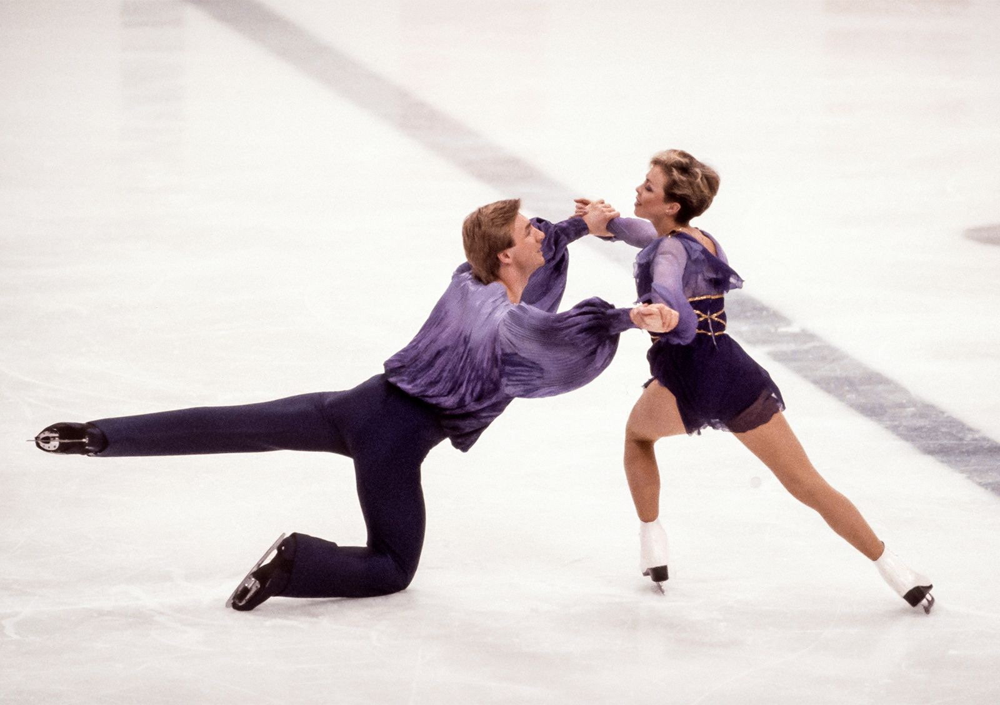

# Fenomena Torvill and Dean: Seni, Sensualitas Terkontrol, dan Ilusi Cinta di Atas Es

*Torvill dan Dean (pic: Grok AI).*

  
***Dua individu profesional yang menciptakan simulasi cinta paling meyakinkan dalam olahraga***
  

Dalam sejarah ice dancing, sedikit pasangan yang mampu menciptakan ilusi kedekatan emosional sekuat Torvill and Dean.

Mereka bukan sekadar atlet.
Mereka adalah arsitek emosi publik.

Penampilan mereka sering dianggap:

•	sensual tanpa vulgar

•	intim tanpa kehilangan struktur

•	romantis tanpa harus benar-benar menjadi pasangan

Fenomena ini memunculkan pertanyaan klasik: Apakah chemistry artistik selalu berakar pada cinta romantis?

## Identitas dan Awal Karier

Jayne Torvill

•	Lahir: 1957, Nottingham, Inggris

•	Awalnya bekerja sebagai pegawai asuransi

Christopher Dean

•	Lahir: 1958, Nottingham, Inggris

•	Mantan polisi

Mereka dipasangkan pada tahun 1975 oleh pelatih mereka.

Yang menarik?

Mereka berasal dari latar belakang kelas pekerja biasa, bukan elit olahraga.

## Revolusi Artistik: Boléro dan Puncak Kejayaan

Puncak karier mereka terjadi di Olimpiade Musim Dingin 1984 (Sarajevo).

Penampilan mereka menggunakan musik:
🎵 Boléro

Hasilnya?

•	Skor sempurna (12 kali nilai 6.0 untuk artistik)

•	Mengubah standar ice dancing selamanya

Kenapa begitu kuat?

Karena mereka:

•	membangun narasi tubuh (body storytelling)

•	menggunakan kontak fisik yang terasa intim

•	menciptakan ketegangan emosional yang ditahan, bukan dilepas

Ini yang disebut sebagai: sensuality through restraint.

## Chemistry: Ilusi atau Realitas?

Secara ilmiah, chemistry mereka bisa dijelaskan melalui:

a. Motor Synchronization

Gerakan mereka sangat sinkron → otak penonton membaca itu sebagai “kedekatan emosional”.

b. Micro-expression alignment

Tatapan, timing sentuhan → menciptakan ilusi keintiman nyata.

c. Embodied cognition

Tubuh mereka “bercerita” tanpa kata → penonton merasakan, bukan hanya melihat.

Fakta Penting: Mereka TIDAK Pernah Menikah

Ini bagian yang sering disalahpahami, Jayne Torvill dan Christopher Dean tidak pernah menjadi pasangan romantis dalam kehidupan nyata.

•	Mereka tetap profesional sebagai partner skating

•	Keduanya memiliki pasangan masing-masing di kehidupan pribadi

•	Tidak ada pernikahan antara mereka

Ini justru membuat fenomena mereka lebih menarik.

## Paradoks: Semakin Tidak Dimiliki, Semakin Terasa Nyata

Kenapa mereka terasa “lebih panas” dari pasangan lain?

Karena: Ketegangan emosional tertinggi muncul dari sesuatu yang hampir terjadi… tapi tidak sepenuhnya dilepas.

Dalam psikologi:

•	disebut deferred gratification tension

•	daya tarik meningkat karena tidak ada “penyelesaian penuh”.

Sehingga banyak yang membayangkan “Kalau di panggung saja segitu… di balik layar pasti luar biasa.”

Padahal justru… ketiadaan realisasi itu yang menjaga ilusi tetap hidup.

Torvill and Dean bukan pasangan cinta. Mereka adalah dua individu profesional yang menciptakan simulasi cinta paling meyakinkan dalam olahraga.

  
**Referensi**

•	Torvill and Dean: Our Life on Ice

•	International Olympic Committee Archives

•	International Skating Union Records

•	Adams, T. (2011) – Artistry in Ice Dance Performance

•	Wulff, H. (2007) – Dancing at the Crossroads: Memory and Mobility in Irish Dance

•	The Social Animal – Elliot Aronson

•	Thinking, Fast and Slow – Daniel Kahneman

•	Hatfield, E., Cacioppo, J., & Rapson, R. (1993) – Emotional Contagion

•	Motor Synchronization Theory (Schmidt & Richardson, 2008)

•	Embodied Cognition (Varela, Thompson & Rosch, 1991)

•	Parasocial Interaction Theory – Donald Horton & R. Richard Wohl (1956)
