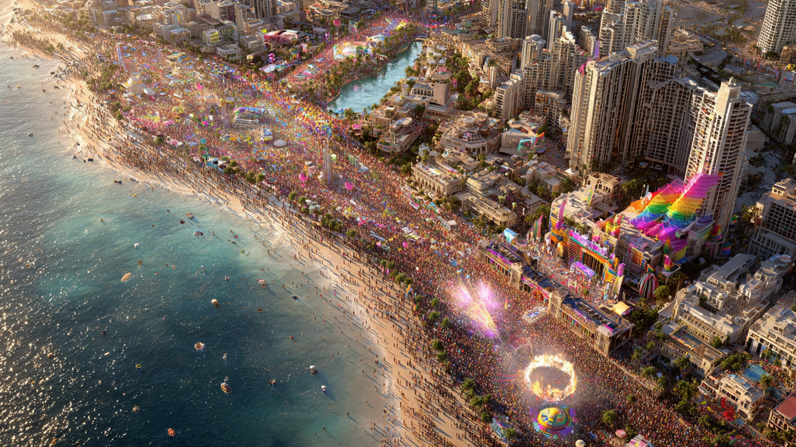

# Festival LGBTQ+ di Kawasan Laut Mati & Memori Nabi Luth: Analisis Teologi, Simbolisme Ruang Suci, dan Konflik Makna Modernitas Global

*Ilustrasi  (pic: Meta AI).*

  
***Event tidak dapat dipahami hanya sebagai intoleransi sederhana, melainkan bagian dari pertarungan simbolik tentang makna ruang, moralitas, dan identitas religius di era modern***
  

Rencana penyelenggaraan festival LGBTQ+ di kawasan Laut Mati (Dead Sea) pada 2026 memunculkan kontroversi global karena wilayah tersebut dalam tradisi Abrahamik sering diasosiasikan dengan kisah Nabi Luth dan kota Sodom-Gomorrah. 

Artikel ini menganalisis fenomena tersebut melalui perspektif teologi Islam, studi agama, simbolisme ruang suci, dan konflik budaya modern. 

Kajian menunjukkan bahwa polemik tidak hanya berkaitan dengan isu seksualitas, tetapi juga benturan antara sakralitas memori religius dan reinterpretasi ruang dalam modernitas sekuler global.

## Pendahuluan

Pada 2026, sejumlah media internasional melaporkan rencana festival LGBTQ+ besar bernama Pride Land di kawasan Laut Mati.  (jpost.com)

Kontroversi muncul karena wilayah tersebut selama berabad-abad diasosiasikan dengan kisah Nabi Luth AS dan kehancuran kaum Sodom.

Reaksi publik kemudian berkembang menjadi:
perdebatan agama,
simbolisme moral,
bahkan narasi eskatologis (“tanda akhir zaman.")

## Nabi Luth dalam Tradisi Islam

Dalam Al-Qur’an, Nabi Luth disebut sebagai nabi yang diutus kepada kaum yang melakukan:
penyimpangan moral,
kekerasan seksual,
penolakan terhadap wahyu,
kerusakan sosial.

Kisah ini muncul dalam beberapa surah, termasuk:
Al-Qur’an Surah Al-A’raf,
Hud,
Al-Hijr,
Asy-Syu’ara,

Al-Qur’an menggambarkan kehancuran kaum tersebut sebagai tanda peringatan bagi generasi berikutnya.

## Laut Mati sebagai Ruang Simbolik

Secara historis dan tradisional, banyak ulama dan tradisi Yahudi-Kristen mengaitkan wilayah sekitar Laut Mati dengan Sodom dan Gomorrah.

Namun secara akademik:
lokasi pastinya masih diperdebatkan,
belum ada konsensus arkeologis absolut,
Meski demikian, dalam kesadaran religius kolektif, Dead Sea telah menjadi “ruang simbolik” memori Nabi Luth.

## Konflik Modernitas vs Sakralitas

1. Reinterpretasi ruang

Dalam modernitas global, ruang dipandang sebagai:
area ekonomi,
wisata,
hiburan,
ekspresi identitas.

Namun agama melihat sebagian ruang sebagai:
simbol sejarah spiritual,
tempat peringatan moral,
Benturan terjadi ketika ruang sakral dipakai untuk simbol yang dianggap bertentangan dengan memori religiusnya.

2. Sekularisasi simbol

Sosiolog agama seperti Peter L. Berger menjelaskan bahwa modernitas cenderung:
mengurangi otoritas simbol agama,
mengganti makna sakral dengan makna budaya/populer.

Dalam konteks ini:
Laut Mati → bukan sekadar situs religius,
tetapi juga destinasi pariwisata & branding global.

## Perspektif Teologi Islam

Dalam Islam, kisah Nabi Luth bukan sekadar sejarah seksualitas. Ia mencakup:
kerusakan moral kolektif,
kekerasan sosial,
penolakan terhadap nabi,
hilangnya rasa malu moral (haya’).

Karena itu, sebagian Muslim melihat festival tersebut sebagai simbol pembalikan makna terhadap tempat peringatan ilahi.

## Fenomena “Provokasi Simbolik”

Dalam studi konflik budaya, terdapat konsep symbolic provocation, yakni tindakan yang secara legal mungkin sah, tetapi secara simbolik dipersepsi menyerang identitas kelompok lain.

Karena Dead Sea dikaitkan dengan Nabi Luth, maka sebagian umat beragama memandang event tersebut bukan sekadar festival biasa.

Satu tempat bisa memiliki makna wisata bagi sebagian orang, makna politik bagi sebagian lain, dan bagi orang beriman…menjadi gema dari kisah nabi yang masih hidup dalam ingatan spiritual mereka.

## Media Sosial dan Eskalasi Emosi

Internet mempercepat polarisasi:

| Kelompok | Narasi |
|------|-------|
| konservatif religius | penghinaan simbolik |
| liberal progresif | ekspresi kebebasan |
| media viral | sensasi & klik |

Akibatnya: diskusi teologis berubah menjadi perang emosi digital.

## Perspektif Religius yang Lebih Dalam

Ada poin penting yang sering hilang. Dalam Islam, tujuan kisah Nabi Luth bukan sekadar “mengutuk suatu kelompok” tetapi:
menjadi pelajaran moral,
mengingatkan manusia tentang batas etika,
dan pentingnya tatanan sosial spiritual.

## Apakah Ini “Tanda Azab”?

Secara teologis, manusia tidak memiliki otoritas absolut untuk memastikan kapan azab Tuhan turun atau siapa yang pasti dihukum.

Al-Qur’an sendiri menekankan hanya Allah yang Maha Mengetahui keputusan akhir.

Dalam Islam:
Allah Maha Adil,
Allah Maha Mengetahui isi hati,
Allah juga Maha Memberi Penangguhan (istidraj, imhal).

Karena dalam sejarah Qur’ani:
ada kaum yang dihukum cepat,
ada yang ditangguhkan,
ada yang diberi waktu panjang,
dan keputusan akhir tetap milik Allah. 

Dalam Islam sendiri, kisah Nabi Luth memang jelas dipahami mayoritas ulama sebagai peringatan keras terhadap perilaku kaumnya.

Kontroversi festival LGBTQ+ di kawasan Laut Mati mencerminkan:
benturan modernitas dan simbol agama,
konflik makna atas ruang suci,
polarisasi budaya global.

Bagi banyak umat Islam, kawasan tersebut bukan sekadar lokasi geografis, tetapi memori moral dan spiritual tentang Nabi Luth.

Karena itu, reaksi emosional terhadap event tersebut tidak dapat dipahami hanya sebagai intoleransi sederhana, melainkan bagian dari pertarungan simbolik tentang makna ruang, moralitas, dan identitas religius di era modern.

  
**Referensi**

Al-Qur’an. Surah Al-A’raf, Hud, Al-Hijr, Asy-Syu’ara.

Peter L. Berger. (1967). The sacred canopy. Anchor Books.

Mircea Eliade. (1959). The sacred and the profane. Harcourt.

The Jerusalem Post. (2026). Four day pride festival to be held at Dead Sea, largest in Middle East history.

IBTimes UK. (2026). Israel to host largest LGBT Pride Land festival at Dead Sea.

RT News. (2026). Israel to host biggest ever Middle East LGBTQ event.
