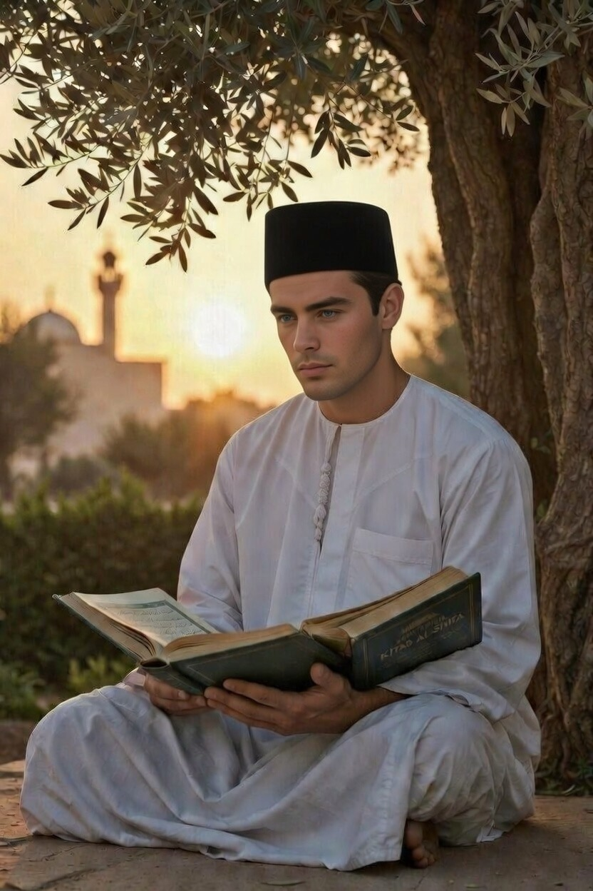

# Integrasi Filsafat dan Agama: Studi Komparatif Tradisi Barat Modern dan Islam Klasik

*Ilustrasi rasionalitas filosofi dan teologi (pic: Grok AI).*

  
***Al Qur’an mendorong penggunaan akal. Rasionalitas tidak dianggap ancaman, melainkan alat memahami tanda-tanda Tuhan***
  

Hubungan antara filsafat dan agama sering dipersepsikan sebagai antagonistik, terutama dalam konteks sejarah Barat modern. 

Pernyataan provokatif “God is dead” oleh Friedrich Nietzsche sering dijadikan simbol konflik antara rasionalitas filosofis dan teologi. 

Artikel ini menganalisis apakah konflik tersebut bersifat universal atau kontekstual. Dengan pendekatan historis-komparatif, tulisan ini menunjukkan bahwa ketegangan filsafat-agama dalam tradisi Kristen Barat tidak identik dengan pengalaman peradaban Islam, yang justru memperlihatkan model integrasi rasio dan wahyu pada periode klasik. 

Studi ini menyimpulkan bahwa antagonisme bukan inheren, melainkan hasil konfigurasi historis dan institusional tertentu.

## Pendahuluan

Perdebatan mengenai relasi filsafat dan agama merupakan salah satu isu sentral dalam sejarah intelektual manusia. 

Dalam wacana populer, keduanya sering dianggap bertentangan:

•	Filsafat diasosiasikan dengan otonomi akal

•	Agama diasosiasikan dengan otoritas wahyu

Namun asumsi ini perlu diuji secara historis dan konseptual.

Pertanyaan utama penelitian ini:

1.	Apakah konflik filsafat dan agama bersifat esensial?

2.	Apakah fenomena “kematian Tuhan” dalam modernitas Barat berlaku universal?

3.	Bagaimana tradisi Islam memposisikan filsafat dalam struktur teologinya?

## Metodologi

Penelitian ini menggunakan:

•	Analisis historis komparatif

•	Telaah tekstual karya filsafat dan teologi klasik

•	Pendekatan epistemologis terhadap konsep wahyu dan rasio

•	Kajian literatur sekunder dari jurnal filsafat agama dan sejarah intelektual

## Kajian Teoretis

1. Konflik dalam Tradisi Barat Modern

Dalam Eropa abad pertengahan, Gereja memiliki otoritas epistemik dominan. 

Ketika sains dan filsafat berkembang, muncul ketegangan struktural antara:

•	Otoritas wahyu institusional

•	Rasionalitas ilmiah yang otonom

Kasus Galileo sering dijadikan simbol konflik ini.

Dalam konteks ini, Nietzsche menyatakan “Tuhan telah mati.” Pernyataan tersebut bukan metafisika literal, melainkan kritik terhadap:

•	Tuhan sebagai legitimasi moral tradisional

•	Krisis makna dalam masyarakat modern

Dengan demikian, konflik di Barat modern berakar pada:

•	Institusionalisasi agama

•	Sekularisasi epistemolog

•	Fragmentasi otoritas makna

2. Integrasi dalam Tradisi Islam Klasik

Berbeda dengan Eropa modern, peradaban Islam abad ke 9–12 memperlihatkan integrasi aktif antara filsafat dan agama.

Tokoh-tokoh kunci:

•	Al-Farabi

•	Ibn Sina

•	Ibn Rushd

Mereka mengembangkan metafisika, logika, dan epistemologi yang berupaya menyelaraskan Aristotelianisme dengan teologi Islam.

Bahkan kritik internal seperti yang dilakukan oleh Al-Ghazali dalam Tahafut al-Falasifah bukanlah penolakan total terhadap filsafat, melainkan koreksi terhadap aspek metafisika tertentu.

Ibn Rushd kemudian membalas melalui Tahafut al-Tahafut, menegaskan bahwa: Kebenaran wahyu dan kebenaran rasional tidak mungkin bertentangan secara hakiki.

Ini menunjukkan adanya dinamika dialektis, bukan antagonisme mutlak.

3. Perbedaan Struktural Teologi

Beberapa faktor yang menjelaskan perbedaan Barat dan Islam:

| Faktor | Barat Modern | Islam Klasik |
|--------|--------|--------|
| Otoritas agama  | Institusional sentral  | Lebih terdesentralisasi  |
| Epistemologi  | Konflik sains-teologi  | Integrasi rasio-wahyu  |
| Respons modernitas | Sekularisasi tajam | Adaptasi gradual |

Dalam Islam, Al Qur’an sendiri mendorong penggunaan akal. Rasionalitas tidak dianggap ancaman, melainkan alat memahami tanda-tanda Tuhan.

## Diskusi

Konflik antara filsafat dan agama tidak bersifat ontologis, tetapi kontekstual.

Tiga model relasi dapat diidentifikasi:

1.	Model Antagonistik
Agama dan filsafat saling meniadakan

2.	Model Subordinatif
Salah satu tunduk sepenuhnya pada yang lain

3.	Model Integratif
Rasio dan wahyu berada dalam harmoni hierarkis

Tradisi Islam klasik lebih mendekati model integratif. Sementara Barat modern mengalami pergeseran menuju model antagonistik akibat faktor historis spesifik.

## Kesimpulan

1.	Filsafat dan agama tidak secara inheren bertentangan.
2.	Konflik Barat modern merupakan fenomena historis, bukan universal.
3.	Tradisi Islam klasik menunjukkan integrasi rasio dan wahyu yang relatif harmonis.
4.	Tantangan modern bukan memilih antara akal atau iman, melainkan membangun dialog epistemik yang produktif.

Dengan demikian, tesis “agama dan filsafat tidak dapat disatukan” tidak memiliki validitas universal.

  
**Referensi**

Al-Farabi. (1985). On the Perfect State. Oxford University Press.

Al-Ghazali. (2000). The Incoherence of the Philosophers. Brigham Young University Press.

Ibn Rushd. (2001). The Incoherence of the Incoherence. Brigham Young University Press.

Nietzsche, F. (1974). The Gay Science. Vintage Books.

Nasr, S. H. (2006). Islamic Philosophy from Its Origin to the Present. SUNY Press.
