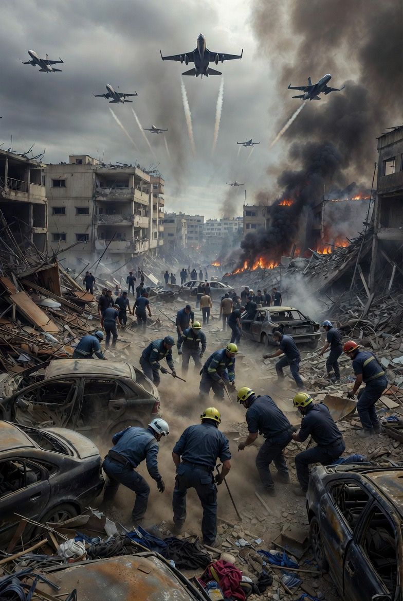

# Fragmentasi Gencatan Senjata dan Standar Ganda dalam Konflik Multiteater Timur Tengah: Kasus Serangan Israel di Lebanon dan Penolakan Proposal Iran

*Ilustrasi serangan Israel di Lebanon (pic: Grok AI).*

  
***Selama hak itu tidak setara…
perdamaian akan selalu tampak seperti negosiasi yang berat sebelah***
  

Tulisan ini menganalisis ketimpangan normatif dalam konflik Timur Tengah 2026, khususnya pada dua fenomena: 

(1) keberlanjutan serangan Israel terhadap Hezbollah di Lebanon meskipun terdapat gencatan senjata antara Amerika Serikat dan Iran, serta 

(2) penolakan terhadap proposal diplomatik Iran oleh Amerika Serikat. 

Dengan menggunakan kerangka fragmented ceasefire, double standards, dan strategic legitimacy, artikel ini menunjukkan bahwa konflik modern tidak hanya ditentukan oleh kekuatan militer, tetapi juga oleh kontrol narasi dan hierarki legitimasi global.

## Pendahuluan

Pada Maret 2026, gencatan senjata terbatas antara Amerika Serikat dan Iran tidak menghentikan operasi militer Israel terhadap Hezbollah di Lebanon.

Pernyataan Perdana Menteri Benjamin Netanyahu menegaskan bahwa Lebanon tidak termasuk dalam kesepakatan tersebut, mencerminkan fenomena fragmentasi gencatan senjata dalam konflik multiteater.

## Fragmented Ceasefire

Gencatan senjata tidak lagi bersifat menyeluruh, melainkan terbatas pada aktor dan wilayah tertentu.

Konsekuensi:

•	perang tetap berlangsung di front lain

•	kekerasan tidak benar-benar berhenti.

## Double Standards dalam Hubungan Internasional

Konsep ini menjelaskan bagaimana:

•	sekutu mendapatkan toleransi lebih besar

•	musuh mendapatkan standar lebih ketat.

## Strategic Legitimacy

Legitimasi bukan hanya soal benar atau salah, tetapi: siapa yang punya kekuatan menentukan narasi global.

## Bukti Empiris

1. Serangan Israel di Lebanon di tengah ceasefire

•	Serangan udara besar terjadi di Beirut dan Lebanon selatan

•	Korban dilaporkan ratusan jiwa dalam satu hari

Israel berargumen:

👉 target adalah Hezbollah

👉 bukan bagian dari kesepakatan dengan Iran.

Namun implikasi di lapangan:

•	korban sipil tinggi

•	wilayah padat penduduk terdampak

2. Sipil sebagai korban “resiko operasional”

Dalam doktrin militer modern: serangan terhadap target militer di area sipil dianggap “legal” jika proporsional.

Namun dalam praktik:

👉 batas antara target militer dan sipil menjadi kabur.

3. Penolakan Proposal Iran

Proposal diplomatik dari Iran dilaporkan:

•	dianggap “tidak serius” oleh pihak Amerika Serikat

•	bahkan digambarkan secara metaforis sebagai “dibuang”.

Implikasi:

👉 delegitimasi sejak awal

👉 tidak ada ruang negosiasi setara.

## Analisis

1. Ilusi gencatan senjata

Ceasefire AS–Iran tidak menghentikan konflik karena:

•	tidak mencakup seluruh aktor

•	tidak mencakup seluruh wilayah

👉 hasilnya: “perdamaian parsial dalam sistem perang total”.

2. Double standard dalam legitimasi kekerasan

Fenomena di lapangani:

•	serangan Israel → dibingkai sebagai keamanan

•	respons Iran → dibingkai sebagai ancaman.

Ini bukan kebetulan, melainkan:

👉 produk struktur geopolitik global.

3. Dehumanisasi melalui bahasa strategis

Istilah seperti:
	
  •	“collateral damage”
	
  •	“operational risk”

👉 berfungsi mengubah:

kematian manusia → menjadi variabel teknis.

4. Bias terhadap sumber proposal

Proposal dari pihak musuh sering:

•	dianggap tidak kredibel

•	ditolak sebelum dianalisis

Sebaliknya:

•	tindakan sekutu cenderung diberi justifikasi

## Diskusi

Ketimpangan ini menunjukkan bahwa konflik bukan hanya soal: siapa menyerang siapa.

Tetapi:

👉 siapa yang memiliki otoritas untuk mendefinisikan realitas.

Konflik Timur Tengah 2026 memperlihatkan bahwa gencatan senjata parsial dan standar ganda menciptakan kondisi di mana kekerasan tetap berlangsung meskipun terdapat upaya diplomasi. 

Ketimpangan legitimasi antara aktor negara memperdalam konflik dan menghambat resolusi jangka panjang.

Dalam konflik ini, masalah utamanya bukan sekadar siapa benar dan siapa salah.

Tetapi: 

siapa yang berhak menentukan mana yang disebut “keamanan”…
dan mana yang disebut “ancaman”

Dan selama hak itu tidak setara…
perdamaian akan selalu tampak seperti negosiasi yang berat sebelah.:—

  
**Referensi**

United Nations. (2024–2026). Reports on Lebanon and Gaza conflicts.

Human Rights Watch. (2025–2026). Civilian harm and airstrike analysis.

Amnesty International. (2025–2026). Documentation of proportionality and war conduct.

International Crisis Group. (2026). Middle East escalation reports.

Reuters; Al Jazeera; BBC. (2026). Regional conflict coverage.
