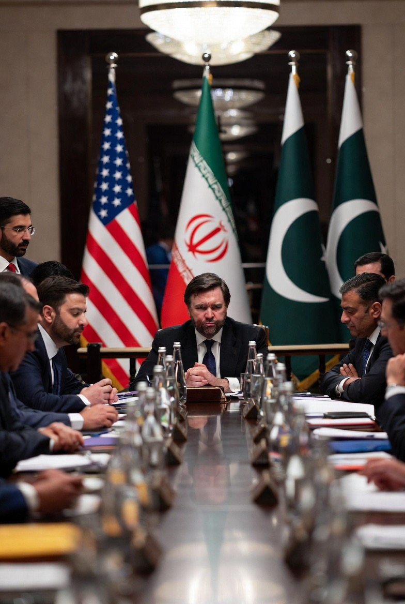

# Gagalnya Perundingan Iran–AS 2026 dan Masa Depan Gencatan Senjata: Antara Eskalasi Ulang dan Stabilitas Semu

*Ilustrasi perundingan gagal (pic: Grok AI).*

  
***Tanpa perubahan posisi: perang kemungkinan besar akan kembali, bukan “apakah”, tapi “kapan”***
  

Kegagalan perundingan antara Iran dan Amerika Serikat setelah 21 jam negosiasi intensif menciptakan ketidakpastian serius terhadap keberlanjutan gencatan senjata dua minggu yang rapuh. 

Tulisan ini menganalisis probabilitas kembalinya konflik bersenjata melalui pendekatan ceasefire theory, strategic deadlock, dan war recurrence. 

Temuan menunjukkan bahwa tanpa kesepakatan substantif, gencatan senjata cenderung bersifat sementara dan berisiko tinggi runtuh.

## Fakta Kunci (Realitas Saat Ini)

•	Perundingan resmi gagal total  

•	Tidak ada kesepakatan lanjutan

•	Gencatan senjata hanya berlaku ±2 minggu (hingga ±22 April)  

•	Iran menolak tuntutan utama (terutama nuklir)  

•	AS menyebut sudah memberi “final offer”

👉 Artinya: kita sekarang berada di fase “ceasefire tanpa fondasi”.

## Fragile Ceasefire Theory

Gencatan senjata tanpa:
	
  •	kesepakatan politik
	
  •	mekanisme verifikasi
	
  •	konsesi nyata

👉 = hanya jeda perang, bukan akhir perang

## Strategic Deadlock

Kedua pihak:
	
  •	tidak mau mundur
	
  •	tidak bisa menang cepat

👉 hasilnya:

kebuntuan → lalu kembali ke konflik

## War Recurrence

Dalam studi konflik:

👉 lebih dari 60% gencatan senjata gagal dalam waktu singkat
(jika akar konflik tidak diselesaikan)

Analisis Situasi

1. Kenapa gagal?

Masalah inti:
	
  •	AS: tuntut pembatasan nuklir
	
  •	Iran: anggap itu “penyerahan”

👉 ini bukan beda teknis

👉 ini beda prinsip kedaulatan

2. Kenapa gencatan senjata tetap dipertahankan (sementara)?

Meski gagal:
	
  •	mediator (Pakistan, dll) masih dorong tetap bertahan  
	
  •	kedua pihak belum siap eskalasi total lagi

👉 ini disebut: strategic pause.”

## Prediksi

🟥 Skenario 1: Perang lanjut (Probabilitas tinggi: ±60–70%)

Jika:

•	gencatan senjata berakhir tanpa perpanjangan

•	tidak ada negosiasi lanjutan

👉 maka:

•	serangan akan kembali

•	kemungkinan lebih intens

•	multi-front (Israel, Lebanon, Hormuz).

🟨 Skenario 2: Gencatan senjata diperpanjang tanpa deal (±20–30%)

Jika:

•	tekanan global meningkat

•	ekonomi (minyak, Hormuz) makin terganggu

👉 maka:

•	“fake peace” diperpanjang

•	tapi konflik tetap latent

🟩 Skenario 3: Deal parsial (±10% atau kurang)

Sangat kecil kemungkinan karena:

•	posisi kedua pihak terlalu keras

•	tidak ada trust.

## Indikator Kunci

Perhatikan:

•	🚢 aktivitas di Selat Hormuz

•	💣 intensitas serangan kecil (proxy)

•	🗣️ retorika Iran (“no talks” vs “open”)

•	🇺🇸 pergerakan militer AS

👉 ini lebih jujur daripada pernyataan resmi.

Gencatan senjata saat ini:

👉 bukan perdamaian
👉 tapi intermission perang

Ini bukan sekadar gagal negosiasi
👉 tapi: structural deadlock antara dua kepentingan yang tidak bisa dipertemukan.

Ceasefire memang rapuh sejak awal, bukan gagal tiba-tiba, tapi: memang dari awal hanya “penundaan konflik”.

Dan tanpa perubahan posisi: perang kemungkinan besar akan kembali, bukan “apakah”, tapi “kapan”.

Ada upaya damai, tapi darah masih belum benar-benar berhenti mengalir.

  
**Referensi**

Reuters. (2026, April 11). US-Iran talks end without a deal as delegations leave Pakistan.  

Reuters. (2026, April 12). US-Iran talks falter, ceasefire concerns resurface.  

The Guardian. (2026, April 11). US-Iran talks in Islamabad amid regional escalation.  

New York Post. (2026, April 12). Iran rejects further talks, maintains control over Hormuz.  

Reuters (via laporan lanjutan).
