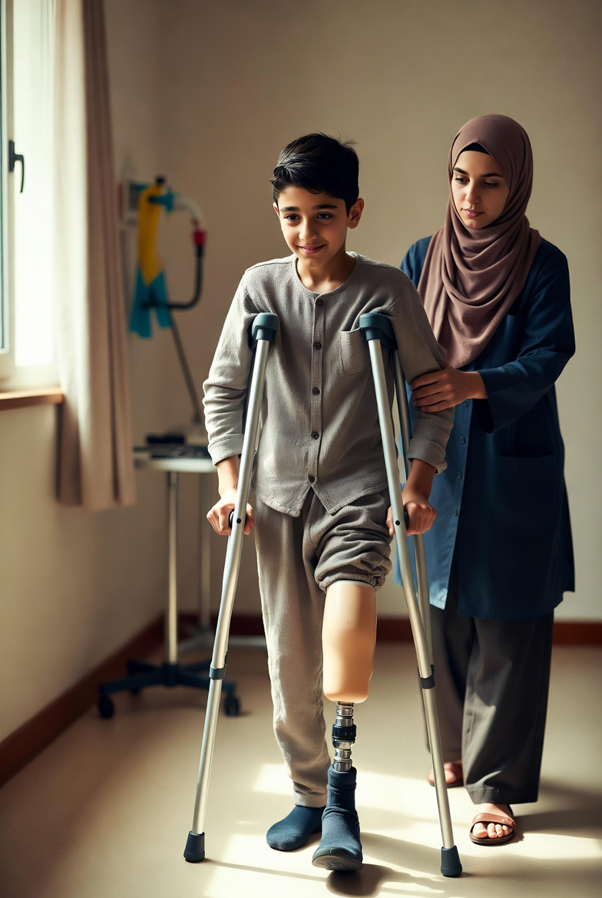

# Gaza & Generasi yang Terpotong: Amputasi Massal Anak sebagai Warisan Biologis Konflik Modern

*Ilustrasi (pic: Grok AI).*

  
***Perang itu ikut pulang bersamanya, masuk ke ruang rehabilitasi, masuk ke sekolah, dan masuk ke masa dewasanya***
  

Konflik Gaza sejak Oktober 2023 telah menghasilkan salah satu krisis amputasi anak terbesar dalam sejarah modern. 

Organisasi internasional melaporkan ribuan korban amputasi, dengan anak-anak menjadi kelompok yang sangat terdampak. 

Artikel ini menganalisis fenomena tersebut dari perspektif kesehatan masyarakat, hukum humaniter internasional, ekonomi pembangunan, dan psikologi trauma. 

Temuan menunjukkan bahwa amputasi massal pada anak bukan sekadar konsekuensi medis perang, melainkan transformasi permanen terhadap masa depan sebuah generasi.

## Pendahuluan

Biasanya ketika orang mendengar perang, mereka membayangkan korban tewas, ledakan, dan reruntuhan. Namun ada kategori korban yang sering terlupakan yaitu mereka yang selamat.

Seorang anak yang kehilangan kedua kaki pada usia 8 tahun tidak tercatat sebagai “kematian”. 

Secara statistik ia termasuk korban yang selamat. Tetapi secara biologis, psikologis, dan sosial, hidupnya berubah selamanya.

## Fenomena yang Mengguncang Dunia Medis

Menurut laporan berbagai organisasi kemanusiaan, Gaza menjadi salah satu wilayah dengan tingkat amputasi anak tertinggi di dunia selama konflik 2023-2025.

Banyak operasi dilakukan dalam kondisi rumah sakit hancur, listrik terbatas, kekurangan obat, anestesi tidak memadai, serta tenaga medis kelelahan.

Laporan kemanusiaan berulang kali menggambarkan situasi di mana dokter harus melakukan prosedur penyelamatan nyawa dalam kondisi yang jauh dari standar medis normal.

## Ketika Tubuh Anak Menjadi Medan Perang

Ledakan modern tidak dirancang untuk “melukai secara rapi”. 

Gelombang ledakan menghasilkan serpihan logam (shrapnel), trauma jaringan masif, kerusakan pembuluh darah, dan infeksi berat. Akibatnya dokter sering menghadapi pilihan tragis antara amputasi atau kematian.

Dalam banyak kasus, amputasi bukan pilihan terbaik, namun meniadi satu-satunya pilihan yang tersisa.

## Perang Modern dan Paradoks “Korban Selamat”

Dalam perang abad ke-21, kemajuan medis menghasilkan paradoks.

Dulu banyak korban langsung meninggal. Sedangkan saat ini lebih banyak korban selamat. Tetapi dengan kehilangan anggota tubuh, cedera otak, trauma kronis, serta disabilitas permanen.

Secara statistik angka kematian mungkin turun. Namun angka penderitaan jangka panjang meningkat.

## Ekonomi Kehilangan

Seorang anak yang kehilangan kaki tidak hanya kehilangan kaki. Ia juga berisiko kehilangan pendidikan, mobilitas, pekerjaan masa depan, dan pendapatan seumur hidup.

Ekonom pembangunan menyebut fenomena ini sebagai human capital destruction. Bahwa Perang tidak hanya menghancurkan gedung namun juga menghancurkan kapasitas manusia.

## Trauma yang Tidak Terlihat

Amputasi memiliki dua luka.  Luka pertama adalah luka fisik. Sedangkan luka kedua adalah luka identitas.

Anak-anak sering bertanya: mengapa aku berbeda? apakah aku masih bisa bermain? apakah aku masih bisa berlari?

Trauma semacam ini dapat bertahan puluhan tahun.

## Krisis Prostetik

Banyak orang berpikir: “Nanti tinggal pasang kaki palsu.” Padahal realitasnya jauh lebih rumit.

Untuk anak-anak, tubuh terus tumbuh, prostetik harus diganti berkala, serta rehabilitasi berlangsung bertahun-tahun.

Jika sistem kesehatan lumpuh, bahkan kaki palsu sederhana menjadi barang mewah.

## Hukum Humaniter Internasional

Prinsip dasar hukum perang modern adalah perlindungan warga sipil. Terutama anak-anak, pasien, dan tenaga medis.

Ketika jumlah korban anak meningkat drastis, pertanyaan yang muncul bukan hanya “Siapa yang menang?” melainkan “Apa yang tersisa untuk dimenangkan?”

## Generasi Amputasi

Istilah yang mulai muncul dalam diskusi kemanusiaan adalah “lost generation” atau “generasi yang hilang.”

Namun dalam kasus Gaza, istilah itu terasa bahkan lebih konkret. Karena sebagian anak tidak hanya kehilangan rumah, sekolah, dan masa kecil. Mereka juga kehilangan bagian tubuh mereka.

## Analisis 

Di sinilah bagian yang sering membuat banyak orang tidak nyaman. Negara-negara besar menghabiskan miliaran dolar untuk rudal, miliaran dolar untuk pesawat tempur, dan miliaran dolar untuk sistem penghancur.

Namun ketika anak-anak kehilangan kaki, dunia kemudian mengadakan konferensi tentang rehabilitasi, bantuan kemanusiaan, serta terapi trauma.

Seolah-olah manusia menjadi sangat ahli memperbaiki luka yang sebelumnya ia ciptakan sendiri.

Krisis amputasi di Gaza bukan sekadar isu kesehatan. Ia adalah isu kemanusiaan, isu pembangunan, isu psikologi, serta isu moral global.

Sejarah mungkin akan menghitung jumlah rudal, jumlah korban, dan jumlah gedung yang hancur. Tetapi pertanyaan yang lebih mengganggu adalah: Berapa banyak anak yang harus belajar berjalan kembali sebelum dunia mengakui bahwa sesuatu telah gagal secara fundamental?

Yang paling pahit adalah kenyataan bahwa ketika seorang anak kehilangan kaki, perang tidak berakhir saat suara ledakan berhenti.

Perang itu ikut pulang bersamanya, masuk ke ruang rehabilitasi, masuk ke sekolah, dan masuk ke masa dewasanya.

Dan kadang tetap tinggal di sana puluhan tahun setelah para politisi selesai berpidato.

  
**Referensi**

UNICEF. (2024-2026). Reports on children affected by conflict in Gaza.

World Health Organization. (2024-2026). Emergency health situation reports for Gaza.

Save the Children. (2024). Reports on child casualties and amputations in Gaza.

Palestine Children’s Relief Fund. (2024-2026). Rehabilitation and prosthetic assistance reports.

Humanity & Inclusion. (2024-2026). Disability and rehabilitation assessments in Gaza.

International Committee of the Red Cross. (2024-2026). Civilian protection and war surgery reports.
