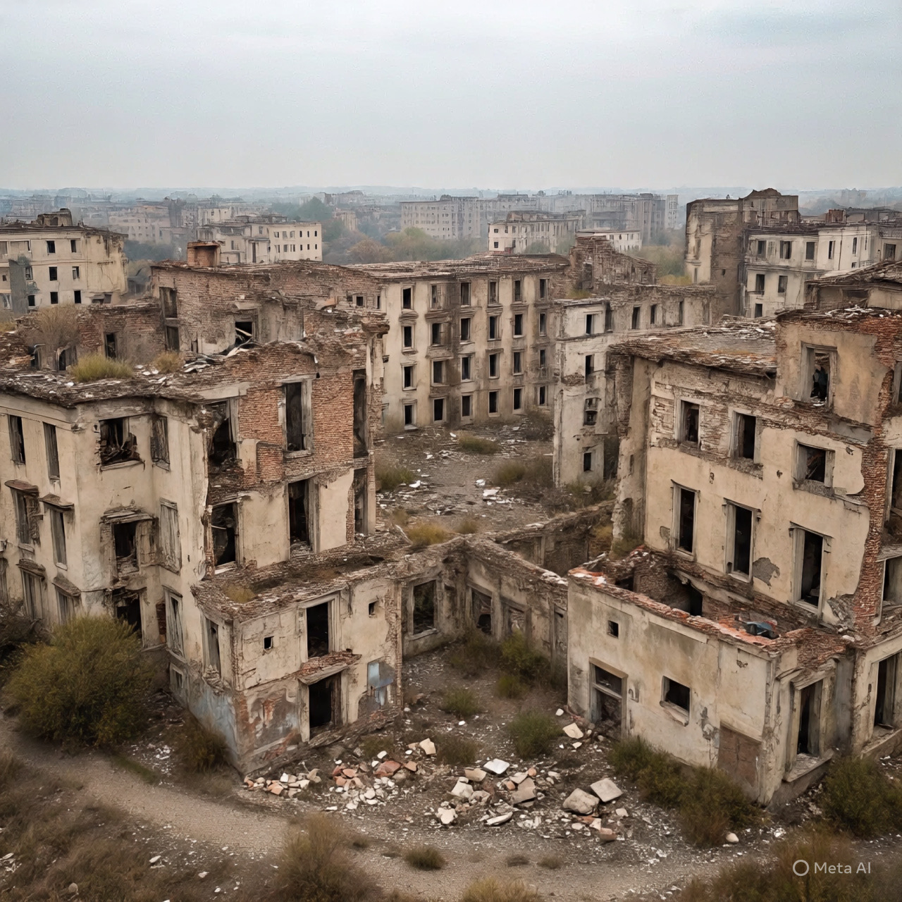

# Geopolitik Distraksi dan Fragmentasi: Analisis Strategi Kekuasaan, Kepentingan Intelijen, dan Krisis Palestina dalam Sistem Internasional Kontemporer

*Ilustrasi kehancuran Gaza (pic: Meta AI).*

  
***Ini bukan semata kebetulan — melainkan hasil dari struktur global yang memetakan prioritas berdasarkan kekuatan, bukan moral***
  

Tulisan ini mengevaluasi bagaimana konflik regional yang tumpang tindih di Timur Tengah berfungsi sebagai mekanisme distraksi strategis yang menenggelamkan isu Palestina dalam dinamika geopolitik yang lebih luas. 

Dengan menggunakan pendekatan yang menggabungkan teori hubungan internasional, ekonomi politik perang, dan intelijen strategis, artikel ini menelusuri motif aktor eksternal dalam “mengacak-acak” situasi domestik dan regional, serta dampaknya terhadap penderitaan warga Palestina, akses terhadap bantuan kemanusiaan, dan perluasan pemukiman Israel. 

Hasil penelitian menunjukkan bahwa fragmentasi konflik sering kali memperkuat posisi kekuatan besar dan industri militer, sekaligus mengaburkan tanggung jawab kolektif terhadap pelanggaran hak asasi manusia dan hukum humaniter internasional.

## Pendahuluan

Palestina selama lebih dari tujuh dekade menjadi fokus konflik yang kompleks dan multilevel: pendudukan, pemukiman ilegal, blokade, dan pelanggaran hak asasi. 

Namun, dalam dekade terakhir, konflik internal dan eksternal di kawasan — termasuk di Iran, Yaman, Suriah, dan hubungan Arab-Iran — menciptakan lapisan konflik lain yang menyita perhatian global.

Pertanyaan kunci tulisan ini adalah:
Apakah konflik-konflik lain di Timur Tengah secara struktural mengalihkan perhatian politik, ekonomi, dan diplomatik dari isu Palestina? Dan bagaimana peran kepentingan intelijen dan aktor eksternal dalam konfigurasi ini?

## Kerangka Teoretik

1. Teori Distraksi dan Fragmentasi Konflik

Dalam literatur hubungan internasional, konflik tidak selalu “acak”.

Diversionary conflict theory berargumen bahwa negara atau aktor eksternal terkadang mengeksploitasi konflik luar negeri untuk memecah perhatian dari isu domestik atau regional yang tidak menguntungkan.

Teori ini biasanya digunakan untuk menjelaskan kenapa negara memilih eskalasi konflik pada saat internalnya rapuh (Mason & Krane, 1989; Lai, 2017).

2. Ekonomi Politik Perang

Konflik modern bukan hanya arena militer. Ia menjadi:

• pasar bagi industri pertahanan,

• katalisator ekspansi politik luar negeri,

• sumber legitimasi anggaran militer.

Ekonomi perang memperlihatkan bagaimana konflik proksi dan distribusi senjata menjadi bagian dari ekosistem finansial global (Dunne & Perlo-Freeman, 2003; Singer, 2009).

3.Intelijen Strategis dan Perang Informasi

Aktivitas intelijen bukan hanya soal spionase, tetapi juga tentang:

• pembentukan narasi,

• manipulasi persepsi publik,

• operasi psikologis.

Dalam perang kontemporer, persaingan memperluas sering dilakukan melalui influence operations dan information campaigns yang tidak selalu teridentifikasi secara jelas (Rid, 2020; Johnson, 2018).

## Motif “Pengacak-acak” Geopolitik

1. Kepentingan Strategis Negara Besar

Negara kuat seperti AS, Rusia, dan sekutu regionalnya memiliki parameter:

• akses ke sumber energi,

• stabilitas aliansi,

• dominasi strategis atas jalur logistik global.

Ketika isu Palestina menjadi beban politik domestik, strategi diversifikasi konflik bisa meredam tekanan publik tanpa menyelesaikan akar persoalan.

2. Industri Militer dan Ekonomi Senjata

Industri pertahanan global mencetak rekor penjualan ketika:

• konflik berkepanjangan,

• ketidakpastian politik meningkat,

• anggaran keamanan meningkat.

Ini menghasilkan insentif struktural bagi aktor dengan kapasitas produksi senjata untuk mendukung fragmentasi ketimbang resolusi (SIPRI, 2024).

## Dampak terhadap Palestina

1. Kelaparan dan Krisis Kemanusiaan

Laporan‐laporan kemanusiaan dari PBB dan NGO menunjukkan bahwa:

• warga Gaza mengalami malnutrisi karena blokade dan hambatan bantuan,

• anak-anak serta perempuan menjadi kelompok paling rentan (UN OCHA, 2025).

Distribusi bantuan sering tertunda oleh prioritas keamanan yang sensitif di wilayah konflik lain.

2. Pengusiran dan Pemukiman

Pemukiman Israel di Tepi Barat terus bertambah, menyebabkan:

• displacement warga lokal,

• pengurangan akses air,

• fragmentasi wilayah yang makin memperburuk ketersambungan komunitas Palestina (Human Rights Watch, 2024; B’Tselem, 2021).

3. Perubahan Fokus Global

Kombinasi konflik lain di kawasan menyebabkan:

• media internasional membagi atensi,

• tekanan diplomatik tersebar,

• isu Palestina tidak lagi menjadi prioritas strategis dalam forum diplomatik utama.

## Diskusi

Pendekatan fragmentasi konflik menunjukkan bahwa perang tidak hanya terjadi di medan fisik, tetapi juga di medan perhatian internasional, di mana:

• isu dilegitimasi sebagai masalah “lokal” ketimbang krisis global,

• narasi kemanusiaan tergantikan oleh agenda keamanan dan geopolitik lainnya.

Ini bukan semata kebetulan — melainkan hasil dari struktur global yang memetakan prioritas berdasarkan kekuatan, bukan moral.

Palestina hari ini tidak “hilang secara kebetulan” dari radar global. (Isu itu semakin terbingkai sebagai masalah marginal karena agenda politik yang lebih luas.)

Fragmentasi konflik di kawasan Timur Tengah:

• melemahkan solidaritas regional,

• memecah fokus global,

• menguntungkan aktor kuat yang mempertahankan status quo.

Dalam struktur konflik kontemporer, fragmentasi bukan sekadar kondisi, tetapi alat strategi yang memperkuat sistem yang ada.

  
**Referensi**

B’Tselem. (2021). A regime of Jewish supremacy from the Jordan River to the Mediterranean Sea. B’Tselem.

Dunne, J. P., & Perlo-Freeman, S. (2003). The demand for military spending in developing countries. International Review of Applied Economics, 17(1), 23–48. https://doi.org/10.1080/713673165

Human Rights Watch. (2024). A threshold crossed: Israeli authorities and the crimes of apartheid and persecution. Human Rights Watch.

Johnson, L. K. (2018). A season of inquiry: Intelligence pedagogy, theory, and practice. Rowman & Littlefield.

Lai, B. (2017). Diversionary foreign policy: A reinterpretation of the diversionary theory of war. Journal of Global Security Studies, 2(1), 4–21. https://doi.org/10.1093/jogss/ogw036

Mason, T. D., & Krane, D. (1989). International conflicts, 1945–1985. Springer.

Rid, T. (2020). Active measures: The secret history of disinformation and political warfare. Farrar, Straus and Giroux.

SIPRI. (2024). Trends in international arms transfers, 2023. Stockholm International Peace Research Institute.

United Nations Office for the Coordination of Humanitarian Affairs (UN OCHA). (2025). Occupied Palestinian Territory: Humanitarian needs overview. United Nations.

