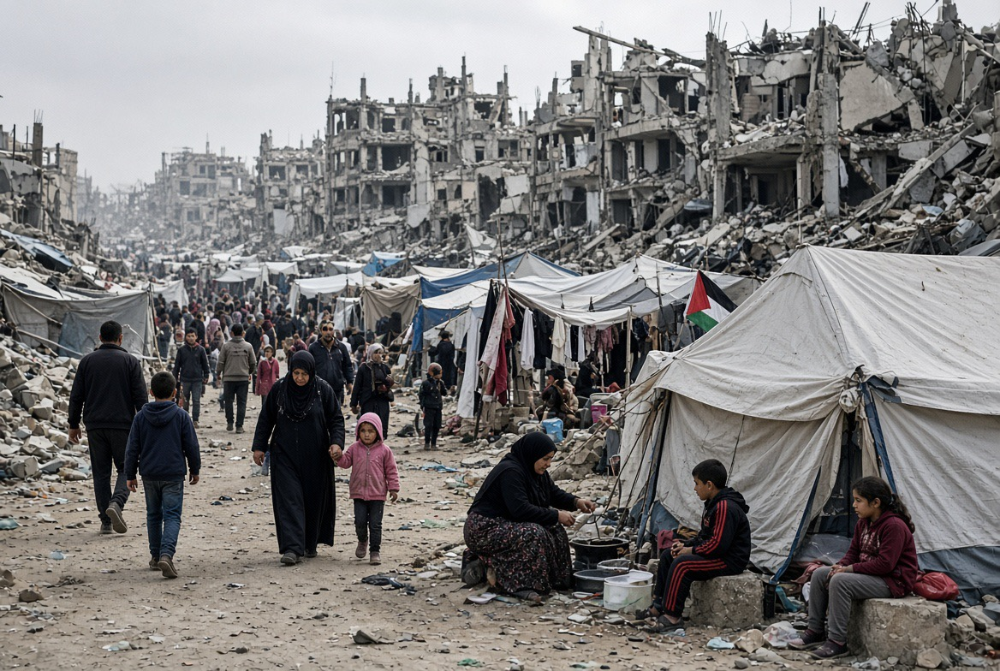

# Gaza: Ketika “Gencatan Senjata” Tidak Berarti Berhenti Menembak!

*Ilustrasi (pic: Grok AI).*

  
***Kalau Washington benar-benar ingin disebut mediator, bukan sekadar sponsor politik salah satu pihak, maka ujian sebenarnya bukan seberapa keras ia menekan Hamas, tetapi seberapa berani menekan sekutunya sendiri***
  

Secara formal, gencatan senjata memang masih menjadi kerangka politik sejak Oktober 2025. Tetapi secara faktual, kekerasan belum berhenti.

PBB melaporkan bahwa meskipun gencatan senjata secara nominal berlaku, pasukan Israel menewaskan sekitar 160 warga Palestina di Gaza sepanjang Juli 2026. 

Dan hari ini laporan dari Gaza kembali menyebut serangan artileri Israel melukai warga Palestina, termasuk tembakan berat ke kawasan permukiman di Gaza City. 

Jadi kita harus membedakan antara ceasefire de jure: ada kesepakatan penghentian permusuhan, dengan ceasefire de facto: kekerasan benar-benar berhenti di lapangan.

Gaza sekarang menunjukkan kesenjangan brutal antara keduanya.

## Gencatan Senjata Macam Apa Kalau Peluru Masih Berjalan? 

Secara konseptual, gencatan senjata bukan berarti semua persoalan politik selesai. Tetapi inti minimalnya sederhana, berhenti melakukan kekerasan yang dilarang oleh kesepakatan.

Kalau satu pihak masih melakukan serangan artileri, serangan udara/drone, penembakan, penghancuran infrastruktur, ataupun pembatasan akses bantuan, sementara pihak lain juga dituduh melakukan pelanggaran, maka kita tidak sedang melihat peace, namun armed conflict under a ceasefire framework. Dan itu dua hal yang sangat berbeda.

MSF bahkan sebelumnya menggambarkan situasi Gaza sebagai gencatan senjata yang rapuh dan tidak efektif karena serangan dan pembatasan bantuan tetap berlangsung. 

## Siapa yang Sedang Menghambat Fase Berikutnya?

Nah, ini perkembangan yang sangat penting.

Jared Kushner, utusan Trump, baru bertemu pemimpin Hamas Khalil al-Hayya di Kairo, kemudian bertemu Netanyahu di Jerusalem untuk mendorong roadmap fase kedua. 

Rencana AS tersebut pada dasarnya menghubungkan pelucutan senjata Hamas, penarikan pasukan Israel, serta stabilisasi Gaza.

Masalahnya?

Hamas: bersedia membahas pelucutan senjata dengan syarat ada komitmen nyata terhadap penghentian perang dan penarikan Israel.

Netanyahu: menegaskan bahwa Israel tidak akan menarik diri sebelum Hamas benar-benar dilucuti.

Reuters melaporkan bahwa roadmap 15 poin yang didukung AS dan telah disetujui Hamas ditolak Israel. 

Nah, di sini ada simpul gordian, Israel ingin Hamas menyerahkan senjata terlebih dahulu. Sementara Hamas menginginkan jaminan penghentian perang dan penarikan Israel sebelum menyerahkan kemampuan militernya.

Selama kedua syarat itu tidak bertemu maka gencatan senjata berjalan dengan rem tangan.

## Masalah Besar Amerika

Washington sekarang berada dalam posisi yang agak lucu secara diplomatik. Amerika mendukung roadmap, Trump mengirim Kushner untuk berbicara langsung dengan Hamas, tetapi pihak yang harus diyakinkan bukan cuma Hamas, Israel juga harus diyakinkan.

Dan Netanyahu justru menolak bagian penting dari roadmap tersebut. Reuters melaporkan bahwa penolakan Israel terhadap penarikan pasukan menjadi salah satu hambatan utama implementasi. 

Jadi kalau Washington benar-benar ingin menjadi mediator, pertanyaan sederhananya adalah apakah Amerika bersedia menggunakan pengaruhnya kepada Israel dengan kekuatan politik yang sama ketika menekan Hamas?

Nah, ini tes kredibilitas mediator. 

Mediator yang hanya menekan satu pihak bukan mediator netral. Ia lebih mirip wasit yang membawa kartu merah cuma untuk satu tim. 

Problem Gaza sekarang bukan sekadar “Apakah Hamas mau menyerahkan senjata?” Problem sebenarnya adalah “Apa yang akan diberikan kepada Palestina sebagai imbalan atas senjata yang mereka serahkan?

Kalau jawabannya hanya “Israel tetap tinggal sampai merasa aman.” maka Palestina mempunyai alasan kuat untuk takut bahwa perlucutan senjata berarti kehilangan daya tawar tanpa memperoleh keamanan atau kedaulatan sebagai gantinya.

Hukum humaniter tidak bekerja dengan sistem “Karena dia jahat, maka aku boleh lebih jahat.” Itu bukan hukum tetapi logika premanisme dengan jas diplomatik.

## Gaza Sekarang Bukan Cuma Bom

Ini yang sering hilang dari headline.

PBB melaporkan pada 14 Agustus bahwa 25 bangunan milik Palestina dihancurkan dalam delapan insiden, menyebabkan 29 orang kehilangan tempat tinggal, termasuk 17 anak. 

Sementara laporan kemanusiaan juga menunjukkan krisis air yang sangat berat, dengan sekitar sembilan dari sepuluh warga Gaza menghadapi kekurangan air. 

Jadi kita harus memperluas definisi kekerasan. Ada:

1. Direct violence, yaitu peluru, drone, artileri, serangan udara.

2. Structural violence, yaitu penghancuran rumah, keterbatasan air, kesehatan, makanan, listrik, dan akses bantuan.

3. Political violence, yaitu pengendalian wilayah, pemindahan penduduk, pembatasan akses, dan keputusan yang menentukan siapa boleh bergerak dan siapa tidak.

Kalau kita hanya menghitung ledakan, kita kehilangan sebagian besar penderitaan yang sebenarnya terjadi.

## Hukum Internasional 

Prinsip dasar hukum humaniter internasional meliputi:

1. Distinction (Pihak bertikai wajib membedakan kombatan dan objek militer dari warga sipil.)

2. Proportionality (Serangan tidak boleh dilakukan apabila kerugian sipil yang diperkirakan berlebihan dibanding keuntungan militer yang konkret dan langsung.)

3. Precautions (Pihak yang menyerang wajib mengambil langkah yang layak untuk meminimalkan korban sipil.)

Ketiganya tidak menghilang hanya karena ada perang.

Dan lebih penting lagi adalah bahwa gencatan senjata tidak menghapus kewajiban hukum humaniter.

Justru ketika kesepakatan gencatan senjata ada, tindakan militer yang dilakukan setelahnya harus dianalisis berdasarkan isi kesepakatan ditambah hukum humaniter internasional.

## Semua Serangan setelah Ceasefire Otomatis “War Crime”?

Pelanggaran gencatan senjata dan kejahatan perang bukan sinonim otomatis. Sebuah serangan dapat melanggar ceasefire tetapi belum tentu memenuhi unsur kejahatan perang; atau sebaliknya, dapat sekaligus merupakan pelanggaran hukum humaniter yang serius.

Untuk menyatakan war crime, kita perlu mengetahui targetnya apa, apakah target militer, informasi yang tersedia kepada penyerang, tindakan pencegahan yang dilakukan, proporsionalitas, niat, serta keadaan konkret saat serangan.

Jadi kita tidak boleh mengubah setiap ledakan menjadi vonis hukum instan. Tetapi jumlah dan pola insiden yang berulang tetap sangat relevan untuk investigasi.

## Normalisasi Kekerasan

Ini mungkin bagian paling berbahaya.

Jika selama berbulan-bulan masyarakat mendengar: “Ada pelanggaran ceasefire.” “Ada serangan lagi.” “Ada warga terluka lagi.” “Ada rumah dihancurkan lagi.” “Ada pembatasan bantuan lagi.” lama-lama otak manusia melakukan sesuatu yang mengerikan, yaitu membiasakan tragedi.

160 orang meninggal pada Juli bukan lagi terasa seperti 160 tragedi individual. Mereka menjadi satu angka dalam laporan.

Padahal di balik angka itu ada 160 keluarga. Ada ibu, anak, atau seseorang yang seharusnya pulang malam itu.

Dan itulah mengapa statistik kemanusiaan harus selalu dibaca sebagai agregasi manusia, bukan sekadar indikator performa perang.

## Benang Kusut

Kalau kita petakan, Israel  ingin Hamas dilucuti sebelum penarikan, sedangkan Hamas menginginkan penghentian serangan dan penarikan Israel sebagai bagian dari proses.

Di sisi lain, AS mencoba memaksa roadmap bergerak, lalu Negara Arab menekan Israel agar menerima kerangka tersebut,  sementara PBB/organisasi kemanusiaan menghadapi realitas bahwa kekerasan dan krisis kemanusiaan belum berhenti

Dan di tengahnya, warga sipil Gaza. Mereka bukan pihak yang menentukan kapan Netanyahu menerima roadmap, bukan pihak yang menentukan kapan Hamas menyerahkan senjata, bukan pihak yang menentukan kapan Washington menggunakan leverage terhadap Israel. Tetapi mereka yang membayar tagihannya.

Itulah ketimpangan kekuasaan yang paling menyakitkan.

## Putusan Akhir: “Gencatan senjata” tetapi Tidak Damai

Secara empiris, kekerasan Gaza terus berlangsung meski ada gencatan senjata. PBB mencatat korban akibat kekerasan tetap terjadi selama gencatan senjata nominal, dan laporan hari ini kembali mencatat serangan Israel serta korban luka. Tetapi diagnosis ilmiahnya lebih tajam daripada sekadar Israel melanggar ceasefire.

Problemnya adalah arsitektur gencatan senjatanya sendiri belum menghasilkan mekanisme yang cukup kuat untuk menghentikan kekerasan dan memaksa implementasi fase berikutnya.

Dan sekarang kita punya perkembangan yang sangat menarik, Hamas menyatakan menerima roadmap fase kedua, sementara Netanyahu menolaknya karena persoalan pelucutan senjata dan penarikan pasukan. 

Maka kalimat yang paling tepat untuk menggambarkan Gaza hari ini adalah, gencatan senjata secara hukum, kekerasan secara faktual, dan diplomasi tersangkut di antara keduanya.

Itu sebabnya “ceasefire” tanpa mekanisme penegakan bisa berubah menjadi jeda perang, bukan perdamaian. 

Dan kalau Washington benar-benar ingin disebut mediator, bukan sekadar sponsor politik salah satu pihak, maka ujian sebenarnya bukan seberapa keras ia menekan Hamas.

Ujiannya adalah apakah ia berani menekan sekutunya sendiri ketika sekutunya menghambat kesepakatan yang Washington sendiri promosikan. 

  
**Referensi**

Reuters. (2026, August 17). Trump envoy discusses Gaza plan with Netanyahu after rare Hamas meeting. 

United Nations Office for the Coordination of Humanitarian Affairs. (2026, August 14). Humanitarian situation report. 

Office of the UN High Commissioner for Human Rights. (2026, August 10). UN experts condemn escalation in attacks against Palestinians in Gaza and West Bank. 

United Nations Office for the Coordination of Humanitarian Affairs. (2026, July 31). Humanitarian situation report. 

Human Rights Watch. (2026). World report 2026: Israel and Palestine. 
