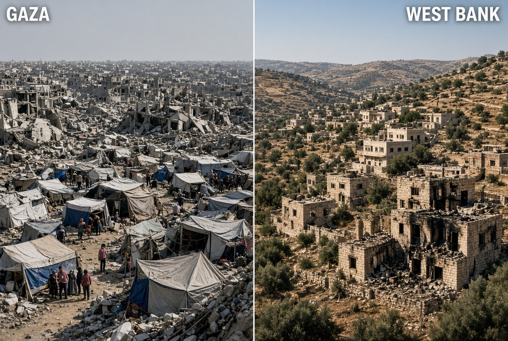

# Gaza–Tepi Barat: Kelaparan, Pemindahan Penduduk & Perebutan Tanah Menjadi Satu Sistem Kekuasaan

*Ilustrasi (pic: Grok AI).*

  
***Yang sedang dipertaruhkan bukan hanya berapa banyak orang Palestina yang mati, namun sesuatu yang lebih fundamental, yakni apakah sebuah masyarakat masih memiliki syarat material untuk tetap menjadi masyarakat di tanahnya sendiri?***
  

Gaza dan Tepi Barat tidak boleh dianalisis sebagai dua krisis terpisah, sebab Gaza menunjukkan penghancuran kondisi hidup, sementara Tepi Barat menunjukkan restrukturisasi ruang hidup.

Kalau keduanya dibaca bersama, kita melihat persoalan yang lebih besar, yaitu siapa yang masih boleh tinggal, di mana mereka boleh tinggal, dan apakah mereka masih memiliki kondisi material untuk tetap tinggal di tanah tersebut.

Dan di sinilah kata “displacement” menjadi sangat penting.

## Gaza: Bukan Cuma “Orang Lapar”

Krisis pangan Gaza sekarang bukan sekadar persoalan stok makanan kurang. Masalahnya adalah seluruh sistem reproduksi kehidupan sipil telah dihancurkan atau dibuat sangat rapuh.

WFP pada Juli 2026 mengatakan kondisi pangan memang membaik dibanding periode terburuk, tetapi hanya karena bantuan kemanusiaan dan akses komersial meningkat. 

Bahkan saat itu hanya Kerem Shalom yang masih terbuka, sehingga sebagian besar penduduk tetap sangat bergantung pada bantuan. 

Data WFP terbaru memperkirakan sekitar 1,4 juta orang di Gaza masih menghadapi tingkat kerawanan pangan akut crisis atau lebih buruk, sekitar 1,5 juta orang dijangkau WFP setiap bulan, sekitar 80% penduduk masih menganggur, dan WFP membutuhkan sekitar US$426 juta untuk operasi Gaza dan Tepi Barat Juli–Desember 2026. 

Jadi kalimat yang lebih tepat bukan tidak ada makanan sama sekali,  melainkan sistem pangan Gaza masih hidup dengan infus kemanusiaan. Cabut infusnya, dan sistemnya bisa kolaps lagi.

WFP sendiri memperingatkan bahwa jika bantuan tidak dipertahankan, sampai 90% penduduk dapat kembali menghadapi tingkat kerawanan pangan tinggi pada akhir 2026. 

Itu jauh lebih mengerikan daripada sekadar angka stok tepung.

## 73.000 Kematian Bukan Angka Statistik Biasa

Laporan terbaru Reuters pada 7 September 2026 menyebut otoritas kesehatan Gaza telah melaporkan lebih dari 73.000 warga Palestina tewas, sementara lebih dari 8.000 orang masih diperkirakan berada di bawah reruntuhan. 

Sekarang bayangkan konsekuensi demografisnya. Kematian bukan satu-satunya efek. Ada kematian, cedera, disabilitas, trauma, kehilangan rumah, kehilangan pekerjaan, kehilangan sekolah, kehilangan fasilitas kesehatan, serta kehilangan jaringan sosial.

Maka kerusakan sebenarnya jauh lebih besar daripada angka kematian.

## Destruction of Habitability

Dalam studi konflik, kita harus membedakan:

A. Membunuh manusia

dan

B. Membuat sebuah tempat semakin tidak layak dihuni.

Yang kedua dapat terjadi melalui kombinasi: penghancuran rumah, air dan sanitasi rusak, rumah sakit rusak, sekolah rusak, listrik dan energi terganggu, pangan terbatas, akses komersial terhambat, tanah pertanian rusak, serta pengungsian berulang.

Hasil akhirnya, manusia secara fisik masih hidup, tetapi ekosistem kehidupan sipilnya dihancurkan.

Ini sebabnya Gaza harus dianalisis bukan cuma sebagai death toll, tetapi sebagai habitability crisis.

## Hukum Humaniter Internasional Punya Garis Sangat Jelas Soal Kelaparan

Ini bagian yang jangan dikaburkan oleh jargon keamanan.

ICRC menjelaskan bahwa dalam hukum humaniter internasional, kelaparan terhadap penduduk sipil tidak boleh digunakan sebagai metode peperangan. 

Pihak yang melakukan pengepungan juga memiliki kewajiban terkait bantuan kemanusiaan dan perlindungan warga sipil. 

Konvensi Jenewa IV Pasal 55 juga menetapkan kewajiban occupying power untuk memastikan pasokan makanan dan medis bagi populasi wilayah yang diduduki ketika sumber daya lokal tidak memadai. 

Jadi pertanyaannya secara hukum bukan “Apakah Israel punya hak melawan Hamas?” tentu hak dan kewajiban keamanan Israel harus dianalisis.

Pertanyaan hukumnya adalah: Apakah cara mencapai tujuan militer tersebut secara sah ketika konsekuensinya mengenai penduduk sipil dalam skala demikian besar?

Itulah perbedaan antara jus ad bellum dan jus in bello. Tujuan perang tidak otomatis membuat semua metode perang legal.

## Tepi Barat

Dan di sini ceritanya menjadi jauh lebih sistemik.

Kalau Gaza memperlihatkan bagaimana populasi dihancurkan melalui perang, Tepi Barat memperlihatkan bagaimana ruang geografis dapat direstrukturisasi secara bertahap.

Amnesty melaporkan bahwa pada Juli 2026 militer Israel mengeluarkan sedikitnya 15 perintah penyitaan tanah, mencakup sekitar 200 dunam atau 20 hektare di wilayah Jenin, termasuk Area A dan C, dengan tujuan yang menurut Amnesty tampaknya berkaitan dengan koneksi dua permukiman yang direncanakan, Emek Dotan dan Noa. 

Dan ini signifikan, karena Area A secara formal berada di bawah administrasi Palestina berdasarkan Oslo.

Jadi ketika penyitaan untuk kepentingan infrastruktur permukiman memasuki Area A, persoalannya bukan lagi sekadar ada settlement baru, melainkan batas geografis otoritas Palestina sendiri mulai tergerus.

## Amnesty Menggunakan iItilah “Annexation”

Kita perlu hati-hati, sebab aneksasi adalah kesimpulan hukum/politik yang harus dibuktikan, bukan sinonim otomatis setiap pembangunan settlement.

Tetapi pola yang dilaporkan Amnesty memang relevan terhadap analisis tersebut, yakni penyitaan tanah, jalan penghubung, perluasan settlement, fragmentasi komunitas Palestina, pembatasan mobilitas, hilangnya akses ekonomi, serta wilayah Palestina makin terpecah.

Amnesty menyebut pembangunan jalan penghubung settlement dapat memotong komunitas Palestina menjadi kantong-kantong terisolasi dan merusak integritas geografis serta ekonominya. 

Ini bukan cuma soal siapa memiliki sebidang tanah. Ini soal siapa yang dapat membangun ruang politik yang berkesinambungan?

## Settlement Menjadi Persoalan Geopolitik, Bukan Sekadar Properti

Bayangkan sebuah wilayah seperti kain. Kalau kita mengambil sedikit kain di sana, sedikit di sini, kemudian membuat jalan, membangun enclave, memasang checkpoint, akhirnya kain itu masih ada, tetapi tidak lagi menjadi satu lembar utuh. Itulah konsep territorial fragmentation.

Dan fragmentasi sangat penting untuk masa depan negara. Sebab sebuah negara tidak cukup hanya mempunyai penduduk, pemerintah, dan pengakuan diplomatik. Ia juga membutuhkan territorial continuity yang memungkinkan mobilitas, perdagangan, administrasi, pembangunan infrastruktur, konektivitas sosial, dan pemerintahan efektif.

Kalau wilayahnya menjadi kumpulan enclave yang terpisah-pisah, maka kapasitas kenegaraannya ikut terkikis.

## Operation Iron Wall

Operasi Iron Wall dimulai 21 Januari 2025 di Tepi Barat utara. UNRWA melaporkan pada Februari 2025 bahwa operasi tersebut telah menyebabkan sekitar 40.000 pengungsi Palestina terusir dari kamp-kamp Jenin, Tulkarm, Nur Shams dan al-Far’a. 

Namun angka yang lebih baru menunjukkan bahwa puluhan ribu orang tersebut tidak sekadar “mengungsi lalu pulang.”

OCHA pada Agustus 2026 melaporkan bahwa lebih dari 33.000 pengungsi Palestina masih belum dapat kembali ke rumah mereka di kamp-kamp Jenin, Tulkarm dan Nur Shams. 

Bahkan laporan OHCHR yang dirilis September 2026 menyatakan bahwa pasukan Israel secara paksa mengosongkan tiga kamp tersebut pada Januari–Februari 2025 dan masih mencegah kepulangan penduduknya. 

Nah, di sinilah istilah “temporary displacement” menjadi sangat problematis.

## Karena “Sementara” Bisa Berubah Menjadi Permanen

Secara teori: “Kami mengusir kalian karena alasan keamanan selama satu tahun.”

Tetapi kalau rumah dihancurkan, infrastruktur dibongkar, akses ditutup, penduduk tidak boleh pulang, jalan baru dibangun, serta wilayah direstrukturisasi, maka setelah beberapa tahun muncul fakta baru: “Ya, mereka memang sudah tidak tinggal di sana.”

Ini disebut fait accompli. Bukan selalu melalui satu deklarasi: “Mulai hari ini kami menganeksasi wilayah ini.” Melainkan melalui akumulasi perubahan yang kemudian membuat keadaan baru terasa normal.

## Laporan OHCHR  Terbaru Membuat Ini Makin Serius

Laporan PBB September 2026 menyebut operasi Iron Wall melibatkan: pembunuhan warga sipil, penghancuran ratusan rumah, kerusakan jalan, pemutusan air dan listrik, hambatan bantuan kemanusiaan, serta perintah dari rumah ke rumah agar penduduk meninggalkan tempat tinggalnya.

PBB menyatakan penduduk tiga kamp tersebut masih dicegah untuk kembali, dan menggambarkannya sebagai pelanggaran hukum internasional. 

Jadi problemnya bukan lagi sekadar Israel sedang melakukan operasi keamanan. Kita harus bertanya: Apakah operasi keamanan tersebut menghasilkan perubahan demografis dan spasial yang melampaui kebutuhan militer sementara?

Kalau jawabannya iya, persoalan hukumnya menjadi jauh lebih berat.

## Kita Sambungkan Gaza dan Tepi Barat

Nah, ini bagian yang paling penting.

Jangan membaca Gaza mengalami perang, dan Tepi Barat mengalami settlement sebagai dua folder terpisah.

Lihat pola bersama:

Gaza (Penghancuran, pengungsian, kehancuran ekonomi, serta ketergantungan bantuan.)

Tepi Barat (Pengungsian, pembatasan mobilitas, penyitaan tanah, settlement, dan fragmentasi wilayah.

Keduanya menghasilkan satu fenomena: yang disebut shrinking Palestinian space.

Bukan berarti setiap tindakan memiliki tujuan yang sama atau setiap kejadian merupakan bagian dari satu komando terpadu. Itu akan menjadi klaim yang terlalu jauh.

Tetapi secara struktural, hasilnya dapat dianalisis sebagai penyempitan ruang hidup Palestina.

Dan itu sangat penting untuk memahami politik masa depan.

## Voluntary Migration

Ini bagian yang sangat, sangat penting.

Mike Huckabee mengatakan pada September 2026 bahwa tidak ada rencana AS untuk memaksa warga Palestina keluar dari Gaza. Ia mengatakan orang yang ingin pergi harus memiliki hak untuk pergi. 

Tetapi pada saat yang sama, Israel Katz mengatakan tidak ada solusi nyata bagi Gaza tanpa “migration”. Bahkan Itamar Ben-Gvir mengusulkan rencana tujuh tahun untuk “voluntary emigration”. 

Nah, secara hukum dan etika, kata “voluntary” tidak otomatis menyelesaikan masalah.

## Voluntary Bukan Genuinely Voluntary

Misalnya kita mengatakan pada seseorang: “Kamu bebas meninggalkan rumahmu.”

Tetapi sebelum itu, rumahnya dihancurkan, pekerjaannya hilang, makanan terbatas, air bersih sulit, rumah sakit hancur, lingkungan tidak aman, tidak tahu kapan bisa pulang, dan tidak ada prospek kehidupan normal.

Lalu kita kembali berkata ke seseorang tadi: “Silakan pilih sendiri. Mau pergi atau tetap?”

Secara formal memang ada pilihan, tetapi secara material choice architecture-nya sudah dimanipulasi.

Inilah konsep yang sangat penting dalam hukum pengungsian: consent under coercive conditions.

Karena itu, dalam hukum humaniter internasional, pertanyaan tentang pemindahan penduduk tidak berhenti pada: “Apakah mereka menandatangani formulir keberangkatan?” tapi Kita harus melihat kondisi yang menghasilkan keputusan tersebut.

## Voluntary Migration Bisa Menjadi Istilah Sangat Berbahaya

Bukan karena setiap orang yang ingin keluar dari Gaza pasti dipaksa, tentu ada manusia yang mungkin benar-benar ingin pergi.

Tetapi kalau negara yang mengendalikan kondisi keamanan dan akses wilayah sekaligus menciptakan kondisi yang membuat kehidupan di wilayah tersebut semakin tidak layak, maka voluntary departure harus diuji terhadap konteksnya.

Dan itu jauh lebih rumit daripada slogan politik.

## Paradoks Bantuan internasional

Ini bagian yang membuat kita benar-benar mengernyit. 

WFP membutuhkan US$426 juta untuk operasi Gaza dan Tepi Barat sampai akhir 2026. Sementara kebutuhan terus meningkat.

Di Tepi Barat, WFP pada September 2026 bahkan harus memotong bantuan pangan sekitar 50%, dari sekitar 400.000 penerima menjadi 200.000, karena kekurangan dana. Sekitar 900.000 orang diperkirakan mengalami food insecurity. 

Jadi kita memiliki paradoks, bahwa dunia membayar untuk mempertahankan kehidupan masyarakat yang sistem ekonominya sedang dihancurkan.

Ini bukan kritik terhadap bantuan kemanusiaan, justru sebaliknya, bantuan itu menyelamatkan manusia. Tetapi secara struktural, bantuan kemanusiaan tidak dapat menggantikan hak politik, keamanan, ekonomi, dan teritorial.

Tepung tidak dapat menggantikan rumah, tenda tidak dapat menggantikan kota, food parcel tidak dapat menggantikan ekonomi, dan bantuan tidak dapat menyelesaikan pertanyaan: “Apakah orang ini boleh kembali ke tanahnya?”

Ini yang disebut humanitarian trap

Bayangkan: kehancuran, bantuan masuk, manusia bertahan hidup, bantuan kekurangan dana, krisis kembali, lalu donor mengirim bantuan lagi. 

Siklus itu dapat berlangsung bertahun-tahun, sementara akar persoalannya yaitu occupation, war, displacement, territorial fragmentation, dan political impasse tetap ada.

Akibatnya bantuan berubah menjadi alat mempertahankan kehidupan, tetapi tidak mampu menciptakan kondisi untuk kehidupan yang normal.

## Gaza Saat Ini  Memperlihatkan Sesuatu yang Lebih Menyeramkan

Ketika 90% atau lebih populasi sangat bergantung pada bantuan, maka bantuan kemanusiaan bukan lagi sekadar tambahan. Ia menjadi life-support infrastructure.

Artinya, keputusan politik donor mengenai dana WFP/UNRWA/NGO secara tidak langsung dapat menentukan apakah masyarakat mampu makan, memperoleh air, atau mendapatkan layanan kesehatan.

Karena itu pemotongan bantuan bukan sekadar masalah anggaran, ia dapat menjadi human security shock.

## Tepi Barat juga Memperlihatkan Hubungan Pangan dan Tanah

Ini sering luput.

Kalau petani kehilangan tanah, akses jalan, air, pasar, kebun, serta panen, maka ia bukan hanya kehilangan sebidang tanah tapi juga kehilangan livelihood system.

Amnesty mengatakan tanah yang disita di Jenin mencakup lahan pertanian dan kebun zaitun, dan penyitaan tersebut dapat memutus mata pencaharian ratusan keluarga. 

Jadi land confiscation menjadi food insecurity bukan dua isu terpisah.

## Pembersihan Etnis

Kita harus sangat hati-hati menggunakan istilah ini secara hukum.

Ethnic cleansing bukan kategori kejahatan internasional yang berdiri sendiri dalam Statuta Roma.Tindakan yang membentuknya dapat masuk ke kategori seperti: deportation, forcible transfer, persecution, crimes against humanity, atau, tergantung fakta dan konteks, genosida.

Tetapi secara deskriptif, istilah tersebut digunakan untuk menggambarkan upaya membuat suatu wilayah homogen secara etnis melalui pemindahan paksa.

Karena itu ketika Amnesty, HRW, PBB atau pakar tertentu menggunakan istilah tersebut, pertanyaan akademiknya bukan: “Apakah kata itu terdengar keras?” melainkan: “Apakah pola tindakan di lapangan memenuhi unsur-unsur hukum yang relevan?”

Itulah cara ilmiah membacanya.

## Dunia Internasional Menghadapi Problem Paling Memalukan

Ada dua standar kecepatan.

Kalau sebuah negara kecil melakukan pelanggaran, langsung diberondong: “Sanctions!” Namun ketika pelanggaran dilakukan oleh sekutu strategis, pernyataannya berubah menjadi: “We are deeply concerned.”

Padahal hukum internasional seharusnya bekerja berdasarkan conduct, not friendship.
Sekutu tidak mendapatkan exemption clause dari Geneva Convention, dan musuh tidak boleh otomatis dinyatakan bersalah hanya karena musuh.

Standar yang benar adalah evidence, law, attribution, serta accountability. Bukan: alliance , narrative, lalu impunity.

## Faktor Hamas

Serangan 7 Oktober 2023 terhadap warga sipil Israel dan penyanderaan jelas merupakan pelanggaran serius terhadap hukum humaniter internasional. 

Tetapi perlakuan Hamas tidak menghapus kewajiban Israel, begitu pula pelanggaran Israel tidak menghapus kejahatan Hamas.

Hukum humaniter bukan sistem “Kalau dia jahat, gue boleh melakukan apa saja. Prinsipnya justru semua pihak tetap terikat hukum.

## Konflik Ini Punya Dua Medan Perang

Medan perang pertama adalah kinetik((Bom, rudal, tentara, senjata, operasi militer) Sedangkan medan perang kedua yaitu demografis-spasial (Siapa yang tinggal? Siapa yang pergi? Siapa yang boleh kembali? Tanah siapa? Jalan siapa? Settlement di mana? Wilayah siapa?)

Medan kedua ini akan menentukan politik Timur Tengah jauh setelah bom berhenti.

## Settlement, Displacement, dan Food insecurity Harus Dibaca  Bersama

Secara sederhana, Gaza: mengalami kehancuran habitability, sedangkan Tepi Barat fragmentasi territorial continuity. Sementara Humanitarian aid mencegah populasi mati total, justru voluntary migrationtawarkan exit dari kondisi yang semakin tidak layak.

Kalau semua proses itu berlangsung bersamaan, maka pertanyaan geopolitiknya menjadi: Apakah solusi politik dua negara masih memiliki ruang fisik untuk diwujudkan?

Nah, ini pertanyaan yang jauh lebih besar daripada sekadar “siapa menguasai Gaza”.

Gaza sedang mengalami krisis habitabilitas dan Tepi Barat sedang mengalami krisis kontinuitas teritorial. Keduanya bertemu pada satu persoalan, yaitu kemampuan rakyat Palestina untuk tetap hidup, tinggal, kembali, dan membangun masa depan di tanahnya sendiri.

Dan angka-angkanya sekarang bukan lagi sekadar headline:
- Lebih dari 73.000 tewas di Gaza menurut otoritas kesehatan Gaza. 
- 1,4 juta masih menghadapi kerawanan pangan akut tingkat krisis atau lebih buruk menurut WFP. 
- Lebih dari 900.000 orang di Tepi Barat menghadapi food insecurity. 
- Lebih dari 33.000 pengungsi dari kamp-kamp utara Tepi Barat masih belum dapat kembali menurut OCHA. 
- 15 perintah penyitaan / 20 hektare di Jenin pada Juli 2026 menurut Amnesty. 

Dan sekarang muncul kembali bahasa politik tentang “voluntary emigration” dari Gaza, sementara AS mengatakan tidak mendukung pemindahan paksa. 

Jadi, yang sedang dipertaruhkan bukan hanya berapa banyak orang Palestina yang mati, namun sesuatu yang lebih fundamental, yakni apakah sebuah masyarakat masih memiliki syarat material untuk tetap menjadi masyarakat di tanahnya sendiri?

Karena kalau rumah dihancurkan, tanah dipersempit, ekonomi diputus, akses dibatasi, penduduk dipindahkan, kepulangan dicegah, lalu dunia berkata: “Tenang, kami kirim bantuan makanan.” maka kita telah menyelesaikan survival, tetapi belum menyelesaikan existence.

Dan dua hal itu bukan sinonim. 

  
**Referensi**

International Committee of the Red Cross. (n.d.). IHL on the protection of civilian population during sieges. 

UN Office for the Coordination of Humanitarian Affairs. (2026). Humanitarian situation reports: Gaza and the West Bank. 

World Food Programme. (2026, July 23). Food security and child nutrition crises persist in Gaza despite fragile gains. 

Amnesty International. (2026, September 3). Israel/OPT: Israel steps up annexation measures with unlawful land seizure orders in the occupied West Bank. 

United Nations Office of the High Commissioner for Human Rights. (2026, September 7). West Bank: UN rights report warns of forcible displacement from three refugee camps. 
