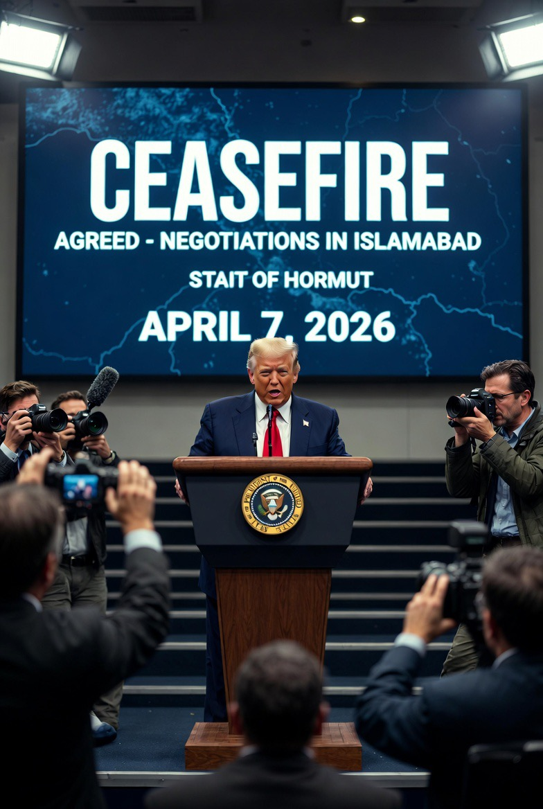

# Gencatan Senjata Iran–Israel–Amerika Serikat: Analisis Ambiguitas Strategis dan Diplomasi Darurat Konflik 

*Ilustrasi gencatan senjata (pic: Grok AI).*

  
***Ini bukan perdamaian yang jujur…
ini adalah perdamaian yang terpaksa***
  

Gencatan senjata 8 April 2026 antara Amerika Serikat, Iran, dan Israel merupakan hasil diplomasi darurat yang menghentikan eskalasi konflik besar di Timur Tengah. 

Artikel ini menganalisis karakteristik gencatan senjata tersebut sebagai bentuk strategic pause, bukan resolusi konflik. 

Dengan menggunakan kerangka conflict resolution, coercive diplomacy, dan alliance politics, tulisan ini menunjukkan bahwa kesepakatan ini sarat ambiguitas, bersifat sementara, dan mencerminkan konflik kepentingan yang belum terselesaikan.

## Pendahuluan

Pada 8 April 2026, dunia menyaksikan sesuatu yang nyaris terlambat: perang besar… yang berhenti beberapa jam sebelum menjadi lebih destruktif.

Amerika Serikat, Iran, dan Israel menyepakati:

•	gencatan senjata selama 2 minggu

•	dimediasi oleh Pakistan

•	disertai pembukaan kembali Selat Hormuz  

Namun, pertanyaan besar muncul: apakah ini perdamaian… atau hanya jeda sebelum ledakan berikutnya?

## Metodologi

Pendekatan:

1.	Analisis konflik internasional

2.	Teori diplomasi koersif

3.	Analisis geopolitik aliansi

## Coercive Diplomacy

Konsep ini menjelaskan: negosiasi yang terjadi di bawah ancaman kekerasan.

Kasus ini jelas:

•	AS mengancam serangan besar

•	Iran menahan Selat Hormuz

•	lalu… muncul kesepakatan mendadak

## Strategic Pause

Dalam studi militer: gencatan senjata sering bukan untuk damai… tapi untuk mengatur ulang posisi.

## Alliance Politics

Peran Israel sebagai sekutu utama AS menunjukkan: keputusan perang dan damai tidak berdiri sendiri, tapi terikat jaringan kepentingan.

## Analisis

A. Gencatan Senjata sebagai “Jeda Paksa”

Kesepakatan ini terjadi:

•	hanya beberapa jam sebelum ancaman serangan besar AS

•	di bawah tekanan ekonomi global (energi)

Artinya: ini bukan hasil kepercayaan… tapi hasil tekanan ekstrem.

B. Peran Kunci Selat Hormuz

Selat Hormuz:

•	jalur ±20% minyak dunia

•	dikontrol secara strategis oleh Iran

Kesepakatan mencakup: pembukaan kembali jalur ini sebagai syarat utama.

Jadi ini bukan cuma perang militer… tapi juga perang ekonomi global.

C. Ambiguitas Isi Kesepakatan

Masalah besar:

•	Iran punya proposal 10 poin

•	AS punya 15 poin

•	tidak ada kesepakatan final

Ini berarti: gencatan senjata terjadi sebelum kesepakatan substansi tercapai.

D. Israel: Setuju… tapi Tidak Sepenuhnya

Benjamin Netanyahu menyetujui jeda, tapi: operasi di Lebanon tetap berjalan.

Ini menciptakan paradoks: ada “gencatan senjata”… tapi perang tetap berlangsung di front lain.

E. Diplomasi Pakistan: Faktor Tak Terduga

Peran Pakistan sebagai mediator menunjukkan: aktor non-Barat masih bisa memainkan peran krusial dalam stabilitas global.

F. Fragilitas Kesepakatan

Bahkan pada hari yang sama:

•	laporan serangan masih terjadi

•	ketegangan belum benar-benar berhenti  

Ini menunjukkan: ceasefire tidak sama dengan peace.

## Diskusi

Fenomena ini menunjukkan tiga karakter utama:

1. Perdamaian Tanpa Kepercayaan

Semua pihak:

•	setuju berhenti

•	tapi tidak saling percaya.

2. Diplomasi di Bawah Ancaman Total

Kesepakatan lahir bukan dari niat damai, tapi: ketakutan akan kehancuran besar.

3. Ambiguitas Strategis sebagai Alat

Ketidakjelasan bukan kelemahan—justru: digunakan untuk memberi ruang manuver politik.

Gencatan senjata 8 April 2026 bukanlah akhir konflik.

Ia adalah: napas panjang di antara dua gelombang kekerasan.

Selama:

•	isu nuklir

•	pengaruh regional

•	dan konflik Israel–Iran

belum selesai, maka: jeda ini hanyalah sementara.

  
**Referensi**

Reuters. (2026). EU welcomes US-Iran ceasefire.

Reuters. (2026). Statements on US-Iran-Israel ceasefire.

The Guardian. (2026). US-Iran ceasefire developments.

Al Jazeera. (2026). Ceasefire and Strait of Hormuz reopening.

Associated Press. (2026). US, Israel, Iran ceasefire report.
